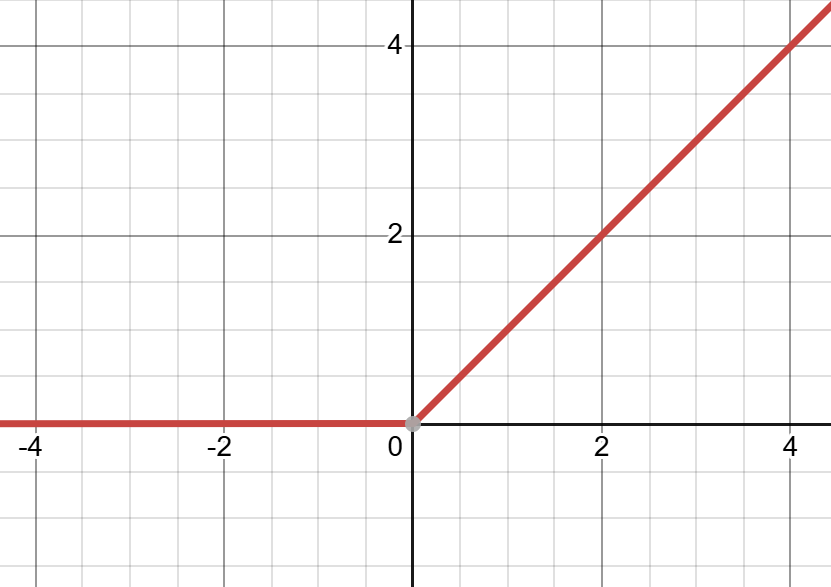

# 1.2 Neural Networks and Deep Learning

## I. Neural Networks

Mainstream artificial intelligence today uses multilayer neural networks (layers will be defined later) in a form of machine learning called deep learning. A "neural network" is, in fact, a complex function. This function may have a very large number of inputs, outputs, and parameters. Inside it are individual "neurons," which are interconnected, with a particular "connection strength" (a parameter) between two neurons. Data enters through specific neurons, passes through the neurons and a series of computations involving different parameters, and ultimately emerges from one or more neurons. This architecture takes inspiration from the interconnected neurons in the human body, hence the name "neural network."

What this "neural network" needs to do is "fitting."

We have studied Taylor expansions: as more terms are retained, the number of terms and coefficients increases, and the expansion gradually approaches the target function we want to fit. Real-world tasks can also be represented by functions (even if we cannot obtain their analytical expressions). Classifying images of handwritten digits, for example, means finding a function that takes an image as input and outputs a digit from 0 to 9. Asking a large model to write an essay means repeatedly providing the task instructions and the preceding text as input, and outputting an appropriate next word until the essay is complete.

For a given input, the output of this function is determined by "the form of its analytical expression" and "the values of its parameters." Training AI means continually adjusting the internal parameters so that its computed results become closer and closer to the "correct answers" we want.

## II. Linear Regression

We begin with the simplest function, y = wx + b.

Suppose, for example, that you want to make cola with the "perfect sweetness." Let x be the "amount of syrup" you add and y be the final "sweetness." Your goal is to find the best w (the syrup's "sweetness coefficient") and b (the cola base's "baseline sweetness"). Linear regression means finding the best w and b so that the y computed by wx + b is as close as possible to the "reference sweetness" you taste.

Note that x need not be a single number. More often, the output y is jointly determined by many factors, in which case x is a vector of values [x_1,x_2,...,x_n]. For example, if 10 ingredients jointly determine sweetness, then y=w_1*x_1+...+w_10*x_10+b. Alternatively, if w and x are written as a row vector and a column vector, respectively, the expression can still take the form y = wx + b.

We can then regard linear regression as a single-layer neural network: the output-layer value $o_1$ is jointly determined by the input-layer values $x_1,\ldots,x_d$. The number of inputs in the input layer (also called the feature dimension) is $d$, and the output layer has $1$ output. This is a single-layer neural network (computation takes place in only one layer). Here, every input is connected to every output, so it is called a fully connected layer.

However, the linear regression "machine" can only handle linear relationships. If the relationship between "sweetness" and "ingredients" is nonlinear (for instance, adding too much could instead decrease sweetness), linear regression cannot fit it. We need more complex and flexible functions.

## III. Activation Functions

We need a "magic tool" to break this linearity: an activation function.

One of the best-known activation functions is the rectified linear unit (ReLU). Its rule is extremely simple: $\mathrm{ReLU}(x)=\max(x,0)$, meaning that positive values remain unchanged and negative values become 0.

This raises a question:

ReLU appears merely to discard information (turning all negative numbers into 0). Why can it transform a "simple-minded" linear network into a deep neural network with many powerful capabilities?

The answer is precisely nonlinearity.

The simple act of "blocking negative numbers" introduces a "crease" or a "joint." Imagine a straight wooden stick (a linear function). Adding and subtracting straight lines and multiplying them by coefficients clearly still gives a straight line. With "joints" (ReLU functions), however, the situation is completely different.

We now have four linear functions:

After each passes through ReLU (denoted by f in the figure), the results are as follows. Notice that the "joint position" and "extension direction" differ for each function after applying ReLU:

Adding them together makes every distinct "joint" a "joint" in the new function:

This provides an intuitive understanding of the universal approximation theorem: with enough neurons that have "joints" (nonlinear activation functions), you can theoretically "assemble" (fit) any complex function in the universe.

Of course, cutting off all negative numbers indiscriminately can sometimes be too crude. What if the negative information is useful? Researchers therefore developed variants such as Leaky ReLU, which allows a small amount of negative information to "leak" through: f(x) = max(x, 0) + a*min(x, 0). When a=0, it becomes ordinary ReLU again.

## IV. Loss Functions

We have just built a "function machine" made of "craftspeople" (neurons) and "joints" (ReLU). It can now produce its own output y for an input x. How do we know whether its output $y$ is "good" or "bad"?

Just as an exam needs "grading criteria," AI needs a "grading criterion" to measure the gap between its predictions and the "correct answers." This criterion is the loss function. A loss function is a "scorer": given all of the AI's parameters, it computes a loss value from the inputs and outputs. The sole goal of training AI is to keep adjusting the parameters until we find a set that minimizes this "loss value," meaning that the outputs are as close as possible to the desired targets; a perfect prediction has a loss of 0. In linear regression, these parameters have an analytical solution, but in most problems they do not (methods for optimizing parameters will be discussed later).

For regression problems, the most commonly used loss function is squared error. If a sample's prediction is $\hat{y}$ and its corresponding true label is $y$, the squared error can be defined as:

$$
Loss=\frac{1}{2}(\hat{y}-y)^2
$$

For a batch of $n$ samples, the total loss is:

$$
Loss=\frac{1}{2}\sum_{i=1}^{n}(\hat{y}_i-y_i)^2
$$

This is, in fact, the method of least squares. (Different constants make no essential difference. The factor 1/2 makes the constant coefficient equal to 1 after differentiation, simplifying subsequent gradient calculations.)

High-school textbooks explain the use of mean squared loss by noting that the absolute-value function has less favorable properties. But why choose the "square" in particular?

As explained above, differentiating it produces the simple term $\hat{y}-y$, which makes subsequent gradient calculations more convenient. In fact, mean squared loss also has a deeper statistical meaning.

We assume that the AI's predictions are correct, but that real-world observations always contain some random error ("noise"), so the data in the dataset do not exactly follow the function they should follow. We assume that this "noise" follows a Gaussian (normal) distribution. Suppose the parameters of this perfectly correct AI are θ. According to the formula, when the input is x, the probability density of the output y (for continuous outputs, this can be understood as the probability of an output between y and y+dy divided by dy) is:

$$
p(y \mid \mathbf{x};\theta)=\frac{1}{\sqrt{2\pi\sigma^2}}\exp\left(-\frac{(y-f(\mathbf{x};\theta))^2}{2\sigma^2}\right).
$$

We want this probability to be as large as possible: this is "maximum likelihood estimation." Here, σ is a coefficient of the Gaussian distribution. Maximizing this probability requires only minimizing the term in parentheses in the exponent, which is exactly the mean squared loss under parameters θ.

Later, we will introduce another loss function: cross-entropy loss.

## References

- Goodfellow, I., Bengio, Y., & Courville, A. (2016). [Deep Learning](https://www.deeplearningbook.org/). MIT Press.
- Cybenko, G. (1989). [Approximation by superpositions of a sigmoidal function](https://doi.org/10.1007/BF02551274). Mathematics of Control, Signals and Systems, 2, 303-314.
- Glorot, X., Bordes, A., & Bengio, Y. (2011). [Deep Sparse Rectifier Neural Networks](https://proceedings.mlr.press/v15/glorot11a.html). AISTATS 2011.
