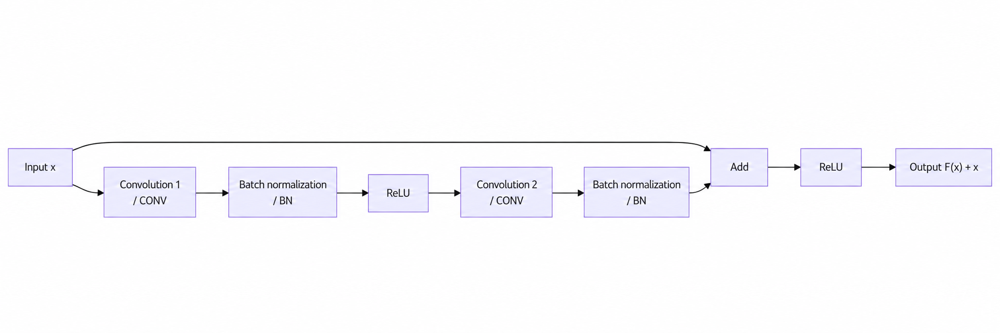

# 3.4 Residual Networks (ResNet)

## I. Core Idea: Learning a "Residual" Rather Than the "Original Mapping"

1. The problem: the predicament of deep networks

Before ResNet, researchers observed a counterintuitive phenomenon: simply increasing network depth could decrease performance. This was not merely overfitting on the test set; training error also increased. Deeper networks were therefore even harder to optimize. This is called the degradation problem.

Vanishing/exploding gradients: techniques such as Batch Normalization substantially alleviate them, but do not eliminate them entirely.

Network degradation: even with gradient problems addressed, a 56-layer network could perform worse than a 20-layer one. This suggests that deep networks are not inherently difficult to train; rather, existing optimization algorithms struggle to find the better solutions that should theoretically exist.

2. The solution: skip connections / shortcuts

ResNet's solution is concise and powerful: if a deep network struggles to learn the desired mapping H(x), let it learn the residual between that mapping and input x, F(x) = H(x) - x.

Original mapping: H(x) = x (identity mapping)
Residual mapping: F(x) = H(x) - x
Reconstructing the target mapping: H(x) = F(x) + x

Why is the original mapping harder to learn than the residual? The residual is generally near 0, whereas the target mapping is generally near x. Fitting y=x with a neural network full of summations and activation functions is difficult, but fitting y=0 requires only that all parameters approach 0.

Probabilistic perspective: ResNet provides an "identity mapping" prior (a default shortcut). Learning a "small perturbation" or "small correction" F(x) relative to the identity is much easier than learning an entirely new, complex mapping H(x).

Worst case: if the residual distribution cannot be learned, the block simply becomes H(x) = x, so residual-block output = residual-block input (note that a residual block is not the entire network). For example, in a two-layer network with a residual block at the second layer, the worst result is effectively doing nothing at that layer and reducing to one layer. Without a residual network, even the main features of H(x) ≈x may not be learned, giving worse performance than a single layer.

An everyday analogy:
Suppose you want to learn the route from Beijing to Shanghai (mapping H(x)).

Conventional network: learn the entire route from scratch, with the risk of getting lost or taking wrong turns.

ResNet: you already know a main expressway (input x). You only need to learn how to exit via some ramps, explore new side roads, and return to the main route. Your task is to learn these "ramps and side roads" as corrections (residual F(x)). Even if an explored side road is a dead end (F(x) = 0), you can return to the expressway (H(x) = x), ensuring performance no worse than the original route. This greatly reduces learning risk and difficulty.

In the network, "returning to the main route" is implemented by a shortcut connection: input x skips several layers and is added directly to their output F(x).

From the perspective of function classes, a key advantage of ResNet is making the function classes of increasingly deep networks as "nested" as possible.

- Nested function classes: for example, $\mathcal{F}_1$ (a 1-layer network) $\subseteq \mathcal{F}_2$ (a 2-layer network) $\subseteq \cdots \subseteq \mathcal{F}_6$ (a 6-layer network). A 2-layer network can therefore fully reproduce a 1-layer network's behavior simply by making the second layer do nothing.
- Nonnested function classes: if a more complex network cannot contain a simpler one—for example, $\mathcal{F}_6$ is an architecture entirely different from $\mathcal{F}_1$—there is no such guarantee. The more complex network may learn worse because it cannot learn the good solution already found by the simple network.

An everyday analogy: imagine building a faster car.

- Nested: the new racing car ($\mathcal{F}_2$) upgrades the engine of the old racing car ($\mathcal{F}_1$). It is at least as fast, and may be faster.
- Nonnested: the new racing car ($\mathcal{F}_6$) is designed as a boat. It may be faster on water but much slower than the old racing car on land (the image-classification task).

## II. Residual Block Architecture

Note: F(x) + x is elementwise addition, so F(x) must have exactly the same dimensions as x. The final convolution within the residual block must therefore adjust its channel count to match x.

ResNet builds networks of different depths by stacking these residual blocks.

## III. Why Are Residual Networks So Effective?

1. Addressing vanishing gradients: skip connections provide a "highway" through which gradients propagate directly backward from deep to shallow layers with almost no loss, making extremely deep networks trainable.

2. Simplifying the learning objective: learning F(x) = H(x) - x is generally easier than learning the entire H(x). In particular, when the identity mapping is already optimal or nearly optimal, pushing F(x) toward 0 is far easier than fitting the identity with many nonlinear layers.

3. Implicit model ensembling: some theories suggest that ResNet behaves like an ensemble of many shallow networks. Skip connections let data flow along paths of different depths, giving the network both shallow and deep characteristics.

## IV. Variants

Bottleneck: to reduce computation in deeper networks such as ResNet-50/101/152, each residual block uses a bottleneck design: 1x1 convolution (dimension reduction) -> 3x3 convolution -> 1x1 convolution (dimension expansion). This greatly reduces the cost of the 3x3 convolution.

## V. Residual Connections in Modern Large Models

Modern large models generally do not use a single residual connection directly from the overall input to the output. Instead, residual structures are added within each block or layer so that gradients and information flow smoothly through it, providing more flexible information flow—as in the many Add operations in Transformer architectures.

## References

- He, K., Zhang, X., Ren, S., & Sun, J. (2016). [Deep Residual Learning for Image Recognition](https://arxiv.org/abs/1512.03385). CVPR 2016.
- Veit, A., Wilber, M. J., & Belongie, S. (2016). [Residual Networks Behave Like Ensembles of Relatively Shallow Networks](https://proceedings.neurips.cc/paper_files/paper/2016/hash/37bc2f75bf1bcfe8450a1a41c200364c-Abstract.html). NeurIPS 2016.
