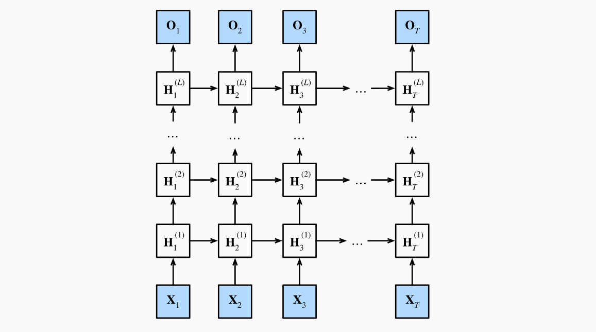

# 4.6 Deep Recurrent Neural Networks

So far, we have discussed only recurrent neural networks with one unidirectional hidden layer. The way latent variables and observations interact with the specific functional form is fairly arbitrary. This is not a major problem if the modeled interactions are sufficiently flexible, but achieving that flexibility within one layer can be challenging. For linear models, we addressed this by adding layers. In RNNs, however, we first need to decide how to add layers and where to introduce additional nonlinearities, making the problem somewhat more subtle.

In fact, multiple recurrent layers can be stacked, producing a flexible mechanism by combining several simple layers. In particular, data may relate to different levels of the stack. For example, we may want to preserve macro-level information about financial-market conditions (bearish or bullish), while micro-level data capture only shorter-term dynamics.

The figure below shows a deep RNN with $L$ hidden layers. Each hidden state is passed both to the next time step in the same layer and to the same time step in the next layer.

We can formalize the functional dependencies in this deep architecture with $L$ hidden layers. The discussion focuses on classic RNNs but also applies to other sequence models.

At time $t$, suppose a mini-batch of inputs is $X_t \in \mathbb{R}^{n \times d}$ ($n$ samples, with $d$ inputs each). Let hidden state of layer $l$ ($l = 1, \ldots, L$) be $H_t^{(l)} \in \mathbb{R}^{n \times h}$ ($h$ hidden units), and let output variables be $O_t \in \mathbb{R}^{n \times q}$ ($q$ outputs). Set $H_t^{(0)} = X_t$. With activation $\phi_l$ in hidden layer $l$:

$$
H_t^{(l)} = \phi_l(H_t^{(l-1)}W_{xh}^{(l)} + H_{t-1}^{(l)}W_{hh}^{(l)} + b_h^{(l)})
$$

Weights $W_{xh}^{(l)} \in \mathbb{R}^{h \times h}$ and $W_{hh}^{(l)} \in \mathbb{R}^{h \times h}$, and bias $b_h^{(l)} \in \mathbb{R}^{1 \times h}$ are the model parameters of hidden layer $l$.

Finally, the output layer depends only on the final hidden state of layer $L$:

$$
O_t = H_t^{(L)}W_{hq} + b_q
$$

Weights $W_{hq} \in \mathbb{R}^{h \times q}$ and bias $b_q \in \mathbb{R}^{1 \times q}$ are output-layer parameters.

As in an MLP, the hidden-layer count $L$ and hidden-unit count $h$ are adjustable hyperparameters. Replacing the hidden states in these computations with those of GRUs or LSTMs readily gives deep gated recurrent networks or deep long short-term memory networks.

## References

- Zhang, A., Lipton, Z. C., Li, M., & Smola, A. J. (2023). [Dive into Deep Learning](https://D2L.ai). Cambridge University Press.
