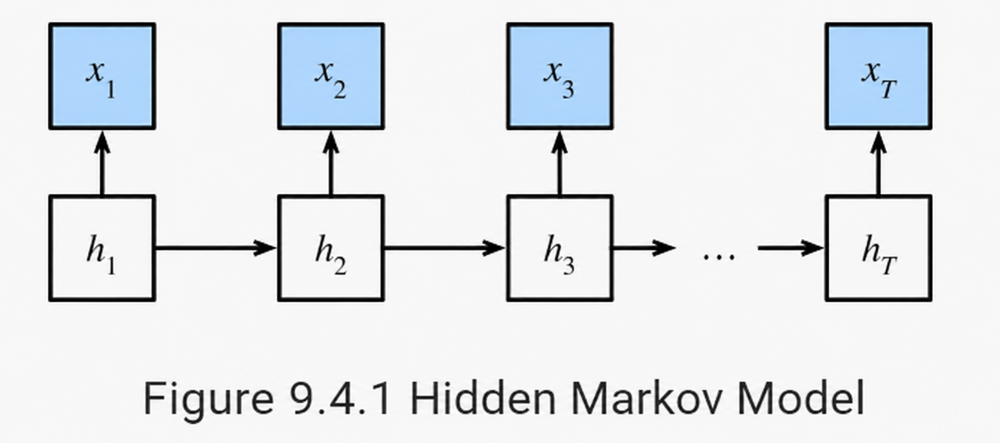

# 4.7 Bidirectional Recurrent Neural Networks

## I. Dynamic Programming in Hidden Markov Models

To address this problem with a probabilistic graphical model, we can design a latent-variable model: at any time $t$, assume a hidden variable $h_t$ controls the observation $x_t$ through probability $P(x_t \mid h_t)$. Every transition $h_t \to h_{t+1}$ is specified by a state-transition probability $P(h_{t+1} \mid h_t)$. This graphical model is a hidden Markov model (HMM), as illustrated below.

  

For a sequence of $T$ observations, the joint distribution over observed and hidden states is therefore:

$$
P(x_1, \ldots, x_T, h_1, \ldots, h_T)
= \prod_{t=1}^{T} P(h_t \mid h_{t-1})P(x_t \mid h_t), \quad P(h_1 \mid h_0) = P(h_1)
$$

Now suppose all $x_i$ except $x_j$ are observed and the goal is $P(x_j \mid x_{-j})$, where $x_{-j} = (x_1, \ldots, x_{j-1}, x_{j+1}, \ldots, x_T)$. Since $P(x_j \mid x_{-j})$ contains no latent variables, we consider summing over every possible combination of $h_1, \ldots, h_T$. If each $h_i$ can take $k$ different values (a finite state space), this means summing $k^T$ terms, an impossibly difficult task. Fortunately, there is an ingenious solution: dynamic programming.

1. Forward recursion ("recurring from the preceding step")

To understand dynamic programming, consider summing successively over hidden variables $h_1, \ldots, h_T$. From the joint distribution above:

$$
\begin{aligned}
P(x_1, \ldots, x_T)
&= \sum_{h_1,\ldots,h_T} P(x_1, \ldots, x_T, h_1, \ldots, h_T) \\
&= \sum_{h_1,\ldots,h_T} \prod_{t=1}^{T} P(h_t \mid h_{t-1})P(x_t \mid h_t) \\
&= \sum_{h_2,\ldots,h_T}\left[\sum_{h_1}P(h_1)P(x_1 \mid h_1)P(h_2 \mid h_1)\right]P(x_2 \mid h_2)\prod_{t=3}^{T}P(h_t \mid h_{t-1})P(x_t \mid h_t) \\
&= \sum_{h_3,\ldots,h_T}\left[\sum_{h_2}\pi_2(h_2)P(x_2 \mid h_2)P(h_3 \mid h_2)\right]P(x_3 \mid h_3)\prod_{t=4}^{T}P(h_t \mid h_{t-1})P(x_t \mid h_t) \\
&= \ldots \\
&= \sum_{h_T}\pi_T(h_T)P(x_T \mid h_T)
\end{aligned}
$$

Here, $\pi_t(h_t)$ is the sum of probabilities of all paths producing $(h_1, \ldots, h_{t-1}, h_t, x_1, \ldots, x_{t-1})$. In other words, it is the accumulated probability of reaching hidden state $h_t$ at time $t$ after observing $x_1, \ldots, x_{t-1}$. At the end, only a sum over $h_T$ remains.

The forward recursion is usually written:

$$
\pi_{t+1}(h_{t+1}) = \sum_{h_t}\pi_t(h_t)P(x_t \mid h_t)P(h_{t+1} \mid h_t)
$$

Initialize with $\pi_1(h_1) = P(h_1)$. In simplified notation, write $\pi_{t+1} = f(\pi_t, x_t)$, where $f$ is a learnable function. This resembles the latent-variable update equation discussed for RNNs.

2. Backward recursion ("recurring from the following step")

Define $\rho_t(h_t)$ as "the probability of ultimately obtaining $(x_{t+1}, \ldots, x_T)$ given $h_t, x_t$." It is a "predictive probability given the state," including a sum over all possible paths through $h_{t+1}, \ldots, h_T$.

To perform dynamic programming backward, start at the sequence's end and progressively combine future-path probabilities into $\rho$:

$$
\begin{aligned}
P(x_1, \ldots, x_T)
&= \sum_{h_1,\ldots,h_T} P(x_1, \ldots, x_T, h_1, \ldots, h_T) \\
&= \sum_{h_1,\ldots,h_T}\prod_{t=1}^{T-1}P(h_t \mid h_{t-1})P(x_t \mid h_t)\cdot P(h_T \mid h_{T-1})P(x_T \mid h_T) \\
&= \sum_{h_1,\ldots,h_{T-1}}\prod_{t=1}^{T-1}P(h_t \mid h_{t-1})P(x_t \mid h_t)\cdot \left[\sum_{h_T}P(h_T \mid h_{T-1})P(x_T \mid h_T)\right] \\
&= \sum_{h_1,\ldots,h_{T-2}}\prod_{t=1}^{T-2}P(h_t \mid h_{t-1})P(x_t \mid h_t)\cdot \left[\sum_{h_{T-1}}P(h_{T-1} \mid h_{T-2})P(x_{T-1} \mid h_{T-1})\rho_{T-1}(h_{T-1})\right] \\
&= \ldots \\
&= \sum_{h_1}P(h_1)P(x_1 \mid h_1)\rho_1(h_1)
\end{aligned}
$$

The backward recursion can therefore be written:

$$
\rho_{t-1}(h_{t-1}) = \sum_{h_t}P(h_t \mid h_{t-1})P(x_t \mid h_t)\rho_t(h_t)
$$

Note: $\rho_1(h_1)$ already includes the sum over all paths through $h_2, \ldots, h_T$.

  

To preserve the formula's form at $t=T$, initialize $\rho_T(h_T)=1$. Both forward and backward recursion allow summation over all values of $(h_1,\ldots,h_T)$ for $T$ hidden variables in $O(kT)$ time (linear rather than exponential). This is a major advantage of probabilistic inference with graphical models and a very special case of general message-passing algorithms.

3. Combining the two

Suppose all elements of time-series output $x_1,\ldots,x_T$ except $x_j$ are known, but hidden states $h_1,\ldots,h_T$ are unknown. Individually enumerating every possible value of every $h_j$ (assuming that each $h_j$ can take $k$ values) costs $O(k^T)$, which is infeasible.

Instead, combine forward and backward recursion:

$$
P(x_j \mid x_{-j}) \propto \sum_{h_j}\pi_j(h_j)\rho_j(h_j)P(x_j \mid h_j)
$$

The denominator is the probability of obtaining all elements except $x_j$, a constant independent of hidden states. In simplified notation, backward recursion is $\rho_{t-1}=g(\rho_t,x_t)$, where $g$ is learnable. Again, this resembles an update equation, except it runs backward rather than forward as in an RNN. Knowing when future data are available is beneficial for HMMs; signal-processing researchers distinguish interpolation from extrapolation based on whether future observations are known.

In terms of computational complexity, both forward and backward recursion sum over all assignments of $(h_1,\ldots,h_T)$ for $T$ hidden variables in $O(kT)$. The combined formula uses forward recursion before $x_j$ and backward recursion after it, still costing $O(kT)$. (This is the complexity of executing the computation, excluding training-stage procedures such as learning probability values.)

## II. Bidirectional Recurrent Neural Networks

In sequence learning, we previously assumed the goal was to model the next output given observations, such as time-series or language-model context. For fill-in-the-blank tasks, however, the text following a phrase also conveys important information (when available) about the missing word. Sequence models unable to use it perform poorly on such tasks. For example, effective named-entity recognition—determining whether "Green" means "Mr. Green" or the color—requires equally important context spans of different lengths.

At any time $t$, let a mini-batch of inputs be $\mathbf{X}_t \in \mathbb{R}^{n \times d}$ ($n$ samples, $d$ inputs each), and let the hidden-layer activation be $\phi$.

In a bidirectional architecture, forward and backward hidden states are $\overrightarrow{\mathbf{H}}_t \in \mathbb{R}^{n \times h}$ and $\overleftarrow{\mathbf{H}}_t \in \mathbb{R}^{n \times h}$, respectively, where $h$ is the hidden-unit count. Their updates are:

$$
\begin{aligned}
\overrightarrow{\mathbf{H}}_t &= \phi(\mathbf{X}_t\mathbf{W}_{xh}^{(f)} + \overrightarrow{\mathbf{H}}_{t-1}\mathbf{W}_{hh}^{(f)} + \mathbf{b}_h^{(f)}), \\
\overleftarrow{\mathbf{H}}_t &= \phi(\mathbf{X}_t\mathbf{W}_{xh}^{(b)} + \overleftarrow{\mathbf{H}}_{t+1}\mathbf{W}_{hh}^{(b)} + \mathbf{b}_h^{(b)})
\end{aligned}
$$

Weights $\mathbf{W}_{xh}^{(f)} \in \mathbb{R}^{d \times h}$, $\mathbf{W}_{hh}^{(f)} \in \mathbb{R}^{h \times h}$, $\mathbf{W}_{xh}^{(b)} \in \mathbb{R}^{d \times h}$, and $\mathbf{W}_{hh}^{(b)} \in \mathbb{R}^{h \times h}$, and biases $\mathbf{b}_h^{(f)} \in \mathbb{R}^{1 \times h}$ and $\mathbf{b}_h^{(b)} \in \mathbb{R}^{1 \times h}$ are model parameters.

Next, concatenate $\overrightarrow{\mathbf{H}}_t$ and $\overleftarrow{\mathbf{H}}_t$ to obtain hidden state $\mathbf{H}_t \in \mathbb{R}^{n \times 2h}$ for the output layer. In deep bidirectional RNNs with multiple hidden layers, this becomes the next bidirectional layer's input. Finally, the output layer computes $\mathbf{O}_t \in \mathbb{R}^{n \times q}$ ($q$ output units):

$$
\mathbf{O}_t = \mathbf{H}_t\mathbf{W}_{hq} + \mathbf{b}_q
$$

Weight matrix $\mathbf{W}_{hq} \in \mathbb{R}^{2h \times q}$ and bias $\mathbf{b}_q \in \mathbb{R}^{1 \times q}$ are output-layer parameters. In fact, the two directions can have different numbers of hidden units.

A key property of bidirectional RNNs is using information from both ends of a sequence to estimate outputs: past and future observations predict the current observation. Such models are not what we need for next-token prediction, however, because the following context is ultimately unknown when predicting the next token, so accuracy is poor. Specifically, training can use both past and future data to estimate a missing word, whereas testing has only past data, resulting in poor accuracy. The experiment below will illustrate this.

Another serious problem is very slow computation. Forward propagation must perform both forward and backward recursion in bidirectional layers, and backpropagation depends on those forward results. Gradient computation therefore involves a very long chain.

Bidirectional layers are used infrequently in practice and only in certain settings, such as filling missing words, annotating tokens (for named-entity recognition), and encoding sequences as part of a processing pipeline (for machine translation). Relevant later sections introduce bidirectional RNNs for encoding text sequences.

## References

- Zhang, A., Lipton, Z. C., Li, M., & Smola, A. J. (2023). [Dive into Deep Learning](https://D2L.ai). Cambridge University Press.
- Doucet, A., de Freitas, N., & Gordon, N. (Eds.). (2001). [Sequential Monte Carlo Methods in Practice](https://doi.org/10.1007/978-1-4757-3437-9). Springer.
- Schuster, M., & Paliwal, K. K. (1997). [Bidirectional recurrent neural networks](https://doi.org/10.1109/78.650093). IEEE Transactions on Signal Processing.
