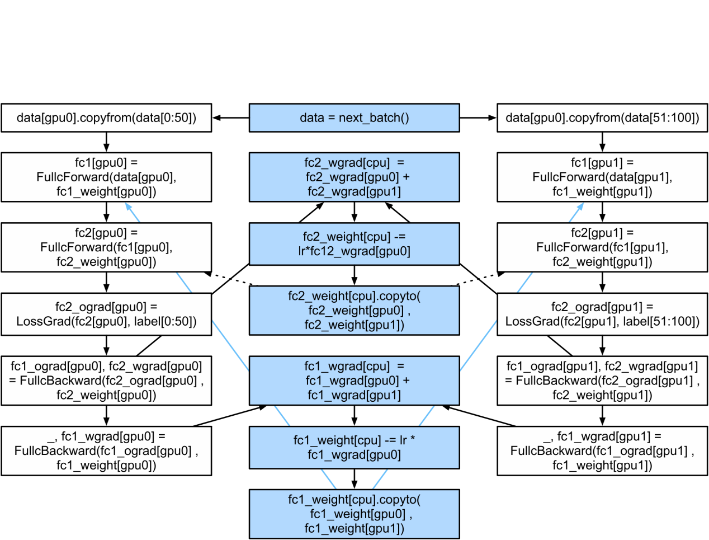

# 7.2 Deep Learning Frameworks

## I. Imperative and Symbolic Programming

1. Imperative programming

(1) Core logic

“What you see is what you get”: when execution reaches a line of code, the computer executes that line and immediately computes the result. A Python example:

e = add(a, b)  # The interpreter immediately computes a+b and stores the result in memory as e

f = add(c, d)  # The interpreter immediately computes c+d and stores the result in memory as f

(2) Advantages

High flexibility: Python control flow (if, for) can freely change the computational logic.

Easy debugging: when the program reports an error, you can identify exactly which line's data caused the problem because intermediate variables remain in memory.

(3) Disadvantages (performance bottlenecks)

High Python overhead: every operation requires the Python interpreter. With extremely fast hardware such as GPUs, the interpreter may fail to keep up, leaving the GPU idle and waiting.

Lack of global optimization: because execution proceeds line by line, the system does not know what the next line will do and cannot fuse computations or reuse memory. For example, it must retain e and f until the function ends because it does not know whether they will be used again later.

2. Symbolic programming

(1) Core logic

“Draw the blueprint first, then build”: code first describes all computational steps to generate a flowchart, without performing any actual computation. The compiler optimizes this graph (for example, discovering that (1+2)+(3+4) can be simplified directly to 10, or that memory for a variable can be released immediately after its last use), and data are then fed into the compiled program for execution. We simulate this process with C++ code (although C++ is imperative, it is a compiled language, and its “compilation and optimization before execution” share similarities with the advantages of symbolic programming):

```cpp
int main() {
    // --- Stage 1: Symbolic Definition ---
    // No mathematical operations occur yet; only "strings" are recorded

    std::vector<Node> computation_graph;

    // Define: e = add(a, b)
    computation_graph.push_back({"e", "ADD", {"a", "b"}});

    // Define: f = add(c, d)
    computation_graph.push_back({"f", "ADD", {"c", "d"}});

    // Define: g = mult(e, f)
    computation_graph.push_back({"g", "MULT", {"e", "f"}});

    std::cout << ">>> Blueprint complete; no computation has occurred yet." << std::endl;

    // --- Stage 2: Compilation/Optimization ---
    // This is the decisive advantage of symbolic programming.
    // After seeing the complete blueprint, the compiler finds a remarkable optimization opportunity!

    std::cout << ">>> Compiling and optimizing..." << std::endl;
    // Assume constant inputs: a=1, b=2, c=3, d=4
    // The compiler discovers that all inputs are fixed!
    // It can simplify (1+2)*(3+4) directly to 21, removing all intermediate steps.

    // The optimized blueprint may contain only one instruction:
    std::string optimized_instruction = "Return 21";

    // --- Stage 3: Execution ---
    std::cout << ">>> Starting execution:" << std::endl;
    std::cout << optimized_instruction << std::endl;
}
```

(2) Advantages

Extremely high efficiency: the compiler sees the global picture and can perform memory optimization and operator fusion.

Portability: once compiled into a computational graph, the program no longer depends on the Python environment. The model and its parameters can be serialized (saved) to disk, and computation can proceed directly from the graph at runtime. This allows trained models to be deployed to other devices (such as mobile devices) and also makes it convenient to use other frontend programming languages such as C++.

(3) Disadvantages

Difficult debugging: because definition and execution are separate, errors are often hard to trace back to the original Python line.

Steep learning curve: less intuitive than Python.

3. Hybrid programming

Early deep learning frameworks generally used either imperative or symbolic programming. Theano, TensorFlow, Keras, and CNTK adopted symbolic programming, whereas Chainer and PyTorch adopted imperative programming. In subsequent version updates, TensorFlow 2.0 and Keras added imperative programming.

As AI develops, compute requirements continue to grow, and multi-GPU parallel processing has become routine, making the single-threaded Python interpreter an obvious bottleneck. Hybrid programming emerged to provide the efficiency and portability of symbolic programming while retaining the development convenience of imperative programming. It combines the strengths of the two models. For example, torchscript lets users develop and debug imperatively while converting most programs into symbolic programs for production-level computational performance and deployment. If we define an MLP network net, for instance, net = torch.jit.script(net) converts it into a form that can be compiled and optimized.

## II. Asynchronous Computation

1. Core idea of asynchronous computation

(1) Python (the waiter) receives the instruction b = dot(a, a).

(2) Python writes the instruction on an order slip and drops it into the backend task queue.

(3) Key point: Python does not wait for the result. It returns immediately, ready to receive the next instruction.

(4) C++ (the kitchen) quietly takes orders from the queue and cooks in the background.

In other words, instructions enter the queue on one side while they are taken out and executed on the other; the two sides can proceed at different rates.

For PyTorch users, although PyTorch looks synchronous (imperative), its GPU operations are also asynchronous. When you execute result = gpu_tensor_a + gpu_tensor_b, Python likewise returns instantly, while the actual addition waits in the GPU queue. Python synchronizes the CPU and GPU only when print(result) is called.

2. Major advantage of asynchronous computation: pipeline parallelism

(1) Synchronous execution

```python
for _ in range(10000):
    y = x + 1
    y.wait_to_read()  # Force a wait every time
```

Process: Python issues an instruction -> wait -> C++ computes -> Python issues an instruction -> wait -> C++ computes...

Problem: the CPU and GPU are idle during the waiting periods.

(2) Asynchronous execution

```python
for _ in range(10000):
    y = x + 1

npx.waitall()  # Wait once at the end
```

Process: Python rapidly issues instructions (issue, issue, issue...), while C++ rapidly computes in the background (compute, compute, compute...).

Advantage: Python's instruction-issuing time overlaps with C++'s computation time. As long as Python issues instructions faster than C++ computes them, the GPU always has work to do and operates at full utilization.

3. Dependency graph

Since Python drops off a task and leaves, what happens if a later task depends on an earlier result? For example:

```python
x = np.ones((1, 2))
y = np.ones((1, 2))
z = x * y + 2 * x  # Computing z depends on x and y
```

The backend (kitchen) is very clever: it maintains a computational graph (dependency graph). When it receives the task of computing z, it checks and finds that z requires the results of x and y. If x and y are not ready, it suspends z and computes x and y first. This ensures that even if Python issues instructions extremely quickly, their computational order remains correct.

4. Blocking operations and barriers

(1) Explicit blocking

You instruct the program: “You cannot leave until all the dishes are ready.”

npx.waitall(): forces a wait until the backend finishes every task in the queue.

z.wait_to_read(): waits only for variable z to be computed, regardless of other tasks.

(2) Implicit blocking

Some operations inherently imply that a result is needed, so the framework automatically triggers a wait:

print(z): to print the numerical value, you must wait until it has been computed.

z.asnumpy() or z.item(): converts data from the framework (device memory/MXNet format) back to Python/NumPy format. Since NumPy is synchronous, waiting is necessary.

Performance pitfall: frequently copying small amounts of data from MXNet's scope to NumPy can undermine performance.

## III. Automatic Parallelism

1. GPU-based parallel computation

Deep learning frameworks (such as MxNet, PaddlePaddle, and PyTorch) automatically construct computational graphs in the backend. These graphs let the system understand all dependencies and selectively execute independent tasks in parallel to improve speed. Typically, a single operator uses all computational resources on all CPUs or on one GPU. Parallelization is therefore not particularly useful on a single-device computer, but is important across multiple devices. Although it is usually applied across multiple GPUs, adding the local CPU can improve performance slightly further.

Executing two parts of a task in parallel on two GPUs takes less total time than the sum of their individual execution times, because the deep learning framework automatically schedules computations across the two GPU devices without requiring users to write complex code.

2. Data communication

In many situations, data must move between devices, such as between a CPU and a GPU or between different GPUs. For example, distributed optimization requires moving data to aggregate gradients across multiple accelerator cards.

The difference from parallel computation lies in the resources used by communication: the bus between CPU and GPU. In fact, computation and communication can occur simultaneously on two devices. Their dependency requires y[i] to be computed before it can be copied to the CPU. Naturally, the system can copy y[i-1] while computing y[i], reducing total runtime.

3. An example computational graph and its dependencies

The following figure shows a two-layer multilayer perceptron running on one CPU and two GPUs. Its dependencies are quite complex and difficult to schedule manually.



## References

- Zhang, A., Lipton, Z. C., Li, M., & Smola, A. J. (2023). [Dive into Deep Learning](https://D2L.ai). Cambridge University Press.
