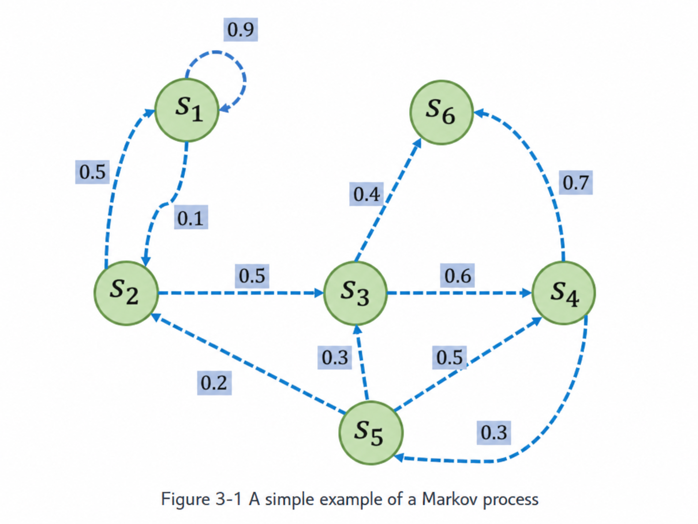

# 10.2 Markov Processes

First, a clarification: reinforcement learning is a training method (alongside supervised learning and others), not a model architecture or optimization algorithm.

## I. Markov Processes

In a multi-armed bandit, the agent's actions do not affect the environment, but the real world is different. We introduce the concept of a Markov process.

A Markov process is a stochastic process with the Markov property, also called a Markov chain. It is usually described by a tuple $(\mathcal{S},P)$, where $\mathcal{S}$ is a finite set of states and $P$ is the state transition matrix. With $n$ states, $\mathcal{S}=\{s_1,s_2,\ldots,s_n\}$, and the transition matrix is:

$$
P=
\begin{bmatrix}
P(s_1\mid s_1) & \cdots & P(s_n\mid s_1)\\
\vdots & \ddots & \vdots\\
P(s_1\mid s_n) & \cdots & P(s_n\mid s_n)
\end{bmatrix}.
$$

The element in row $i$, column $j$ of $P$,

$$
P(s_j\mid s_i)=P(S_{t+1}=s_j\mid S_t=s_i)
$$

is the probability of transitioning from state $s_i$ to $s_j$. For every $s_i$, the probabilities of reaching other states from it must sum to $1$; thus every row of the transition matrix sums to $1$.

Given a Markov process, we can start at a state and use its transition matrix to generate an episode as a state sequence, a procedure also called sampling. For example, starting at $s_1$ can produce $s_1\to s_2\to s_3\to s_6$ or $s_1\to s_1\to s_2\to s_3\to s_4\to s_5\to s_3\to s_6$. The probabilities of these sequences depend on the transition matrix.

## II. Markov Reward Processes

### 1. Return

Adding a reward function $r$ and discount factor $\gamma$ to a Markov process yields a Markov reward process. It consists of $(\mathcal{S},P,r,\gamma)$, where:

- $\mathcal{S}$ is a finite state set.
- $P$ is the state transition matrix.
- $r$ is the reward function; the reward $r(s)$ of a state $s$ is the expected reward received upon transitioning into that state.
- $\gamma$ is the discount factor, in $[0,1)$. Discounting is introduced because distant benefits carry uncertainty, and sometimes we prefer receiving rewards sooner. $\gamma$ near $1$ emphasizes long-term cumulative reward; near $0$, it emphasizes short-term reward.

In a Markov reward process, the discounted sum of rewards from state $S_t$ at time $t$ until termination is called the return $G_t$:

$$
G_t=R_t+\gamma R_{t+1}+\gamma^{2} R_{t+2}+\cdots
=\sum_{k=0}^{\infty}\gamma^{k} R_{t+k}.
$$

For an LLM, each generation step is a “state transition” (the full text so far is the state). The action selects a word token probabilistically from the vocabulary (tens of thousands of words), transitioning to the next state (the updated full text). A reward function can reward a state (outcome) or a process.

### 2. Value Function

In a Markov reward process, a state's expected return (the expected future cumulative reward starting there) is its value. The values of all states form the value function, which takes a state as input and outputs its value. Write it as

$$
V(s)=\mathbb{E}[G_t\mid S_t=s].
$$

Expanding gives:

$$
\begin{aligned}
V(s)
&=\mathbb{E}[G_t\mid S_t=s]\\
&=\mathbb{E}[R_t+\gamma R_{t+1}+\gamma^{2} R_{t+2}+\cdots\mid S_t=s]\\
&=\mathbb{E}[R_t+\gamma(R_{t+1}+\gamma R_{t+2}+\cdots)\mid S_t=s]\\
&=\mathbb{E}[R_t+\gamma G_{t+1}\mid S_t=s]\\
&=\mathbb{E}[R_t+\gamma V(S_{t+1})\mid S_t=s].
\end{aligned}
$$

For the last equality, the expected immediate reward is the reward function's output, $\mathbb{E}[R_t\mid S_t=s]=r(s)$. The remaining term $\mathbb{E}[\gamma V(S_{t+1})\mid S_t=s]$ follows from transition probabilities out of $s$, giving:

$$
V(s)=r(s)+\gamma\sum_{s'\in\mathcal{S}}P(s'\mid s)V(s').
$$

This is the well-known Bellman equation for Markov reward processes, valid for every state. If the process has $n$ states, $\mathcal{S}=\{s_1,s_2,\ldots,s_n\}$, represent their values as a column vector $\mathbf{V}=[V(s_1),V(s_2),\ldots,V(s_n)]^{\top}$. Likewise, write transition probabilities as matrix $P$ and rewards as column vector $\mathbf{R}=[r(s_1),r(s_2),\ldots,r(s_n)]^{\top}$. The Bellman equation becomes:

$$
\mathbf{V}=\mathbf{R}+\gamma P\mathbf{V}.
$$

It can be solved directly by matrix operations:

$$
\begin{aligned}
\mathbf{V}&=\mathbf{R}+\gamma P\mathbf{V},\\
(I-\gamma P)\mathbf{V}&=\mathbf{R},\\
\mathbf{V}&=(I-\gamma P)^{-1}\mathbf{R}.
\end{aligned}
$$

This analytical solution has computational complexity $O(n^{3})$, where $n$ is the number of states, so it is suitable only for very small Markov reward processes. For larger processes, value functions can be solved using dynamic programming, Monte Carlo methods, or temporal-difference methods.

## III. Markov Decision Processes

An agent's policy is usually denoted $\pi$. The policy

$$
\pi(a\mid s)=P(A_t=a\mid S_t=s)
$$

is a function giving the probability of action $a$ when state $s$ is provided. A deterministic policy outputs one fixed action in each state: that action has probability $1$ and all others have probability $0$. A stochastic policy outputs a probability distribution over actions in each state, from which an action can be sampled.

Because of the Markov property, a policy in an MDP needs to depend only on the current state, not historical states. As with an MRP, a similar value function can be defined in an MDP. It now depends on the policy, so two policies can assign different values to the same state: they choose different actions, encounter different subsequent states and rewards, and therefore have different expected cumulative rewards.

Let $V^{\pi}(s)$ denote the state-value function under policy $\pi$ in an MDP, defined as the expected return from state $s$ while following $\pi$:

$$
V^{\pi}(s)=\mathbb{E}_{\pi}[G_t\mid S_t=s].
$$

Unlike an MRP, an MDP includes actions, allowing an action-value function to be defined. $Q^{\pi}(s,a)$ denotes the expected return from taking action $a$ in current state $s$ and following policy $\pi$:

$$
Q^{\pi}(s,a)=\mathbb{E}_{\pi}[G_t\mid S_t=s,A_t=a].
$$

The relationship between state and action values is as follows: under policy $\pi$, state $s$'s value is the sum over all actions of their probabilities under $\pi$ multiplied by their action values:

$$
V^{\pi}(s)=\sum_{a\in\mathcal{A}}\pi(a\mid s)Q^{\pi}(s,a).
$$

Under $\pi$, taking action $a$ in state $s$ has value equal to the immediate reward plus the discounted expected value of all possible next states:

$$
Q^{\pi}(s,a)=r(s,a)+\gamma\sum_{s'\in\mathcal{S}}P(s'\mid s,a)V^{\pi}(s').
$$

## IV. Bellman Expectation Equations

“Expectation” is added to distinguish these Bellman equations from the optimality equations that follow. Simple derivations give the Bellman expectation equations for state and action values:

$$
\begin{aligned}
V^{\pi}(s)
&=\mathbb{E}_{\pi}[R_t+\gamma V^{\pi}(S_{t+1})\mid S_t=s]\\
&=\sum_{a\in\mathcal{A}}\pi(a\mid s)
(r(s,a)+\gamma\sum_{s'\in\mathcal{S}}P(s'\mid s,a)V^{\pi}(s')),
\end{aligned}
$$

$$
\begin{aligned}
Q^{\pi}(s,a)
&=\mathbb{E}_{\pi}[R_t+\gamma Q^{\pi}(S_{t+1},A_{t+1})\mid S_t=s,A_t=a]\\
&=r(s,a)+\gamma\sum_{s'\in\mathcal{S}}P(s'\mid s,a)
\sum_{a'\in\mathcal{A}}\pi(a'\mid s')Q^{\pi}(s',a').
\end{aligned}
$$

## V. Bellman Optimality Equations

Reinforcement learning usually aims to find a policy that gives the agent the greatest expected return from the initial state. First define a partial ordering of policies: write $\pi\succ \pi'$ if and only if $V^{\pi}(s)\ge V^{\pi'}(s)$ for every state $s$. In an MDP with finite state and action sets, at least one policy is better than all others, or at least one is no worse than all others; this is an optimal policy. There may be many optimal policies, all denoted $\pi^{*}(s)$.

Optimal policies share the same state-value function, called the optimal state-value function:

$$
V^{*}(s)=\max_{\pi}V^{\pi}(s),\qquad \forall s\in\mathcal{S}.
$$

Similarly, define the optimal action-value function:

$$
Q^{*}(s,a)=\max_{\pi}Q^{\pi}(s,a),\qquad \forall s\in\mathcal{S},a\in\mathcal{A}.
$$

To maximize $Q^{\pi}(s,a)$, the optimal policy must be followed after the current state-action pair $(s,a)$, giving the relationship:

$$
Q^{*}(s,a)=r(s,a)+\gamma\sum_{s'\in\mathcal{S}}P(s'\mid s,a)V^{*}(s').
$$

This is the same relationship as between state and action values under an ordinary policy. Conversely, the optimal state value is obtained by choosing the action with the largest optimal action value:

$$
V^{*}(s)=\max_{a\in\mathcal{A}}Q^{*}(s,a).
$$

These relationships between $V^{*}(s)$ and $Q^{*}(s,a)$ yield the Bellman optimality equations:

$$
V^{*}(s)=\max_{a\in\mathcal{A}}\bigl(r(s,a)+\gamma\sum_{s'\in\mathcal{S}}P(s'\mid s,a)V^{*}(s')\bigr).
$$

$$
Q^{*}(s,a)=r(s,a)+\gamma\sum_{s'\in\mathcal{S}}P(s'\mid s,a)
\max_{a'\in\mathcal{A}}Q^{*}(s',a').
$$

Unlike Bellman expectation equations, which depend on policy $\pi$, Bellman optimality equations are independent of $\pi$ and depend only on the environment's state-transition characteristics.

## References

- [Hands-on Reinforcement Learning (translated title; in Chinese)](https://hrl.boyuai.com/).
