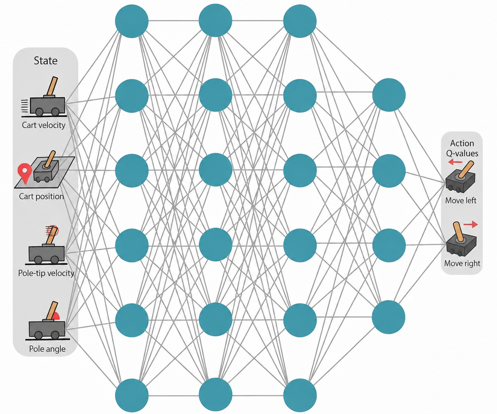

# 11.5 DQN

## I. Basic Idea

Q-learning constructs a matrix-style table storing Q values for all actions in every state. Such tabular action values are suitable only when state and action spaces are discrete and relatively small. When states or actions are numerous or continuous, recording every state-action pair's Q value in a table is unrealistic. Function approximation is needed to estimate Q values by fitting Q(s,a).

Construct a neural network (function) whose training objective is to learn and fit the Q function (intuitively a “Q map,” although machine learning actually optimizes a continuous function). Its input is state s (effectively all corresponding (state s, action a) pairs), and its output gives Q(s,a) for each action a at s (allowing selection of the output maximizing Q for the given state). For example, train a multilayer perceptron to fit Q.

## II. DQN Loss Function

Traditional Q-Learning maintains a $Q$ table. For state $s$ and action $a$, the update is:

$$
Q(s,a)\leftarrow Q(s,a)+\alpha\cdot\left[\left(r+\gamma\max_{a'}Q(s',a')\right)-Q(s,a)\right]
$$

- $r+\gamma\max_{a'}Q(s',a')$ is the TD target, the value that $Q(s,a)$ should approach.
- $Q(s,a)$ is the current estimate.
- Meaning: move the current $Q(s,a)$ slightly toward the target, with step size $\alpha$.

DQN approximates $Q$ values using a neural network $Q(s,a;\theta)$. Training requires a loss $L(\theta)$. DQN uses mean squared error (MSE), aiming to bring network output $Q(s,a;\theta)$ as close as possible to the TD target.

$$
L(\theta)=\mathbb{E}\left[\left(r+\gamma\max_{a'}Q(s',a';\theta^-)-Q(s,a;\theta)\right)^2\right]
$$

Here $y=r+\gamma\max_{a'}Q(s',a';\theta^-)$ is the target, treated as constant during gradient computation; $\theta^-$ contains target-network parameters.

## III. DQN Gradient Update

Writing the target as $y=r+\gamma\max_{a'}Q(s',a';\theta^-)$, the loss gradient is:

$$
\begin{aligned}
\nabla_\theta L(\theta)
&=\nabla_\theta\left(y-Q(s,a;\theta)\right)^2\\
&=2\cdot\left(y-Q(s,a;\theta)\right)\cdot\nabla_\theta\left(-Q(s,a;\theta)\right)\\
&=-2\cdot\left[\left(r+\gamma\max_{a'}Q(s',a';\theta^-)\right)-Q(s,a;\theta)\right]\cdot\nabla_\theta Q(s,a;\theta)
\end{aligned}
$$

The bracketed difference is TD error $\delta$. The parameter update (gradient descent) is:

$$
\theta\leftarrow\theta-\eta\cdot\nabla_\theta L(\theta)
$$

Substituting the gradient gives:

$$
\theta\leftarrow\theta+\eta\cdot2\cdot\delta\cdot\nabla_\theta Q(s,a;\theta)
$$

Q-Learning directly modifies $Q(s,a)$ by an increment proportional to TD error. DQN instead modifies $\theta$ so that $Q(s,a;\theta)$ changes along the gradient direction, with magnitude likewise proportional to TD error.

## IV. Experience Replay

1. Concept

In supervised learning, training data are often assumed independent and identically distributed, and each training batch is sampled randomly, making its gradient an unbiased estimate of the full dataset's gradient. In an MDP, however, agent data form a temporal trajectory: s_0, a_0, r_0, s_1, a_1, r_1,..., with s_{t+1} directly depending on s_t and a_t. Data are therefore highly correlated: a maze robot in the lower-left corner one second is likely nearby the next. Training directly on these data makes the network see many consecutive “lower-left corner” samples. Their distribution is nonstationary: as policy pi updates, state visitation changes, so the training-data distribution itself changes. Strongly optimizing a current consecutive segment modifies shared weights, causing the network to “forget” knowledge learned in other states (as with “catastrophic forgetting” during large model inference).

Introduce experience replay: every environmental interaction produces a tuple e_t = (s_t, a_t, r_t, s_t+1), stored in a fixed-capacity buffer. At training time t, after each interaction, uniformly sample random minibatches from the buffer several times for gradient descent.

2. Advantages

Breaking correlations: random sampling can combine data from three days ago, five minutes ago, and just now in one batch. Its distribution approaches the agent's global historical distribution rather than a current local trajectory, approximately satisfying the i.i.d. assumption.

Improving data utilization: original Q-learning discards data after use. When training DQN, fitting new data until loss approaches 0 often takes multiple gradient-descent steps; a buffered sample can be selected repeatedly for updates. This greatly improves sample utilization, since environmental data are usually expensive to obtain.

3. Difference from Dyna-Q's “environment model”

DQN does not try to understand how the environment works. It maintains a large experience pool of real tuples (s_t, a_t, r_t, s_t+1). Each parameter update randomly draws a batch of events that actually occurred, directly using historical facts to calculate loss and update the network.

An “environment model,” instead, maintains a function mapping s_t and a_t to r_t and s_t+1. In more complex settings it is usually a neural network. For parameter updates, randomly select a previously visited (s_t,a_t), but use the network's output rather than one particular historical (r_t,s_t+1). This function (neural network) generalizes. Advanced versions can even select unvisited (s_t,a_t) pairs and predict from learned physical regularities (impossible for experience replay, which has no such record), using network outputs to teach the Q network generalization.

## V. Target Network

DQN ultimately updates Q(s,a) toward r+gamma*maxQ(s’,a’). Since the TD-error target itself contains network outputs, updating parameters also continually changes the target, readily destabilizing training. DQN therefore introduces a target network: if continuous Q-network updates make the target change, temporarily freeze the Q network inside the TD target. Two Q networks implement this idea. For the loss:

$$
\frac{1}{2}\left[Q_w(s,a)-\left(r+\gamma\max_{a'}Q_{w^-}(s',a')\right)\right]^2
$$

The original training network (main Q network) Q_w computes the first term and updates by ordinary gradient descent. Target network Q_w- computes the second term, with w- denoting its parameters. Keeping both networks identical at all times reproduces the original unstable algorithm. For a more stable target, the target network does not update every step. Specifically, it uses older training-network parameters: the training network updates at every step, while the target parameters synchronize only every C steps, namely. This makes the target network more stable than the training network.

The target network need not directly copy training-network values. “Soft updates” slowly adjust it toward the main Q network instead of making large parameter changes. Every C steps, compute w-_new=τ*w+(1−τ)*w-_new. This keeps target Q values relatively stable, giving the main Q network a reliable learning target.

## References

- [Hands-on Reinforcement Learning (translated title; in Chinese)](https://hrl.boyuai.com/).
- Mnih, V., Kavukcuoglu, K., Silver, D., et al. (2015). [Human-level control through deep reinforcement learning](https://www.nature.com/articles/nature14236). Nature.
