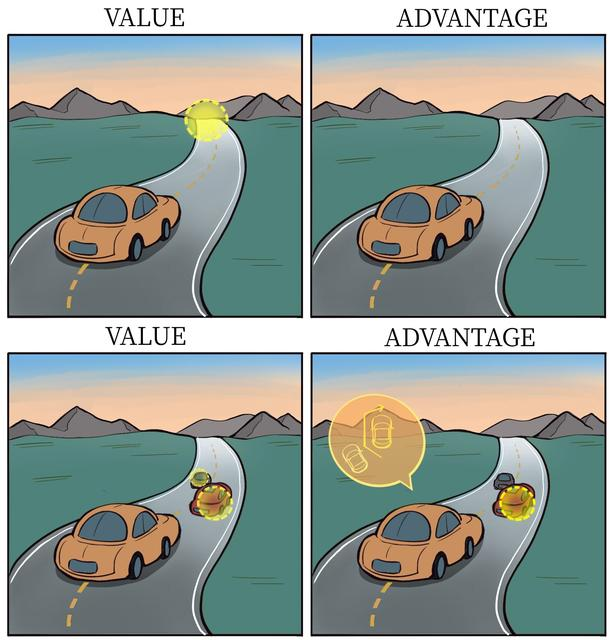

# 11.7 Dueling DQN

In DQN, $Q$ depends jointly on state $s$ and action $a$. In some states, however, the agent needs only to know “whether the current environment is good” (the $V$ value), regardless of differences between actions. Only when actions must avoid danger or earn points does it need to know “which action is better than average” (the $A$ value). Modeling these separately lets $V(s)$ focus on the overall situation, assessing whether the environment is good, while $A(s,a)$ focuses on details, assessing which actions are better and by how much. This decoupling allows $V(s)$ to be learned and updated from every sample (because $V(s)$ is the foundation whichever action is chosen), substantially improving training efficiency.

Scenario A (a long straight road without cars ahead): the screen (state $s$) suggests a stable situation likely to yield a high score. Steering slightly left or right (action $a$) has little effect on the final score.

- Conclusion: $V(s)$ (state value) is high, while differences in $A(s,a)$ (action advantage) are small. The network need not laboriously learn each action's specific value; knowing “this is a good place” is enough.

Scenario B (an obstacle ahead requiring a sharp turn): state $s$ is dangerous, and poor control causes a crash.

- Conclusion: action selection is crucial. Turning left may lead to survival and right to failure, so differences in action advantage $A(s,a)$ are large.
We therefore split Q as:

$$
Q(s,a;\theta,\alpha,\beta)=V(s;\theta,\beta)+A(s,a;\theta,\alpha)
$$

- $\theta$: shared parameters (convolutional layers), extracting general image features such as edges, shapes, and object positions, useful both for assessing the situation and choosing actions.
- $\beta$: value-stream parameters (fully connected layers), mapping features to scalar $V$.
- $\alpha$: advantage-stream parameters (fully connected layers), mapping features to vector $A$ with dimension equal to the number of actions.
The problem is that we calculate and update $Q$ values: how can $V$ and $A$ be recovered from $Q$?

Enumerate all actions $a'$ in the same state $s$. Their relative $Q$ values also give their relative $A$ values. One solution, for a given $s$, takes action $a^*$ maximizing $Q(s,a')$, sets $A(s,a^*)=0$ (the maximum advantage), and $V(s)=Q(s,a^*)$:

Option A: max constraint (theoretically optimal)

$$
Q(s,a)=V(s)+(A(s,a)-\max_{a'}A(s,a'))
$$

- Mathematical meaning: force the maximum advantage to $0$.
Another solution sets the mean advantage over all actions to 0:

Option B: mean constraint (optimal in engineering practice)

$$
Q(s,a)=V(s)+(A(s,a)-\frac{1}{|\mathcal{A}|}\sum_{a'}A(s,a'))
$$

- Mathematical meaning: force the sum of all advantages to $0$, equivalently their mean to $0$.
- Why it is better: $\max$ is nonlinear, passing gradients only at the maximum and giving gradients of $0$ elsewhere; the mean sums all actions, allowing smooth gradient flow to every action-advantage output node.
- Noise resistance: the mean is less sensitive to outliers, stabilizing training.
Although this does not strictly satisfy the Bellman optimality equation, it is better in engineering practice, for the following reasons:

- Mathematical meaning: force the sum of all advantages to $0$ (equivalently their mean to $0$).
- Why it is better:
  - Gradient stability: $\max$ is nonlinear, passing gradients only at the maximum and giving gradients of $0$ elsewhere. The mean sums all actions, allowing smooth gradient flow to every action-advantage output node.
  - Noise resistance: the mean is less sensitive to outliers, stabilizing training.

## References

- Wang, Z., Schaul, T., Hessel, M., van Hasselt, H., Lanctot, M., & de Freitas, N. (2016). [Dueling Network Architectures for Deep Reinforcement Learning](https://arxiv.org/abs/1511.06581). ICML 2016.
- [Hands-on Reinforcement Learning (translated title; in Chinese)](https://hrl.boyuai.com/).
