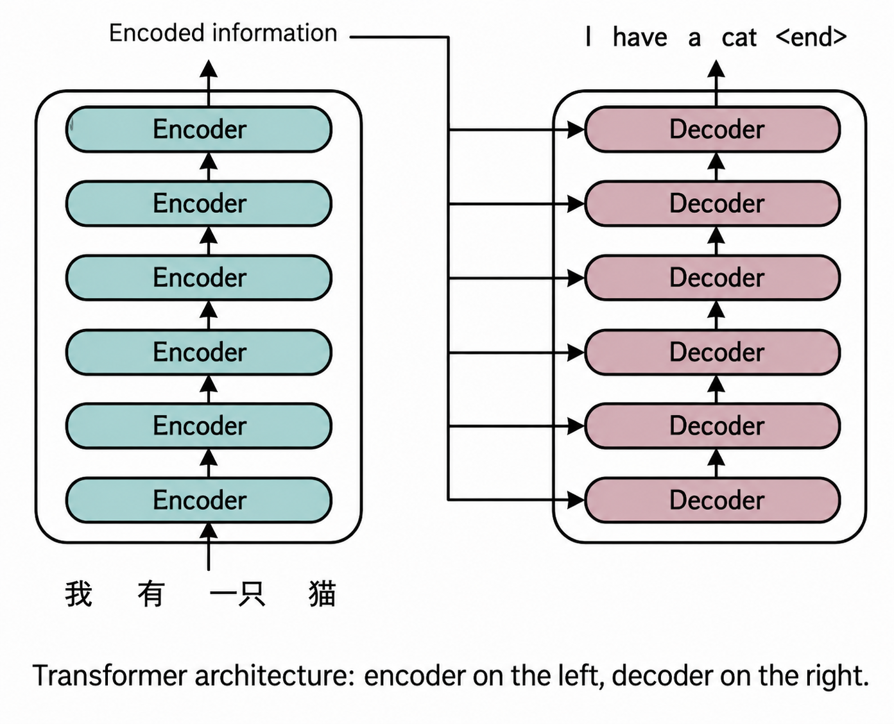
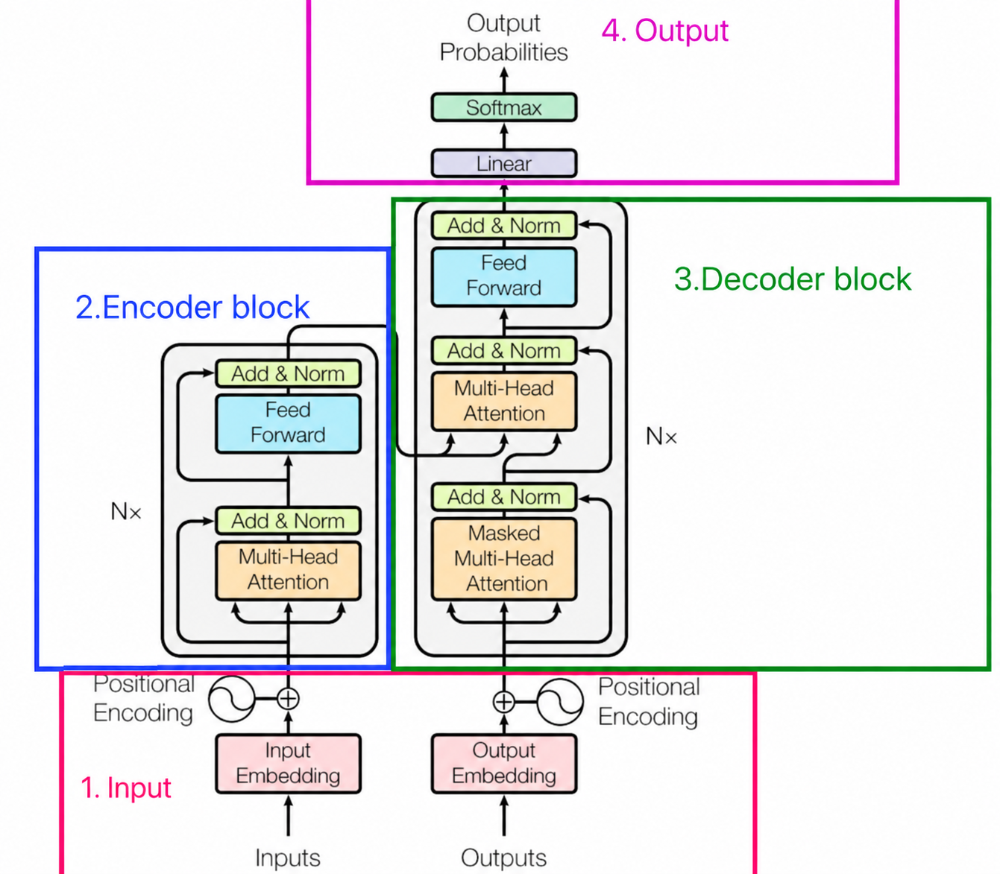

# 15.3 Transformer

Transformer is an architecture proposed by Google in 2017 and is the foundation of all current large-model architectures.

Overall Transformer architecture: the encoder is on the left, and the decoder is on the right.

## I. Input

1. “Inputs” at the lower left denotes the input sequence, while “Outputs (shifted right)” at the lower right denotes the output content (in fact, only content generated before the current time step is provided, to train predictive ability).

2. Word embedding: each word is mapped to a fixed-length vector. For example, “cat” might be represented as `[0.1, -0.4, 0.8, ...]`. These vectors are random at the beginning of training. The model gradually learns to give words with similar meanings (such as “cat” and “tiger”) more similar vectors.

3. Positional encoding: because the Transformer abandons the sequential structure of an RNN, the subsequent encoder cannot itself perceive word positions. Without positional information, “I hit you” and “you hit me” look the same to the model. To address this, a “positional signal” must be added to each word vector. Positional encoding is introduced later.

## II. Encoder Block

1. Multi-head self-attention: the encoder's core reads the input and uses multi-head self-attention to obtain intermediate representations rich in contextual information, layer by layer.

2. Add: following residual neural networks, the result is added directly to the input.

3. Layer normalization: this normalizes the result of the previous step, making training more stable and faster and reducing sensitivity to parameter initialization. We use layer normalization (LN) rather than batch normalization (BN). Their difference is as follows:

Suppose the input has shape [Batch_Size, Seq_Len, d_model], for example [32, 10, 512] (32 sentences, 10 words per sentence, and 512 dimensions per word).

Batch normalization (BN) takes a “vertical slice”: it fixes the feature dimension and computes the mean and variance across the entire batch. For the i-th feature dimension (say, dimension 0), it collects dimension 0 of the words at all positions in the 32 sentences and averages them. This is very problematic in NLP. Sentences have different lengths (usually equalized through padding), words at different positions have very different semantics, and the distributions of individual feature dimensions often differ naturally across passages. Forcing dimension 0 of every word to follow a normal distribution is unreasonable. It effectively “distorts” the embedding space, changes similarities between vectors, and directly damages the semantic information stored in that space.

Layer normalization (LN) takes a “horizontal slice”: it fixes the sample (token) and computes the mean and variance across all dimensions of that token itself. For the first word in the first sentence (a 512-dimensional vector), it computes the mean and variance of those 512 values and then rescales them. This essentially removes differences in vector magnitude, making each token's features approximately follow N(0,1), so that the dot product can approximately represent cosine similarity, that is, semantic similarity. LN pulls all vectors back near the same “unit spherical shell,” allowing the model to focus on learning directions (how features are combined, that is, semantics) rather than numerical magnitudes.

4. Feed forward: after each attention layer, both the encoder and decoder contain a simple feed-forward neural network. This network independently applies a nonlinear transformation to the vector at each position. It consists of two linear layers and a ReLU activation function, and can be viewed as further processing and refining the information extracted by attention, increasing the model's nonlinear capacity.

## III. Decoder Block

1. Masked multi-head self-attention

(1) Purpose and operation: “looking back at what has already been written.” When generating the next word, the decoder needs to know what it has already written to ensure sentence coherence. For example, after writing “I am a,” the next word is likely to be “cat” rather than another “I.” This is almost identical to self-attention in the encoder: both compute relationships between words within a sequence.

(2) Why is a mask needed?

During training, the complete translation is already known (for example, “I am a cat”). Without a mask, when predicting “am,” the model could “peek” at the following “a” and “cat.” This is clearly cheating, and the model would not learn genuine predictive ability.

(3) How is masking implemented?

The mask is an “upper-triangular matrix” applied after attention scores are calculated but before Softmax. It forces the attention scores for all future positions $(i,j)$ ($i>j$), that is, the dot products of $q_i$ and $k_j$, to a negative number with an extremely large magnitude (such as $-10^9$).

Effect: after Softmax, a negative number of extremely large magnitude has a corresponding weight arbitrarily close to 0. Thus, when the model calculates the output at any position, its attention weights can only be distributed over the current and preceding positions, ensuring that the model cannot “see the future.”

2. Encoder–decoder attention / cross-attention

(1) Purpose: this is the central bridge between encoder and decoder. At each step of translation generation, it allows the decoder to attend to the most relevant part of the source text. The decoder uses its current understanding (Q) to query the source text's full information (K and V), determining which part is most important for generating the next word.

(2) Operation: this is also a multi-head attention layer, but its $Q,K,V$ come from different sources:

Query vector (Q): from the output of the decoder's preceding sublayer (the masked self-attention layer). This Q vector represents the current needs of the “writing department”: “Given what I have already written (such as 'I am'), what information do I now need to decide the next word?”

Key vector (K) and value vector (V): both come from the final output of the encoder stack (the final close-reading notes from the “understanding department”). These two vectors represent the full information in the source text and remain fixed throughout decoding.

(3) Analogy: the decoder (the writer) takes its draft (the Q vector) to the encoder (the source-text summary) and asks, “My draft has reached this point; which part of your source text is most relevant to what I need to write now?” The encoder answers through its K and V vectors, and the decoder obtains key clues for generating the next word. For example, when the decoder reaches the position corresponding to “cat,” this layer's attention concentrates strongly on the encoder-output vector representing “cat.”

3. Position-wise feed-forward network

(1) Purpose: “digesting and integrating information, and thinking more deeply.”

(2) Operation: this sublayer is identical to the feed-forward network in the encoder. It takes the output vector from encoder–decoder attention and applies a nonlinear transformation.

(3) Analogy: after reviewing what it has written (masked self-attention) and consulting the source text (encoder–decoder attention), the decoder needs an “independent thinking” process to integrate, process, and refine this information, ultimately producing a highly condensed vector ready to predict the next word. The feed-forward network performs this “independent thinking.”

## IV. Output

1. Which part of the attention layer's output matrix is used?

The attention layer's output matrix has shape `[seq_len,d_model]`, where `seq_len` is the input sequence length.

Our goal is to predict the next token in the sequence (for example, the fourth word). We only need to consider the output vector obtained after the model processes the last token in the sequence (the third word). Under masked self-attention, the last token's vector $h$ has already aggregated all historical information in the sequence.

If the desired result is a context-rich sequence obtained after interactions within the original sequence, output the token sequence corresponding to the entire matrix.

2. Calculating similarity

After obtaining the output vector, we convert it to an output token by computing its dot-product similarity with every token in the vocabulary. This can be expressed through matrix multiplication as $hW$ ($W$ is the output-layer weight matrix, with each row viewed as the embedding vector of the corresponding vocabulary word), followed by Softmax to produce the output.

Why can the dot product serve as a similarity measure? We begin with cosine similarity:

Suppose two different images of cats correspond to vectors $x$ and $y$, and we want their Euclidean distance to be small. In the few signal dimensions associated with contours, fur, and similar characteristics, $x_i$ and $y_i$ may be very similar, making $(x_i-y_i)^2$ small. However, across the vast number of noise dimensions associated with grass, lighting, camera angle, and so on, $x_i$ and $y_i$ have small random differences. Each $(x_i-y_i)^2$ may be small, but these terms are overwhelmingly numerous.

The $L_2$ measure of Euclidean distance is essentially an indiscriminate accumulator:

$$
d^2(x,y)=\sum_{i\in\text{Signal}}(x_i-y_i)^2+\sum_{j\in\text{Noise}}(x_j-y_j)^2
$$

It treats small differences in signal dimensions and random differences across vast numbers of noise dimensions equally, adding their squares together. The resulting total distance may be dominated by the sum of noise terms, making it unsuitable as the primary similarity measure for high-dimensional semantic vectors.

Cosine similarity measures how close two vectors are in direction, directly ignoring their absolute lengths:

$$
d_{\cos}(x,y)=\frac{x\cdot y}{\|x\|\|y\|}=\frac{\sum_{i=1}^{D}x_i y_i}{\sqrt{\sum_{i=1}^{D}x_i^2}\sqrt{\sum_{i=1}^{D}y_i^2}}
$$

Direction is more robust than length as a measure and carries cleaner anisotropic signals:

- In high dimensions, random background noise is almost orthogonal, so its dot product is very close to 0.
- The signal dimensions that constitute a cat show consistent directionality across vectors for different cat images, and the dot product can reinforce this.

In practice, large models mostly use dot-product similarity, for the following reasons:

(1) Efficiency and computational simplicity: the dot product (A · B) is inherently simpler and more efficient than cosine similarity (which first calculates the dot product and then divides by the product of the vector magnitudes ||A|| * ||B||). In autoregressive generation, a similarity score must be calculated for every word in the vocabulary (usually tens or even hundreds of thousands). The dot product can significantly reduce computation.

(2) Natural compatibility with Softmax: the model's learning process has already internalized adjustments to vector “length,” and the lengths of the different vectors are nearly the same. The scores computed by dot products (usually called logits) are then fed directly into Softmax to obtain a probability distribution over the next word. Dividing all word scores by vector magnitudes, or not dividing any of them, has no effect on the probability distribution after Softmax, so this step can be omitted without affecting model performance.

3. Autoregressive output

Each time, the model takes the preceding sequence $[x_1,\ldots,x_{i-1}]$ as input and outputs a token $x_i$, then uses $[x_1,\ldots,x_i]$ as the new input, and so on. The cycle “input -> decoder stack -> linear layer -> Softmax -> word selection” continues until the selected word is the special end-of-sentence token `</s>`. This process is sequential.

## References

- Vaswani, A., Shazeer, N., Parmar, N., et al. (2017). [Attention Is All You Need](https://arxiv.org/abs/1706.03762). NeurIPS 2017.
