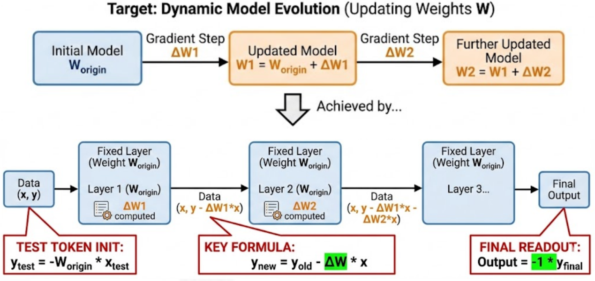

# 15.6 Equivalence Between Attention and Gradient Descent

The Transformer's attention layer, including the residual stream, can as a whole be viewed as gradient-descent optimization of a regression problem.

## I. The Expression for Linear Attention

For a set of tokens (the model's input sequence) $\{e_1,\ldots,e_n\}$ and a query (test) token $e_{\mathrm{test}}$, an attention layer without Softmax (a linear attention layer; the case with Softmax is discussed later) gives:

$$
\mathrm{Output}_{\mathrm{test}}=e_{\mathrm{test}}+PVK^\top q_{\mathrm{test}}
\tag{1}
$$

The input itself is added because of the residual connection; $P$ is the output projection matrix. Viewing $V$ as $(v_1,\ldots,v_t)$ and $K$ as $(k_1,\ldots,k_t)$ gives $VK^\top=\sum_i v_i k_i^\top$, so:

$$
\mathrm{Output}_{\mathrm{test}}=e_{\mathrm{test}}+P\sum_i v_i k_i^\top q_{\mathrm{test}}
\tag{2}
$$

Expressed in an RNN-like form:

$$
S_t=S_{t-1}+v_t k_t^\top
$$

$$
\mathrm{Output}_t=\mathrm{input}_t+PS_tq_t
$$

These equations mean that the hidden-state matrix $S$ constructs a mapping from $K$ to $V$, and its output for input $q_t$ is added as a residual. Ignoring the projection $P$, $V$ here effectively fits the “residual between output and input.”

## II. Constructing a Linear Model and Proving the Equivalence

Suppose we are performing in-context learning, with a series of examples (demonstration data), $(x_1,y_1),(x_2,y_2),\ldots,(x_N,y_N)$, and a new query input $x_{\mathrm{test}}$.

In the Transformer, each token concatenates input features and a label. Define the context matrices as:

$$
X=[x_1,x_2,\ldots,x_N],\qquad Y=[y_1,y_2,\ldots,y_N]
$$

**Input token:** suppose input features $x_i$ and target label $y_i$ are concatenated into a column vector to form a token:

$$
e_i=\begin{pmatrix}x_i\\y_i\end{pmatrix}
$$

Introduce a reference linear model $y(x)=Wx$, parameterized by a weight matrix $W\in\mathbb{R}^{N_y\times N_x}$, and a training dataset $D=\{(x_i,y_i)\}_{i=1}^{N}$ containing inputs $x_i$ and labels $y_i$. The learning objective is to minimize squared-error loss:

$$
L(W)=\frac{1}{2N}\sum_{i=1}^{N}\|Wx_i-y_i\|^2
$$

Gradient descent (the update rule for the dynamic model) is then:

$$
\Delta W=-\eta\nabla_W L(W)=-\frac{\eta}{N}\sum_{i=1}^{N}(Wx_i-y_i)x_i^\top
\tag{3}
$$

Here, $Wx_i-y_i$ corresponds to $v_i$ above (rather than $y_i$ corresponding to $v_i$), representing the “gap between the output under the original weights ($W_0x_i$) and the desired output (label $y_i$)”; $x_i$ corresponds to $k_i$; and $\eta/N$ corresponds to $P$. This means that each input batch changes $W$ by $-P\sum_i v_i k_i^\top$.

Thus, this weight matrix $W$ differs from the hidden-state matrix $S$ discussed earlier. $W$ is implicit and maps $x$ to the final $y$, while $S$ is explicit and maps $k$ to $v$ (the residual $Wx-y$). $\Delta W$ is proportional to $S$, and one gradient-descent step on $W$ amounts to applying the gradients of all context tokens stored in $S$. $(W+\Delta W)x_{\mathrm{test}}$ corresponds to $\mathrm{input}_t+S_tq_t$.

For the test token:

$$
e_{\mathrm{test}}=\begin{pmatrix}x_{\mathrm{test}}\\y_{\mathrm{init}}\end{pmatrix}
$$

Initialize $y_{\mathrm{init}}$ to $-W_0x_{\mathrm{test}}$ (the reason this is possible is explained later). Construct $W_Q$, $W_K$, and $W_V$ so that:

The query vector of the current query token $j$ is:

$$
q_j=W_Q e_j=\begin{pmatrix}I_x&0\\0&0\end{pmatrix}\begin{pmatrix}x_j\\y_j\end{pmatrix}=\begin{pmatrix}x_j\\0\end{pmatrix}
$$

The key vector of context token $i$ is:

$$
k_i=W_K e_i=\begin{pmatrix}I_x&0\\0&0\end{pmatrix}\begin{pmatrix}x_i\\y_i\end{pmatrix}=\begin{pmatrix}x_i\\0\end{pmatrix}
$$

The value vector of context token $i$ is:

$$
v_i=W_V e_i=\begin{pmatrix}0&0\\W_0&-I_y\end{pmatrix}\begin{pmatrix}x_i\\y_i\end{pmatrix}=\begin{pmatrix}0\\W_0x_i-y_i\end{pmatrix}
$$

Compute attention:

$$
k_i^\top q_j=(x_i^\top,0)\begin{pmatrix}x_j\\0\end{pmatrix}=x_i^\top x_j
$$

$$
\sum_{i=1}^{N}v_i(k_i^\top q_j)=\sum_{i=1}^{N}\begin{pmatrix}0\\W_0x_i-y_i\end{pmatrix}(x_i^\top x_j)
$$

$$
PVK^\top q_j=\begin{pmatrix}\eta/N&0\end{pmatrix}\left(\sum_{i=1}^{N}(W_0x_i-y_i)x_i^\top x_j\right)
$$

This “aggregation” of $W_0x-y$ over the context can be viewed as yielding $W_0x_{\mathrm{test}}-y_{\mathrm{test}}$. What we want is the predicted $y$ obtained through this contextual aggregation, $y_{\mathrm{test}}=(W_0+\Delta W)x_{\mathrm{test}}$. The lower part of the preceding expression can therefore be viewed as $W_0x_{\mathrm{test}}-y_{\mathrm{test}}=-\Delta W x_{\mathrm{test}}$, that is, “original output minus desired output.” This matches the earlier expression for $\Delta W$, so:

$$
PVK^\top q_j=\begin{pmatrix}0\\-\Delta W x_j\end{pmatrix}
$$

For the test token, Equation (1) is therefore equivalent to:

$$
\mathrm{Output}
=\begin{pmatrix}x_{\mathrm{test}}\\-W_0x_{\mathrm{test}}\end{pmatrix}
+\begin{pmatrix}0\\-\Delta W x_{\mathrm{test}}\end{pmatrix}
=\begin{pmatrix}x_{\mathrm{test}}\\-(W_0+\Delta W)x_{\mathrm{test}}\end{pmatrix}
\tag{4}
$$

Negating the lower part of this expression gives the output that should be produced after the parameter transformation (using $W_0+\Delta W$), that is, the output of the attention module.

## III. Why Does Equation (4) Have a Minus Sign? If $y_{\mathrm{test}}=Wx_{\mathrm{test}}+\Delta Wx_{\mathrm{test}}$, Why Subtract $\Delta Wx_{\mathrm{test}}$ Here?

This requires analysis from the perspective of multiple optimization rounds. In a large model, multiple attention layers often process data sequentially. Each round transforms input $x_{\mathrm{test}}$ into output $y_{\mathrm{test}}$, which becomes the new $x_{\mathrm{test}}$ for the next attention layer. This is equivalent to repeatedly updating the weights of a linear layer. When $x_{\mathrm{test}}$ is first input (with weights $W_0$), one gradient-descent step is performed (changing the weights to $W_0+\Delta W$), and $y_{\mathrm{test}}$ is output. It is then used as a new input $x_{\mathrm{test}}$ (with the other $x_i$ and $y_i$ retaining their original values) to the model whose weights are now $W_0+\Delta W$. Gradient descent and inference are performed again using the context, and the process repeats.

This model is indeed a valid equivalence. However, the Transformer's actual weights remain fixed, so we seek another equivalent transformation in which $W$ stays fixed while the contextual $y_i$ changes, matching the expression for the Transformer's static structure (Equation (1)) more closely. Apart from calculating the output (which we already know how to do), the only “use” of the “current $W$” is gradient descent. Equation (3) shows that the gradient-descent magnitude for a linear layer is proportional to the residual $Wx_i-y_i$. Changing $W$ from $W_0$ to $W_0+\Delta W$ is therefore equivalent to reducing each context token's label $y_i$ by $\Delta Wx_i$, leaving the loss, residual, and optimization state unchanged. We can thus assume a model consisting of multiple linear layers in sequence, each with parameters $W$, while changing the contextual $y_i$:

$$
y_i^{new}=y_i-\Delta W x_i
$$

The next layer's $W$ is unchanged, but its context tokens now contain $y_i^{new}$ rather than the original $y_i$. That layer similarly processes $y_i^{new}$, and so on. Changes to the context thereby implement the equivalent of changes to the weights.

However, a problem arises: a self-attention layer does not distinguish context tokens from the test token. To keep the residual unchanged, we subtract $\Delta Wx_i$ from $y_i$, but $y_{\mathrm{test}}=W_0x_{\mathrm{test}}+\Delta Wx_{\mathrm{test}}$, which has the opposite sign. We therefore choose $y_{\mathrm{init}}=-W_0x_{\mathrm{test}}$. Subtracting $\Delta Wx_{\mathrm{test}}$ then gives exactly $-W_0x_{\mathrm{test}}-\Delta Wx_{\mathrm{test}}$, which only needs to be multiplied by an output projection matrix whose diagonal entries are all $-1$.

- Passing through attention layer 1 (gradient-descent step 1): layer 1 calculates a gradient increment $\Delta W_1$ from the current context. The residual connection adds it:

$$
y_{1,test}=y_{0,test}-\Delta W_1x_{\mathrm{test}}=-(W_0+\Delta W_1)x_{\mathrm{test}}
$$

- Passing through attention layer 2 (gradient-descent step 2): layer 2 reads $y_{1,test}$ and calculates a new gradient increment $\Delta W_2$. The residual connection adds it again:

$$
y_{2,test}=y_{1,test}-\Delta W_2x_{\mathrm{test}}=-(W_0+\Delta W_1+\Delta W_2)x_{\mathrm{test}}
$$

- Passing through attention layer $K$ (gradient-descent step $K$): continuing in this way, after $K$ layers, the test token's $y$ becomes:

$$
y_{K,test}=-W_0x_{\mathrm{test}}-\sum_{k=1}^{K}\Delta W_k x_{\mathrm{test}}
$$

$$
\hat{y}_{\mathrm{final}}=-y_{K,test}=W_0x_{\mathrm{test}}+\sum_{k=1}^{K}\Delta W_k x_{\mathrm{test}}
$$

We have thus transformed a linear model undergoing continuous gradient descent into an equivalent sequence of linear layers with fixed weights. Data flows in one direction between layers, and each layer subtracts $\Delta Wx$ from the $y$ values of all tokens (both context and test tokens). Each such layer corresponds one to one with an attention layer in the Transformer. Notably, $W_0$ is not explicitly stored as a weight matrix in the Transformer but is maintained implicitly (although it too is fixed). In the earlier derivation, we constructed:

$$
W_V=\begin{pmatrix}0&0\\W_0&-I_y\end{pmatrix}
$$

Thus, here it is determined by $W_V$.

Summary: a standard Transformer cannot conjure up and store a real weight matrix W internally. It can only “simulate” gradient descent by modifying the dataflow (residuals). This “awkward” approach is used to ensure consistency of the optimization state across multiple Transformer layers.

## IV. What Happens in Actual Large Models

### (1) The “Transport” Mechanism and Induction Heads

So far, we have only proved theoretically that “self-attention is capable of gradient descent.” We assumed that each context token concatenates input features and a label. Real-world text clearly does not usually satisfy this assumption: input features and labels generally appear at arbitrary positions across different tokens. Faced with such a real, irregular sequence, the first Transformer layer (including Softmax) does not directly calculate gradients. Instead, it learns a data-preprocessing function. For each token containing y, it uses the matching scores between q and K to find the token containing the corresponding x (not necessarily adjacent to x, and not necessarily just one token), “transports” x into the token containing y, and then uses the subsequent linear layer to “organize” the vector into an (xi,yi) concatenation like the one required in the earlier proposition.

This transport mechanism closely matches the “induction head” phenomenon previously discovered by Anthropic and considered crucial to in-context learning. The first layer performs the induction head's copying operation, paving the way for subsequent layers to perform actual gradient descent (the logic derived above) and learn from the context. Softmax is critical here: “transport” requires the current token to concentrate 100% of its attention on the target token (with the required corresponding x), completely ignoring every other token in the sequence. Only “winner-takes-all” Softmax can accomplish this. A purely linear operation tends to mix the features of all tokens together into a blur, preventing extraction of an exceptionally clean, single x by excluding interference from other tokens.

### (2) Why It Is Reasonable to Set $y_{\mathrm{init}}=-W_0x_{\mathrm{test}}$

As for constructing $y_{\mathrm{init}}$ as $-W_0x_{\mathrm{test}}$, when actually training a Transformer, initializing attention weights to very small values allows us to approximate $W_V=0$. The earlier analysis then gives $W_0=0$ and $-W_0x_{\mathrm{test}}=0$. The actual model's first layer (induction heads) also learns to transform $y_{\mathrm{init}}$ actively to a value near 0. The initial prediction for a test token is therefore 0, after which the calculated gradients accumulate through layer-by-layer residual connections.

It is also worth noting that this pattern generally appears only in some layers and some heads of multi-head attention; the reasons are explained later.

### (3) Excluding $y_{\mathrm{init}}$ from the Calculation of $\Delta W$

In in-context learning, the input sequence has the form:

$$
\mathrm{Input}=[(x_1,y_1),(x_2,y_2),\ldots,(x_N,y_N),(x_{\mathrm{test}},y_{\mathrm{init}})]
$$

We learn a linear regression model through gradient descent on the context (more precisely, the text preceding the test token), then use it to predict the $y$ corresponding to $x_{\mathrm{test}}$. Clearly, $y_{\mathrm{init}}$ should not be mixed into the data used to train this linear regression model. Nevertheless, self-attention treats it “equally” and includes it in calculating $\Delta W$.

One solution is masking: set all diagonal entries of the attention-weight matrix to negative infinity. During training, this changes the attention matrix from “lower triangular” to “strictly lower triangular,” invalidating highly optimized operators such as Flash Attention designed for the usual “lower-triangular matrix.”

In practice, however, this is often unnecessary, because the previous derivation gives:

$$
V_t = W_0 x_t - y_t
$$

From the earlier analysis, $-W_0x_{\mathrm{test}}=0$, and the actual model's first layer (induction heads) also learns to transform $y_{\mathrm{init}}$ actively to a value near 0. This means $V_{\mathrm{test}}=0$. Even if its attention weight is not forced to zero, the value it multiplies is $V_{\mathrm{test}}=0$, so it adds nothing to the result and does not affect the calculation of $\Delta W$.

Of course, a real large model cannot simply set the values of all test tokens to 0 and discard their own information. Large models have enormous feature dimensions (subspaces) and complex divisions of labor across heads and layers. Only some layers and some heads operate as described here to implement in-context learning. In other layers and heads, the test token's value still participates in aggregation, performing other functions such as semantic processing of that token. The real model does not discard the test token's value globally; it assigns “semantic extraction” and “error-gradient calculation” to different attention heads for parallel processing.

It is worth mentioning that attention sinks in models may have a similar mechanism:

Each Transformer layer follows: output = input + attention result.

In a deep network (such as a 100-layer model), some layers may often find the current features (input) already satisfactory, with no need for additional contextual information. Ideally, they would do nothing, letting the features flow unchanged through the residual pathway into the next layer. In other words, the model wants attention result = 0, yielding output = input + 0.

However, attention includes a particularly demanding mathematical formula: Softmax. It requires all token attention weights to sum to exactly 1.0.

Forced to allocate 100% of its attention while wanting to leave the features unchanged, a large model (such as Llama or GPT) discovers a trick during extensive pretraining:

1. Find a sink token to serve as a scapegoat: the model usually selects the sequence's first token (such as `<s>`) or its first punctuation mark.
2. Turn its value into 0: during parameter training, the model learns a special state for the weight matrix extracting this scapegoat's value, so that $V_{sink} \approx 0$.
3. Dump unused attention: when the model “does not want to attend to any context” in a layer, it assigns as much as 99% of its attention score to this scapegoat.

The result follows: multiplying this 99% attention weight by the scapegoat's $V_{sink}$ gives:

$$
0.99 \times 0 = 0
$$

The whole attention branch then produces 0: output = input + 0. The model successfully meets Softmax's strict requirement while doing nothing at all and preserving the original features.

### (4) Which Tokens Have Their V Set to Zero in Practice?

In an actual autoregressive sequence, the input does not consist of assembled $(x,y)$ pairs. Instead, each $x$ and $y$ appears in a separate token, for example in the alternating sequence $x_1,y_1,x_2,y_2,\ldots,x_{19},y_{19},x_{20}$.

When generating $y_{19}$ ($y_{19}$ has not yet been produced and is initialized to $0$; the test token is $x_{19}$):

* Shallow-layer processing: because this is a newly input token, it has no corresponding $y_{19}$ yet. Its hidden state can only be $(x_{19},0)$.
* Deep layers (gradient-descent layers): the deeper network extracts its value vector. From $V = W_0x - y$, this gives $V_{19}=W_0x_{19}-0 \approx 0$.
* Result: it acts exactly as the test token, using $V_{19}=0$ to compute attention with the preceding KV cache and output the prediction $\hat{y}_{19}$.

At this point, gradient descent uses $(x_1,y_1),(x_2,y_2),\ldots,(x_{18},y_{18})$. The $V$ of the $x_{19}$ token is therefore fixed at $0$ in the KV cache.

Note: these deep layers are not the final output layer, but only some heads in some hidden layers. The final output layer's value vector is not 0, so there is no need to worry about information loss.

When generating $x_{20}$ (the test token is $y_{19}$):

* Shallow-layer processing (the copying mechanism activates): the first layer of the large model (usually Softmax induction heads) has a broad temporal view. When processing $y_{19}$ at position 20, it looks back at $x_{19}$ at position 19 and **copies** the features of $x_{19}$ into its own hidden state.
* Deep layers (gradient-descent layers): when the data reaches the deeper layers, the hidden state at position 20 is no longer merely $y_{19}$; the shallow layers have assembled it into the complete context pair $(x_{19},y_{19})$.

Gradient descent still uses $(x_1,y_1),(x_2,y_2),\ldots,(x_{18},y_{18})$. (It cannot include $(x_{19},y_{19})$, because that is the test token.)

$V_{y_{19}}=W_0x_{19}-y_{19}\ne 0$. After this computation, the KV cache contains a nonzero $V_{y_{19}}$.

When generating $y_{20}$ (the test token is $x_{20}$):

$x_{20}$ acts as the query and traverses the previous KV cache.

Gradient descent now uses $(x_1,y_1),(x_2,y_2),\ldots,(x_{18},y_{18}),(x_{19},y_{19})$.

For $x_{19}$, $V_{19}=0$, so the product is $0$ and it is ignored. For $y_{19}$, $V_{y_{19}}=W_0x_{19}-y_{19}\ne 0$, providing gradient information for the 19th sample.

### (5) Does the Transformer Only Perform Basic Gradient Descent Internally?

Some subsequent studies have reported that, when given severely ill-conditioned data (an extremely imbalanced feature matrix), a Transformer performs far better than ordinary gradient descent. Analyses of intermediate-layer outputs suggest that its internal convergence trajectory may automatically become similar to an iterative Newton method, allowing it to learn a new task almost instantly from very few few-shot examples.

## V. The Case with Softmax

### (1) The Single-Head Softmax Problem: Introducing a Linear Offset

A single-layer, single-head Softmax self-attention layer cannot fully match the performance of ordinary gradient descent. Fundamentally, Softmax's exponential operation and normalization denominator introduce an additional error term in matrix multiplication. A first-order Taylor approximation illustrates this.

In self-attention, Softmax is applied to attention scores (the inner products of queries and keys). For current query token $x_j$ and the $i$-th context token $x_i$, the unnormalized attention score is:

$$
z_i = k_i^T q_j = x_i^T W_{KQ}x_j
$$

Feeding the scores for all $N$ context tokens into Softmax gives the output at position $i$:

$$
\mathrm{softmax}(z)_i = \frac{e^{z_i}}{\sum_{k=1}^{N} e^{z_k}}
$$

From the first-order Taylor expansion in calculus, as $z \to 0$, the exponential function can be approximated by:

$$
e^z \approx 1 + z
$$

Substitute this approximation into the numerator and denominator of Softmax:

* Numerator:

$$
e^{x_i^T W_{KQ}x_j} \approx 1 + x_i^T W_{KQ}x_j
$$

* Denominator:

$$
\sum_{k=1}^{N} e^{x_k^T W_{KQ}x_j} \approx \sum_{k=1}^{N}(1+x_k^T W_{KQ}x_j)
$$

Writing the numerators for all $N$ tokens as a column vector:

$$
\begin{pmatrix}
1+x_1^T W_{KQ}x_j \\
\vdots \\
1+x_N^T W_{KQ}x_j
\end{pmatrix}
= \mathbf{1}+
\begin{pmatrix}
x_1^T W_{KQ}x_j \\
\vdots \\
x_N^T W_{KQ}x_j
\end{pmatrix}
= \mathbf{1}+K^Tq_j
$$

Here, $\mathbf{1}$ is an all-ones column vector. Let the denominator's sum be the scalar $S$. The Softmax output vector can then be written as:

$$
\mathrm{softmax}(K^Tq_j) \approx \frac{1}{S}(\mathbf{1}+K^Tq_j)
= \frac{1}{S}K^Tq_j+\frac{1}{S}\mathbf{1}
$$

Therefore:

$$
\mathrm{softmax}(K^Tq_j) \propto K^Tq_j+\mathbf{1}
$$

Interpretation: this $\epsilon$ is a constant linear offset. It means that even when some tokens are entirely unrelated to the current query (with inner product $x_i^TW_{KQ}x_j=0$), Softmax still forces them to receive a baseline weight ($\frac{1}{S}$). This “forced equal allocation” contaminates the originally clean gradient direction, preventing single-head Softmax attention from performing gradient descent perfectly.
Even tokens with negative inner products (potentially corresponding to incorrect directions in the mathematical derivation) receive positive weights. This is clearly unreasonable.

### (2) How Multi-Head Softmax Solves This Problem

As noted earlier, Softmax is indispensable to induction heads, so removing it directly cannot improve in-context learning. However, because the offset 1 (epsilon) is constant, multi-head Softmax can cancel it by subtracting the outputs of different heads:

Suppose the model learns two attention heads, and the final output projection layer learns weights with opposite signs for them, giving $P_1V_1 \approx -P_2V_2$. To simplify the expression, the paper assumes that their error-extraction matrices $PV$ are the same (or aligned by the network), while their internal attention-feature matrices $W_{KQ}$ learn different feature spaces.

Subtract the attention results of the two heads:

$$
\mathrm{Output} \approx PV \cdot \mathrm{softmax}(K_1^Tq_{1,j}) - PV \cdot \mathrm{softmax}(K_2^Tq_{2,j})
$$

Substitute the Taylor-approximation column vectors from the first part (the paper makes the reasonable assumption here that the two heads' Softmax denominator constants $S$ are approximately equal and absorbs them into $PV$):

$$
\mathrm{Output} \approx PV \left[
\begin{pmatrix}
1+x_1^TW_{1,KQ}x_j \\
\vdots
\end{pmatrix} - \begin{pmatrix}
1+x_1^TW_{2,KQ}x_j \\
\vdots
\end{pmatrix}
\right]
$$

Now subtract corresponding rows using elementary linear algebra. For row $i$:

$$
\begin{aligned}
(1+x_i^TW_{1,KQ}x_j)-(1+x_i^TW_{2,KQ}x_j)
&= 1-1+x_i^TW_{1,KQ}x_j-x_i^TW_{2,KQ}x_j \\
&= x_i^T(W_{1,KQ}-W_{2,KQ})x_j
\end{aligned}
$$

The constant term 1 (the unwanted $\epsilon$ offset) cancels exactly in the subtraction.

## VI. Why Does the Transformer, Despite Being a De Facto Meta-Learning Algorithm, Still Struggle with OOD Problems?

### (1) Difficulty in Feature Extraction

The premise of the preceding derivation is that the feature vector $x$ on which gradient descent is performed is a deep representation projected through the large model's embedding and MLP layers. The attention layer can be viewed as real-time gradient descent, that is, meta-learning; the embedding and MLP layers cannot. When an OOD problem arises (such as a data modality never before encountered by humans), the pretrained MLP has no feature coordinate system for that data. After entering the network, OOD data is mapped by the MLP into meaningless noise vectors, preventing successful feature extraction. Consequently, when subsequent attention layers execute $y_{new}=y_{old}-\Delta Wx$, the calculated gradients are also meaningless.

### (2) Limitations of Gradient Descent

The nature of gradient descent itself means that, on an OOD task, a large model's so-called “learning” is not genuinely searching for a global optimum. Instead, it searches the “pool of tasks” encountered in pretraining for a substitute most similar to the current OOD task. It can only interpolate on its existing manifold of prior knowledge, not extrapolate to a completely new physical space.

### (3) Insufficient Computational Depth

We proved that one Transformer layer equals one gradient-descent step. A 100-layer model can perform at most tens to around a hundred effective gradient-descent steps. A genuine OOD task (such as training a vision model from scratch) often needs tens or hundreds of thousands of gradient iterations to converge. A large model's extremely limited number of layers cannot provide sufficient computational depth to fit OOD parameters.

Of course, as RLVR improves model reasoning, the number of KV-cache updates and effective computational depth increase substantially over a task (with the context retained). “Compositional OOD” can often be solved: a completely new mathematics competition problem is OOD as a whole, but the model can decompose it into atomic steps (addition, subtraction, multiplication, division, and algebraic transformations) that lie within its prior feature space. Chains of thought learned through RL can recombine these known features through tens of millions of internal gradient-descent steps and ultimately solve the problem. This still does not work for “absolute OOD,” where the input's underlying features have no mapping in the model's MLP.

## VII. Equivalence of Optimization Problems

In neuropsychology, memory consists of neural updates caused by input, while learning is the process of acquiring effective and useful memories. We follow the definition of Behrouz and colleagues:

**Definition 1 (associative memory):** given a set of keys $\mathcal{K}\subseteq\mathbb{R}^{d_k}$ and values $\mathcal{V}\subset\mathbb{R}^{d_v}$, associative memory is an operator $\mathcal{M}:\mathcal{K}\to\mathcal{V}$ that maps between the two sets. To learn this mapping from data, define an objective function $\tilde{\mathcal{L}}(\cdot;\cdot)$ that measures its quality. $\mathcal{M}$ can be defined as:

$$
\mathcal{M}^*=\arg\min_{\mathcal{M}}\tilde{\mathcal{L}}(\mathcal{M}(\mathcal{K});\mathcal{V})
\tag{1}
$$

Explanation and derivation analysis:

* Core idea: “memory” is treated as a function $\mathcal{M}$. Conventionally, training a model means adjusting parameters. Here, training itself is viewed as searching a function space for an optimum, so that the function maps keys to values as well as possible.
* Interpretation: Equation (1) essentially states that the best memory state $\mathcal{M}^*$ minimizes prediction error. In deep learning, $\mathcal{K}$ usually denotes input data, $\mathcal{V}$ labels or targets, and $\tilde{\mathcal{L}}$ a loss function. What distinguishes NL is its view that every component inside a model—even the optimizer—solves such an equation.

Both the forward computation of an attention module and conventional “optimization” can in fact be viewed as such a process of “finding the optimal function.” We next derive the equivalence with gradient descent:

Suppose a single-layer MLP (with parameters $W$) is trained using gradient descent. Its optimization objective is:

$$
W^*=\arg\min_W\mathcal{L}(W;\mathcal{D}_{train})
$$

The gradient-descent rule makes the weight update equivalent to:

$$
W_{t+1}=W_t-\eta_{t+1}\nabla_{W_t}\mathcal{L}(W_t;x_{t+1})
$$

Here, $x_{t+1}$ is a batch of training data input at time $t+1$. Since $y_{t+1}=W_tx_{t+1}$, the gradient with respect to $W_t$ is the product of the gradient with respect to $y_{t+1}$ and $x_{t+1}$:

$$
W_{t+1}=W_t-\eta_{t+1}\nabla_{y_{t+1}}\mathcal{L}(W_t;x_{t+1})\otimes x_{t+1}
\tag{4}
$$

Let $W_t$ denote the model's current weights, $x_{t+1}$ the current input, and $y_{t+1}=W_tx_{t+1}$ the linear output under those weights. We call the loss $\mathcal{L}(W_t;x_{t+1})$ the “degree of surprise.” This is both because more accurate predictions produce less surprise and because the information-theoretic background of cross-entropy loss is itself “surprisal.”

Define the “surprise signal” as:

$$
u_{t+1}\triangleq \nabla_{y_{t+1}}\mathcal{L}(W_t;x_{t+1})
$$

Here:

* $W_t$: the model's current weights.
* $x_{t+1}$: the current input data.
* $y_{t+1}=W_tx_{t+1}$: the linear output under the current weights (assuming a single-layer MLP).
* $\mathcal{L}$: the loss function.

This can be understood as “the loss function's instruction to the neural network's output layer”: how to adjust the network's output y to minimize the loss.

A direct expression of prediction error: $u_{t+1}$ (that is, $\nabla_y\mathcal{L}$) directly measures the gap between the model's current output $y_{t+1}$ and the true label (or target).

For new data $x_{t+1}$ at time $t+1$, if the weights $W_t$ trained on existing data already transform the input into the correct label $y_{t+1}$, then $W_t$ is already optimal, no update is needed, and $u_{t+1}=0$. Conversely, if the prediction differs greatly from $y_{t+1}$, surprise is high, indicating that $W_t$ needs substantial adjustment.

For example:

1. Input $x$: “The sky is...”
2. Model prediction $y$: “...green”
3. True label: “...blue”

In this process:

* $\mathcal{L}$ (degree of surprise): the model discovers that the truth is Blue rather than Green and is highly surprised. The loss is large (for example, 5.0); this is the “degree of surprise.”
* $u_{t+1}$ (surprise signal): this vector tells the model the specific error: “The probability of Green is too high; lower it!” “The probability of Blue is too low; raise it!” The vector $u_{t+1}$ is the concrete “correction instruction.”
* The memory process in Nested Learning: the model stores this experience in the MLP: “The next time you see 'The sky is...' ($x$), remember to retrieve the correction instruction called $u$.”

This explains why neural networks such as MLPs can serve as memory modules. Before training, a neural network contains no information: given input x, its output y is noise (the prior is a noise distribution). “Training” can be viewed as telling the network, “The next time you encounter x, move your output in direction u.” In other words, it “remembers” the relationship between an input and “how to change its output when encountering that input, starting from the random prior state.”

Equivalently, an MLP's gradient-descent update is fundamentally a “compression” process. It “compresses” the current input data and the corresponding information about “how to modify the output” into the weights. Through continuous online gradient descent, the model changes its neural-network weights in real time, storing information about the data segments it has read.

Going further, the surprise signal is essentially a form of “reflection”: “Given the gap between the network's current output and its target (label), how should my weights improve?” Writing this reflection into the weights enables continuous improvement during inference.

Now consider the problem again from an optimization perspective:

As in Equation (4), because $y_{t+1}=Wx_{t+1}$ is the model output, we can let $u_{t+1}=\nabla_{y_{t+1}}\mathcal{L}(W_t;x_{t+1})$ and reformulate backpropagation as solving an optimization problem for the best associative memory. That is, we seek the best $W$ mapping input $x_{t+1}$ to its corresponding $u_{t+1}$:

$$
W_{t+1}=\arg\min_W \langle Wx_{t+1},u_{t+1}\rangle+\frac{1}{2\eta_{t+1}}\lVert W-W_t\rVert_2^2
\tag{5}
$$

$$
=\arg\min_W\left\langle Wx_{t+1},\nabla_{y_{t+1}}\mathcal{L}(W_t;x_{t+1})\right\rangle+\frac{1}{2\eta_{t+1}}\lVert W-W_t\rVert_2^2
\tag{6}
$$

The first term is the dot-product similarity between $Wx_{t+1}$ (the output) and $u_{t+1}$ (the loss gradient with respect to the output). Updating $W$ moves the output as far as possible against the gradient direction. The second term regularizes the update to avoid excessively large weight changes. This step derives an optimization problem by working backward from the gradient-descent formula.

Define the objective:

$$
J(W)=\left\langle Wx_{t+1},u_{t+1}\right\rangle+\frac{1}{2\eta_{t+1}}\lVert W-W_t\rVert_2^2
$$

Step 1: differentiate the first term. Using the matrix-differentiation identity $\langle A,B\rangle=\mathrm{Tr}(A^\top B)$ gives:

$$
\frac{\partial}{\partial W}\left\langle Wx_{t+1},u_{t+1}\right\rangle
=\frac{\partial}{\partial W}\left(u_{t+1}^{\top}Wx_{t+1}\right)
=u_{t+1}x_{t+1}^{\top}
$$

Note that $u_{t+1}x_{t+1}^{\top}$ is precisely the gradient term in outer-product form.

Step 2: differentiate the second term:

$$
\frac{\partial}{\partial W}\left(\frac{1}{2\eta_{t+1}}\lVert W-W_t\rVert_2^2\right)
=\frac{1}{2\eta_{t+1}}\cdot 2(W-W_t)
=\frac{1}{\eta_{t+1}}(W-W_t)
$$

Step 3: solve the zero-gradient condition:

$$
\nabla_W J(W)=u_{t+1}x_{t+1}^{\top}+\frac{1}{\eta_{t+1}}(W-W_t)=0
$$

Therefore:

$$
W=W_t-\eta_{t+1}(u_{t+1}x_{t+1}^{\top})
$$

Gradient descent with momentum can be viewed similarly:

Introduce momentum. The update rules are:

$$
W_{t+1}=W_t-m_{t+1}
\tag{7}
$$

$$
m_{t+1}=m_t-\eta_{t+1}\nabla_{W_t}\mathcal{L}(W_t;x_{t+1})
\tag{8}
$$

Hierarchical structure:

* Level 1 (outer): update weights $W$ using the value of $m$.
* Level 2 (inner): update momentum $m$. Equation (10) shows that updating $m$ actually solves an optimization problem: align $m$ as closely as possible with the current gradient direction (maximizing the dot product or similarity), while not deviating too far from the previous $m_t$ (the regularization term).

Conclusion: gradient descent with momentum is a two-level nested optimization process. The inner memory “compresses” past gradient history, and the outer level uses this compressed information to update the model.

The preceding equations can indeed be rewritten as this optimization problem:

$$
m_{t+1}=\arg\min_m\left(
-\left\langle m,g_{t+1}\right\rangle
+\eta_{t+1}\lVert m-m_t\rVert_2^2
\right)
\tag{10}
$$

This optimization problem describes how momentum $m$ updates itself at each step.

Term A: alignment

$$
-\left\langle m,\nabla_W\mathcal{L}\right\rangle
$$

* Mathematical meaning: the negative inner product of two vectors. Minimizing this negative value is equivalent to maximizing their positive inner product.
* Interpretation: the new momentum $m$ must align as closely as possible with the current gradient $\nabla_W\mathcal{L}$. This represents absorption of “current new information.”

Term B: historical inertia

$$
\eta_{t+1}\lVert m-m_t\rVert_2^2
$$

* Mathematical meaning: the squared Euclidean distance between the new momentum $m$ and old momentum $m_t$.
* Interpretation: a regularization constraint requiring the new momentum not to deviate too far from the preceding momentum. This represents retention of “past history.”

Why does solving this formula produce a momentum update? We can prove it by differentiation.

Let the objective be $J(m)$:

$$
J(m)=-\left\langle m,g_{t+1}\right\rangle+\eta_{t+1}\lVert m-m_t\rVert_2^2
$$

Here, $g_{t+1}=\nabla_{W_t}\mathcal{L}(W_t;x_{t+1})$ is the current gradient.

Step 1: differentiate with respect to $m$:

$$
\frac{\partial J(m)}{\partial m}=-g_{t+1}+\eta_{t+1}\cdot 2(m-m_t)
$$

Step 2: set the derivative to 0 (finding an extremum):

$$
-g_{t+1}+2\eta_{t+1}(m-m_t)=0
$$

Therefore:

$$
m=m_t+\lambda\cdot g_{t+1}\qquad\left(\text{let }\lambda=\frac{1}{2\eta_{t+1}}\right)
$$

Conclusion: this has exactly the familiar form of momentum accumulation ($\mathrm{New\_Momentum}=\mathrm{Old\_Momentum}+\mathrm{Gradient}$). It proves that updating momentum fundamentally solves an optimization problem balancing “maintaining inertia” against “following the new gradient.”

Adam can also be viewed similarly:

The authors first prove that standard gradient descent with momentum (Momentum SGD) is itself an associative memory system. In Equation (18), they show that momentum $m$ can be viewed as the solution to:

$$
\min_m\left\langle m\nabla\mathcal{L}(W_i;x_i)^\top,I\right\rangle
$$

This indicates that momentum $m$ is a meta-memory module that learns to “compress” gradient history into the parameter $m$. However, this basic momentum is “value-less”: it attempts to map every gradient direction toward the identity matrix $I$, ignoring curvature differences across parameter-space dimensions (the variance or scale of gradients).

To make the memory module more powerful (closer to Adam), the authors introduce a “more expressive association.” They modify the associative-memory objective to map not to $I$, but to a preconditioning matrix $P_i$ (the value). The new objective becomes:

$$
\min_m\left\langle m\nabla\mathcal{L}(W_i;x_i)^\top,P_i\right\rangle
$$

The derived update rule is:

$$
m_{i+1}=\alpha_{i+1}m_i-\eta_tP_i\nabla\mathcal{L}(W_i;x_i)
$$

This formula is mathematically equivalent to preconditioned momentum gradient descent.

The essence of Adam: the Adam optimizer adjusts each parameter's learning rate through the second-moment estimate $v_t$. From the nested-learning perspective, this is equivalent to setting $P_i$ to the inverse standard deviation of the gradients ($1/\sqrt{v_t}$). Adam therefore does more than gradient descent: it is an associative memory system learning to map current gradients (keys) to curvature-corrected update values (values).

Optimality proof: the paper states that, with a “minor modification” (incorporating the preconditioning matrix $P_i$ into the memory objective), Adam becomes an optimal associative memory for model gradients. This means its update rule (adaptive moment estimation) mathematically solves an optimization problem: finding the optimal memory state $m$ that best compresses first-moment (direction) and second-moment (uncertainty or curvature) information from the gradient stream.

The forward computation of linear attention can also be seen as a two-level structure. During pretraining, the inner network (the attention module) can be viewed as a linear neural network whose weights $VK^\top$ form a matrix independent of sequence length. Its weights are optimized at high frequency (updated whenever a token is read), providing short-term memory of input tokens. The outer network (such as the layers mapping inputs to $Q$, $K$, and $V$, and those mapping attention-layer outputs to final outputs) optimizes its weights at an extremely low frequency (only once, during pretraining), remembering general knowledge.

For linear attention, the core update rule is:

$$
\mathcal{M}_{t+1}=\mathcal{M}_t+v_{t+1}k_{t+1}^\top
\tag{16}
$$

This is actually equivalent to optimizing the following objective through gradient descent:

$$
\mathcal{M}_{t+1}=\arg\min_{\mathcal{M}}\left\langle \mathcal{M}k_{t+1},v_{t+1}\right\rangle+\lVert \mathcal{M}-\mathcal{M}_t\rVert_2^2
\tag{15}
$$

Note that the loss is defined here as negative dot-product similarity, $\tilde{\mathcal{L}}:=-\langle \mathcal{M}k,v\rangle$, whose gradient is exactly $-vk^\top$.

Explanation and derivation analysis:

* Derivation: differentiating $\langle \mathcal{M}k,v\rangle$ with respect to $\mathcal{M}$ gives $vk^\top$. Subtracting this gradient in gradient descent (assuming the aim is to minimize negative similarity), or adding it (to maximize similarity), yields $\mathcal{M}_{\mathrm{new}}=\mathcal{M}_{\mathrm{old}}+vk^\top$, precisely the KV-cache update in linear attention (a Hebbian update).
* Conclusion: the Transformer's linear attention module is fundamentally an optimizer undergoing online training through gradient descent. Its objective is to establish a mapping between given keys and values.

## References

- von Oswald, J., Niklasson, E., Randazzo, E., et al. (2023). [Transformers Learn In-Context by Gradient Descent](https://arxiv.org/abs/2212.07677). ICML 2023.
- Katharopoulos, A., Vyas, A., Pappas, N., & Fleuret, F. (2020). [Transformers are RNNs: Fast Autoregressive Transformers with Linear Attention](https://arxiv.org/abs/2006.16236). ICML 2020.
- Olsson, C., Elhage, N., Nanda, N., et al. (2022). [In-context Learning and Induction Heads](https://arxiv.org/abs/2209.11895). arXiv:2209.11895.
- Behrouz, A., Razaviyayn, M., Zhong, P., & Mirrokni, V. (2025). [Nested Learning: The Illusion of Deep Learning Architectures](https://arxiv.org/abs/2512.24695). NeurIPS 2025.
