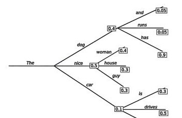
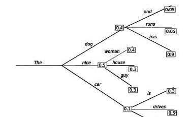

# 16.3 Controlling Generation

## I. Temperature

- **High temperature (such as 1.0):** increases diversity in generated results but may make them unstable.
- **Low temperature (such as 0.1):** produces more stable results but may lack creativity.

Temperature controls randomness in generation. Specifically, the parameter $T$ affects the “sharpness” of the probability distribution. Higher temperature produces a smoother distribution and more diverse results; lower temperature produces a sharper distribution and more stable results.

$$
P(x_{T+1} \mid x_1, x_2, \ldots, x_T) =
\frac{\exp\left(\frac{f(x_1,x_2,\ldots,x_T)}{T}\right)}
{\sum_i \exp\left(\frac{f_i(x_1,x_2,\ldots,x_T)}{T}\right)}
$$

Here, $f(x_1,x_2,\ldots,x_T)$ is the model's internal function, usually a complex neural network such as a Transformer. $T$ is the temperature parameter, controlling the smoothness of the probability distribution.

## II. Sampling (Token Search) Strategies

### Greedy Search

Always select the most probable next word. The output is stable but may be monotonous.

$$
x_{T+1} = \arg\max P(x_{T+1} \mid x_1, x_2, \ldots, x_T)
$$

Greedy-search example: the image shows a tree starting from “The,” selecting the highest-probability branch at each step, such as The -> nice (0.5) -> woman (0.4) ...

Problem: choosing the largest probability at every step does not guarantee the largest product!

### Beam Search

Beam search retains the `num_beams` most likely words at each time step and ultimately chooses the most probable sequence, reducing the risk of losing potentially high-probability sequences.

Beam-search example: the image shows a tree-search process. Unlike greedy search, it keeps multiple paths at every step, such as “The nice” and “The dog,” and continues expanding them.

**Top-k sampling:** randomly select the next word from the $k$ most probable words, balancing stability and diversity.

$$
S_k = \{x_i \mid P(x_i \mid x_1, x_2, \ldots, x_T) \text{ is among the top } k \text{ probabilities}\}
$$

$$
x_{T+1} \sim P(x_{T+1} \mid x_1, x_2, \ldots, x_T) \text{, sampled within } S_k
$$

**Top-p, or nucleus, sampling:** randomly select the next word from the smallest set whose cumulative probability reaches $p$, dynamically adjusting the sampling range.

$$
S_p = \{x_i \mid \sum_{j=1}^{i} P(x_j \mid x_1, x_2, \ldots, x_T) \le p\}
$$

$$
x_{T+1} \sim P(x_{T+1} \mid x_1, x_2, \ldots, x_T) \text{, sampled within } S_p
$$

The following diagram illustrates top-p sampling:

Top-k and top-p can also be combined: first select K words, then select by probability p within that set.

## References

- 温睦宁、林江浩、张伟楠、俞勇 (2025). [*Hands-on Learning of Large-Model Agents* (translated title; in Chinese)](https://haa.boyuai.com/). Posts & Telecom Press. ISBN 978-7-115-68638-1.
- Holtzman, A., Buys, J., Du, L., Forbes, M., & Choi, Y. (2020). [The Curious Case of Neural Text Degeneration](https://arxiv.org/abs/1904.09751). ICLR 2020.
