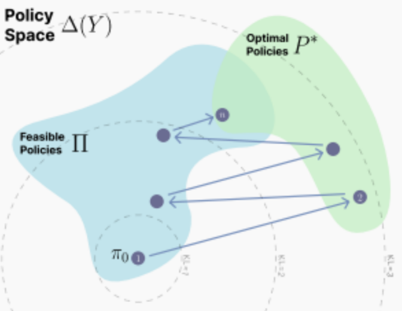

# 17.9 Why Online RL Avoids Catastrophic Forgetting Better Than SFT

Research indicates that on-policy RL outperforms SFT in avoiding "catastrophic forgetting" (*RL's Razor: Why Online Reinforcement Learning Forgets Less*, MIT, 2025). Compared with fine-tuning using SFT, fine-tuning with on-policy RL produces a smaller KL divergence between the model's output policy and the original pretrained model's output policy. (In engineering practice, the KL divergence here is an expectation calculated with inputs from the new task. This is an empirical finding: the model's distribution shift on the new task can predict the extent of its forgetting on old tasks. The paper's predictive metric is forward KL, but it also points out that RL forgets less because it implicitly minimizes reverse KL divergence during optimization.)

## I. The Core Reason

SFT (offline): it uses an external, fixed dataset. The distribution of these data may differ substantially from the model's current distribution. SFT forces the model's outputs toward this arbitrary external distribution. Because the solution space is large, external data often guide the model toward an optimal solution far from its current position, causing a large KL shift and consequently forgetting. The paper finds that off-policy RL has a similar problem.

RL (on-policy): it uses samples generated by the model itself. The update logic of on-policy RL is to reweight samples generated by the model under its current policy, increasing the probabilities of high-reward samples and decreasing those of low-reward samples. Because the samples come from its own policy $\pi$, RL updates essentially make adjustments within the neighborhood of the current distribution. Unlike SFT, it does not forcibly pull the model toward an unknown distribution that may be orthogonal to its original knowledge representations. Instead, on-policy RL tends to find a path with minimal KL change while satisfying the requirements of the new task.

## II. RL Convergence from the Perspective of Projections

A standard policy gradient method is essentially an algorithm that alternates between two types of projection between the "feasible policy space" and the "optimal solution space":

Suppose we are in a simplified binary-reward setting, where $R \in \{0,1\}$:

**Step 1: E-Step (I-Projection / Information Projection).** This step does not update the neural network parameters; instead, it **constructs a target distribution**. When we sample from the current policy $\pi_t$ and filter according to the reward $R$ (for example, retaining only samples with $R=1$, that is, rejection sampling), we are actually constructing a new nonparametric distribution $q_t$.

The paper proves (Lemma A.1) that this reweighted distribution $q_t$ is mathematically the distribution closest to the current policy $\pi_t$ in KL divergence among all distributions satisfying the "optimality condition" (that is, $\mathbb{E}_q[R]=1$):

$$
q_t = \arg\min_{q:\mathbb{E}_q[R]=1} D_{KL}(q\Vert \pi_t)
$$

Intuitively, this is equivalent to finding, within the "set of high-scoring answers," a distribution most similar to the way I currently speak.

**Step 2: M-Step (M-Projection / Moment Projection).** This is the familiar step of updating parameters through gradient descent. When we calculate the policy gradient $\nabla \mathbb{E}[R]$ and update $\pi$, the paper proves (Lemma A.2) that this is equivalent to making the new parametric policy $\pi_{t+1}$ fit the ideal distribution $q_t$ above.

This actually minimizes $D_{KL}(q_t\Vert \pi)$ (that is, the cross-entropy loss):

$$
\pi_{t+1} = \arg\min_{\pi\in\Pi} D_{KL}(q_t\Vert \pi)
$$

Intuitively, I modify my model parameters so that it imitates, as closely as possible, the ideal distribution $q_t$ that "both scored highly and stayed close to me."

Thus, the solution to which this repeated projection process ultimately converges is theoretically the policy with the smallest KL divergence from the initial policy among all policies that can complete the task (optimal policies).

We now prove the equivalence between this two-step process and on-policy RL:

### Step 1: Why Is Rejection Sampling Equivalent to I-Projection?

**Conclusion:** the distribution $q_{RS}$ obtained by rejection sampling from the current policy $p$ is precisely the distribution that satisfies the "reward constraint" and has the smallest KL divergence from $p$.

**Proof:**

**1. Define the setting:**

- $p(y)$ is the current policy (the base distribution).
- $R(y) \in \{0,1\}$ is a binary reward function.
- $S=\{y\in Y:R(y)=1\}$ is the set of all correct answers (that is, samples that receive a reward).
- Rejection sampling proceeds by sampling from $p$ and retaining $y\in S$. The empirical distribution it produces is actually the conditional probability distribution $p(y\mid S)$.

**2. Construct the optimization objective (I-Projection):** we need to find a distribution $q$ that is as close as possible to $p$, subject to an expected reward of 1:

$$
\min_q D_{KL}(q\Vert p) \quad \mathrm{s.t.}\quad \mathbb{E}_{y\sim q}[R(y)] = 1
$$

**3. Derive the equivalence:**

The constraint $\mathbb{E}_{y\sim q}[R(y)]=1$ means that all the probability mass of distribution $q$ must fall within set $S$; if $q$ has a nonzero value outside $S$, the expected reward will be less than 1. Therefore, the support of $q$ must be contained in $S$.

For any distribution $q$ supported on $S$, we can decompose $p(y)$ as $p(y)=p(S)p(y\mid S)$. Substituting into the KL divergence formula:

$$
D_{KL}(q\Vert p)
= \sum_{y\in S} q(y)\ln\frac{q(y)}{p(y)}
= \sum_{y\in S} q(y)\ln\frac{q(y)}{p(S)p(y\mid S)}
$$

Splitting the logarithmic term:

$$
D_{KL}(q\Vert p)
= \sum_{y\in S} q(y)\ln\frac{q(y)}{p(y\mid S)}
- \sum_{y\in S} q(y)\ln p(S)
$$

Because $\sum_{y\in S}q(y)=1$ and $p(S)$ is constant, the second term is independent of $q$. The first term is exactly $D_{KL}(q\Vert p(\cdot\mid S))$.

By the properties of KL divergence ($D_{KL}\ge 0$, with equality if and only if the two distributions are identical), minimizing the expression above requires $q(y)=p(y\mid S)$.

In other words, once we simplify the adjustment of probability distributions in RL to rejection sampling, it becomes mathematically equivalent to finding a theoretically optimal target distribution.

### Step 2: Why Is Policy Gradient Equivalent to M-Projection?

**Conclusion:** updating the parametric policy $\pi$ using policy gradient is equivalent to making $\pi$ fit (project onto) the target distribution $q$ generated in the previous step.

**Proof:**

**1. Define the target distribution:** let the ideal distribution obtained in the previous step be $q(y)$. In RL, this is typically a distribution reweighted according to rewards:

$$
q(y)=\frac{\pi_{\mathrm{old}}(y)R(y)}{Z}
$$

Here, $Z$ is a normalization constant.

**2. Construct the optimization objective (M-Projection):** we need to find a new parametric policy $\pi$ that is as close as possible to the ideal distribution $q$:

$$
\min_\pi D_{KL}(q\Vert \pi)
$$

**3. Derive the equivalence:**

Expanding the KL divergence formula:

$$
D_{KL}(q\Vert \pi)
= \sum_y q(y)\ln\frac{q(y)}{\pi(y)}
= \sum_y q(y)\ln q(y)-\sum_y q(y)\ln\pi(y)
$$

The first term, $\sum_y q(y)\ln q(y)$, is related to the entropy of the target distribution and is constant with respect to the optimization variable $\pi$. Therefore, minimizing KL divergence is equivalent to maximizing the second term:

$$
\max_\pi \mathbb{E}_{y\sim q}[\ln \pi(y)]
$$

Substituting the definition of $q(y)$:

$$
\max_\pi \sum_y \frac{\pi_{\mathrm{old}}(y)R(y)}{Z}\ln\pi(y)
$$

Ignoring the constant $Z$, this is equivalent to maximizing:

$$
\mathbb{E}_{y\sim \pi_{\mathrm{old}}}[R(y)\ln\pi(y)]
$$

This is precisely the objective for a one-step update in standard policy gradient. When the sampling distribution is fixed at $\pi_{\mathrm{old}}$, taking the gradient of $\mathbb{E}_{y\sim\pi_{\mathrm{old}}}[R(y)\ln\pi(y)]$ yields the form $R(y)\nabla\ln\pi(y)$ in the policy gradient theorem.

The policy gradient update process is essentially a search within a parametric family of distributions for a solution that minimizes $D_{KL}(q\Vert \pi)$, so that the policy distribution $\pi$ output by the neural network fits the actual optimal policy distribution $q$ as closely as possible (but the neural network's output cannot always match the actual distribution exactly, so zero is unattainable).

Together, these two steps form a variant of the expectation-maximization (EM) algorithm:

E-Step (I-Projection): implicitly construct the optimal target distribution $q$ (nonparametric) using rejection sampling.

M-Step (M-Projection): update the parameters $\pi$ using policy gradient so that it approximates $q$.

Precisely because each M-projection brings $\pi$ and $q$ closer together (and $q$ is itself a reweighting of $\pi$), the entire trajectory is constrained to a path of minimal KL change, avoiding the large parameter drift and forgetting that SFT causes by fitting an external distribution.

## References

- Shenfeld, I., Pari, J., & Agrawal, P. (2025). [RL's Razor: Why Online Reinforcement Learning Forgets Less](https://arxiv.org/abs/2509.04259). arXiv:2509.04259.
