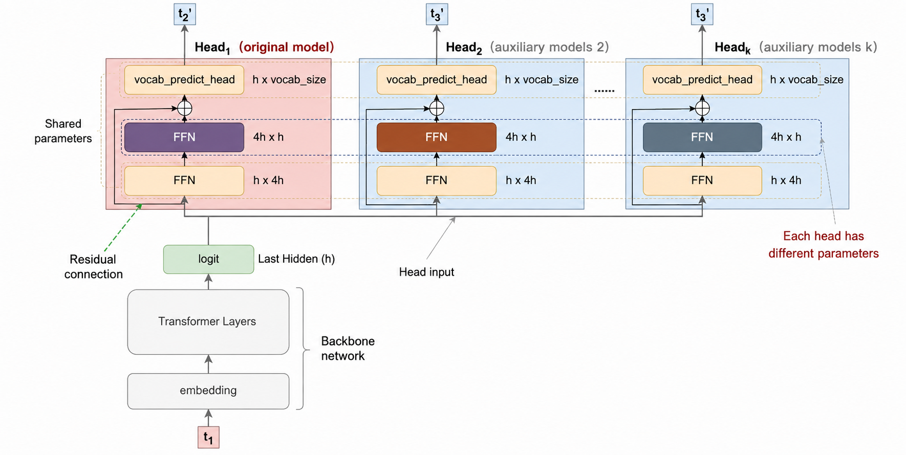
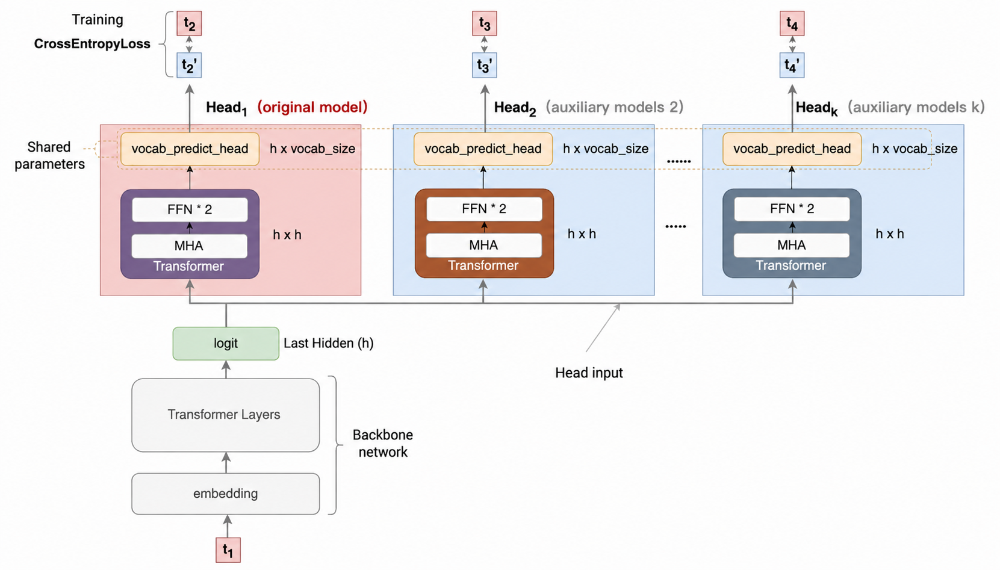
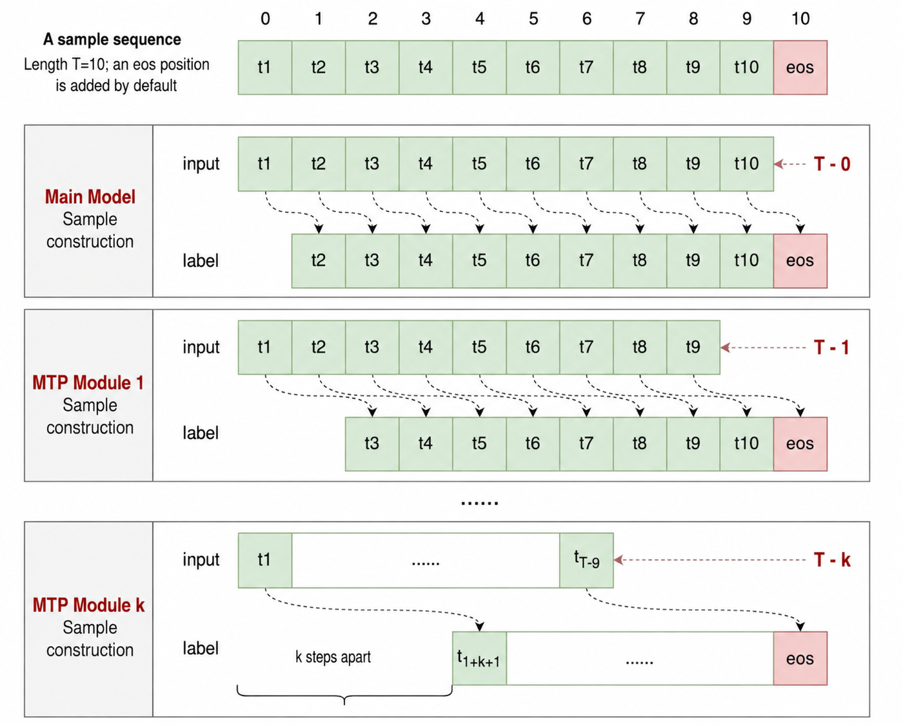
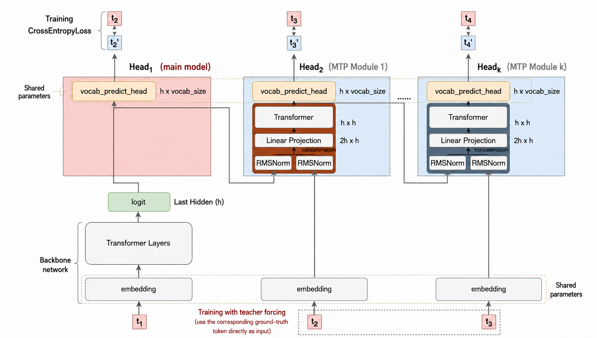

# 20.1 Multi-token Prediction

## I. Background to Multi-Token Prediction (MTP)

Because LLM inference is autoregressive, generating each token requires loading the complete model parameters from GPU memory once, making GPU-memory bandwidth a significant bottleneck for inference speed. At the same time, training with next-token prediction only teaches the model how well it can predict the next token from the current context, without a more distant "horizon." Multi-token prediction (MTP) addresses these problems by generating multiple tokens in parallel at each step during training and inference.

## II. Blockwise Parallel Decoding

This paradigm was proposed by Google in 2018 and was the initial form of MTP.

1. Model architecture

As shown in the figure, the backbone is a trained, multilayer decoder-only Transformer. After forward computation through multiple layers, its final hidden layer outputs an h-dimensional logit (equal to the embedding dimension). Multiple output heads are attached above it, each responsible for predicting one token. Every head has three layers: first, a shared FFN layer widens the logit representation (h dimensions -> 4h dimensions); then an unshared FFN layer restores the logit dimension (4h dimensions -> h dimensions), and a residual connection yields an h-dimensional embedding vector. Finally, the result is passed to the vocabulary projection layer to obtain a probability distribution over words.

2. Generation paradigm

MTP generation is a "predict–verify" cycle. It first predicts $K$ tokens at once, then uses Transformer parallelism to verify them in parallel through masking, as shown in the figure. If all predictions are correct, this is equivalent to completing $K$ inference steps in the time required for 2.

Further overlapping the verify stage of step $n$ with the predict stage of step $n+1$ can improve inference performance. As shown, 3 tokens are predicted first; during verification, 3 tokens are still predicted each time. For example, because the second token is correct, it can condition the generation of the third token "car," the fourth "this," and the fifth "week." Since the initially predicted third token does not match, only "in" and "the" can be retained from the initial prediction. The third through fifth tokens generated here can then directly serve as a new prediction round, and the fourth and fifth tokens generated in this round are subsequently verified, and so on, without predicting 3 tokens again.

Essentially, this uses the parallelism of multi-token generation to merge the subsequent prediction step conditioned on the two correct tokens, "in" and "the," into the preceding verification step.

## III. Meta's MTP

As shown, Meta equips each head with a Transformer layer in addition to FFN layers, enabling it to handle more complex contextual relationships in sequences.

## IV. DeepSeek MTP

Training stage: main model: generate $t_2$ from $t_1$; generate $t_3$ from $t_1,t_2$; ...; generate the eos token from $t_1$ through $t_{10}$; calculate the average cross-entropy loss. MTP model 1: MTP module: generate $t_3$ from $t_1,t_2$; ...; generate the eos token from $t_1$ through $t_9$; calculate the average cross-entropy loss. Subsequent MTP modules follow the same pattern.

Architecturally, DeepSeek builds on Meta's work by adding an extra input before the MTP Transformer layer. During training, this extra input consists of the ground-truth t2 and t3, preventing small errors from causing the model to "drift off course." During inference, it consists of the model's own predicted t2 and t3 (although the previous prediction is used, this does not degenerate into next-token prediction: the predicted t2 and t3 pass only through lightweight MTP modules, not the full model, so this remains MTP). The MTP-head loss is:

$$
\mathcal{L}_{\mathrm{MTP}}^k
= \mathrm{CrossEntropy}\left(P^k_{2+k:T+1}, t_{2+k:T+1}\right)
= -\frac{1}{T}\sum_{i=2+k}^{T+1}\log P_i^k[t_i].
$$

The illustration in the original DeepSeek paper is shown below:

## References

- Stern, M., Shazeer, N., & Uszkoreit, J. (2018). [Blockwise Parallel Decoding for Deep Autoregressive Models](https://arxiv.org/abs/1811.03115). NeurIPS 2018.
- Gloeckle, F., Idrissi, B. Y., Roziere, B., et al. (2024). [Better & Faster Large Language Models via Multi-token Prediction](https://arxiv.org/abs/2404.19737). ICML 2024.
- DeepSeek-AI. (2024). [DeepSeek-V3 Technical Report](https://arxiv.org/abs/2412.19437). arXiv:2412.19437.
- 姜富春. (2025). [Tracing the Past and Present of MTP Technology through DeepSeek V3's MTP](https://zhuanlan.zhihu.com/p/18056041194) (translated title; in Chinese). Zhihu column.
