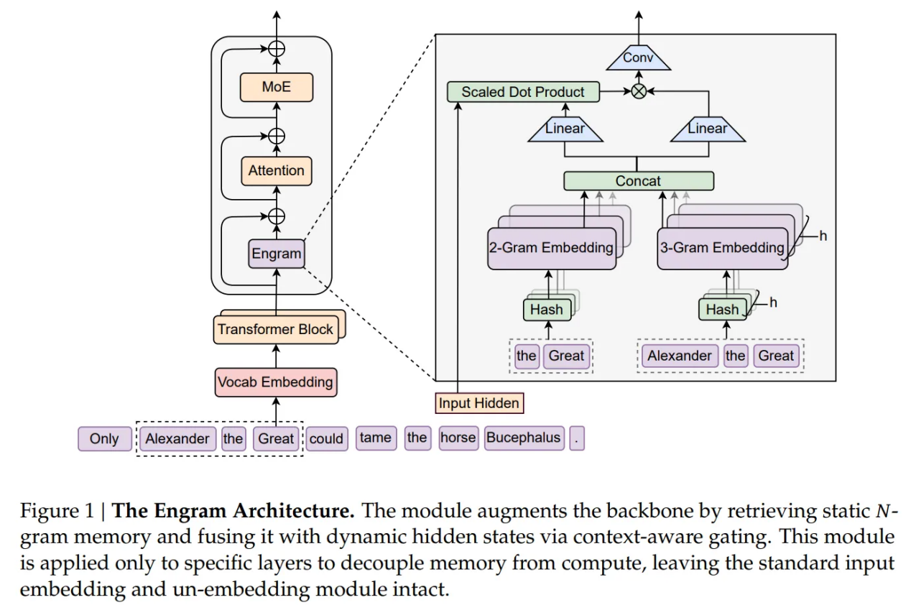

# 20.2 The Engram Module

> This article is a paper-reading note. Its content represents the corresponding paper's method or the author's understanding and should not be treated directly as field consensus or engineering best practice.

Traditional large-model architectures lack a native knowledge-lookup mechanism and can only inefficiently simulate retrieval through multiple layers of computation. For example, given the preceding text "The capital of France is," they cannot directly look up "Paris" and must derive it through computation involving many parameters. Based on conditional memory, Engram decouples memory (static knowledge) from computation (reasoning ability) and implements efficient knowledge access through hash lookup, thereby "freeing up" more parameter layers for reasoning.

Because single-token semantic memory is contained in embeddings, while attention-based reasoning is better than direct memorization for semantics spanning a context, Engram actually addresses the memory of "phrases" consisting of 2–3 tokens.

## I. Basic Principles of the Engram Module

The so-called "static knowledge base" is actually a hash table of length S storing the embedding vectors corresponding to phrases, with S*d_model parameters. Unlike common hash tables that start empty, all values (parameters) in the Engram module's hash table are randomly initialized and subsequently updated through gradient descent. Research shows that, for a fixed total model parameter count, after excluding the fixed-dimensional attention modules, the optimal allocation of the remaining parameters is 20%–30% to static memory and 70%–80% to MoE.

The Engram module uses the N-gram method from NLP, with N equal to 2 and 3. During inference, if the last three preceding tokens are "ABC," it retrieves several Engram semantic vectors corresponding to the 2-gram "BC" and 3-gram "ABC" from the hash table, then uses a gating mechanism to weight them appropriately and add them to the original vector.

N is set to 2 and 3 because these values cover the vast majority of fixed collocations, phrases, idioms, and proper names (such as "New York" and "Machine Learning"), providing the greatest benefit from static memory. N=1 corresponds to individual words, which are already handled by the embedding layer at the bottom of the Transformer and do not need duplicate storage. As N increases, the number of possible combinations grows exponentially (V^N), but their actual frequencies in corpora fall sharply. Long sequences also usually contain complex logical structures, better handled by dynamic inference through attention than by rote memorization.

## II. Hash Lookup

For an input token sequence, the model first maps token IDs to canonical forms to make lookup more compact; for example, token ID 105 ("The") and token ID 203 ("the") map to the same ID, reducing the effective vocabulary size. For the current token i, the system extracts N-grams from its prefix. Multi-head hash functions H_k calculate K different indices, and the embedding vectors at these K positions are retrieved. Using K different indices mitigates hash collisions. For example, if N-gram A maps to [42, 88] and N-gram B maps to [42, 15], slot 42 becomes "dirty" through a collision: it mixes features of A and B and becomes noise. Training teaches the model to "trust" clean slots and ignore the colliding slot.

Without multiple heads, avoiding collisions would require an extremely large table. With multi-head hashing, a relatively small table (for example, S=100 million) can tolerate some collisions as long as clean slots are available.

## III. Gating Mechanism

After retrieval, the vectors are combined with the original input vector through gated addition. The gating mechanism resembles a small cross-attention module without Softmax, determining how strongly each retrieved vector is incorporated according to the input context. Q is obtained from the input vector, and K and V from the Engram-vector matrix. Dot products between Q and K determine the weight scores for each dimension based on the input (the injection weight of each vector is calculated independently, so no normalization is used). Each retrieved V vector is then weighted to produce the Engram_Output vector. Finally, this is added to the original input: h_{next} = h_{input} + Engram_Output.

For example, given "capital of France," the model is "hungry for knowledge." The retrieved vector corresponding to "Paris" has a high dot-product score (maximizing the probability of "Paris" as the next word), while an irrelevant "Apple" vector retrieved because of a hash collision has a low score. As a result, the "Paris"-related vector is strongly injected to assist prediction. In a code-reasoning task, weights for all dimensions of all vectors are nearly 0, effectively bypassing the Engram module.

## IV. Hardware Synergy

1. Asynchronous computation and storage: during training, the Engram module is distributed across multiple GPUs to facilitate gradient backpropagation. During inference, it is stored on the CPU. While the GPU computes the first few attention layers, the CPU performs hash lookups based on the input sequence's token IDs to find N-gram vectors. When the GPU reaches the step requiring retrieval, only gated embedding remains to be performed.

2. Hierarchical design: N-grams in natural language follow a Zipfian distribution, meaning that a small number of high-frequency patterns account for the vast majority of memory accesses. A multi-level cache hierarchy can therefore be built: frequently accessed embeddings are cached in faster storage (such as GPU HBM or host DRAM), while the many low-frequency long-tail patterns are stored in larger but slower media (such as NVMe SSDs). This hierarchical design allows Engram to scale to enormous memory capacities while minimizing the impact on effective access latency.

## References

- Cheng, X., Tian, R., Zeng, W., et al. (2026). [Conditional Memory via Scalable Lookup: A New Axis of Sparsity for Large Language Models](https://arxiv.org/abs/2601.07372). arXiv:2601.07372.
