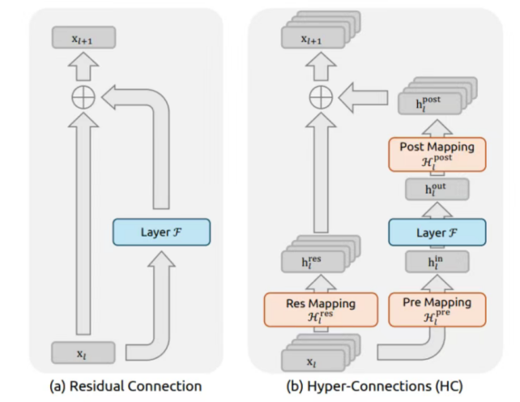
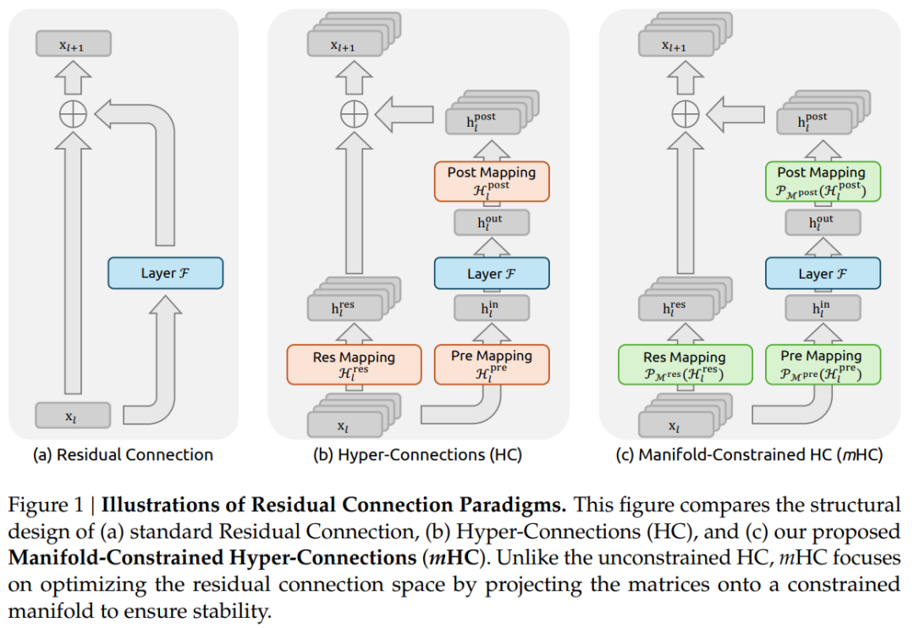

# 20.3 The Manifold Hypothesis and Hyper-Connections

## I. The Manifold Hypothesis

Although data are embedded in a high-dimensional Euclidean space, meaningful data distributions are actually concentrated on a manifold of much lower dimension. This means that, for a neural network (or one of its local blocks), the transformation from input x to output y is low-dimensional, and y-x is a vector distributed in a low-dimensional space.

In *Representation Learning: A Review and New Perspectives*, Yoshua Bengio's team points out that deep neural networks generalize because they successfully learn the low-dimensional manifold structure on which the data lie and "unfold" it into a flat feature space.

## II. Hyper-Connections (HC)

### (I) Expanding the Residual Stream Width

In a traditional residual neural network, y=f(x)+x, where f(x) is the main neural-network function. The input and output dimensions of f(x) are the same as those of x and y, all equal to d_model. In practice, however, the effective dimension of f(x) should be far smaller than the representation dimensions of x and y. Therefore, the "information highway" between x and y in traditional residual networks is too narrow, "losing" many effective representation dimensions of x and y and readily causing training instability.

To address this, HC decouples the residual-stream dimension (the information-transmission dimension) from the dimension of the main network function f (the computation dimension). It increases the residual-stream dimension and introduces learnable down-projection and up-projection matrices Hl_pre and Hl_post to convert between the residual-stream and computation dimensions, substantially increasing the actual amount of information that can be carried without significantly increasing the total parameter count.

### (II) Introducing a Learnable Residual-Connection Matrix

Theoretically, the approach above is already fairly complete. However, HC also introduces a residual-connection matrix Hl_res that linearly transforms the residual stream. The reasons are:

1. Better fitting of curved manifolds: a deep neural network consists of multiple layers. For any l, the difference between layer l's output x_l+1 and input x_l is indeed distributed in a low-dimensional space, but the orientations of the low-dimensional spaces corresponding to different layers often differ. In practice, the overall manifold they form is often curved in the high-dimensional space. A learnable residual-connection matrix allows the basis vectors of the function's high-dimensional space to rotate flexibly (that is, information can be exchanged between different dimensions), improving the ability to fit curved manifolds.

2. Introducing a forgetting mechanism: early features (such as edge textures in the first layer) may be entirely useless and become noise by layer 100. Without Hl_res, however, they are difficult to remove and can only be forcibly suppressed by later layers through LayerNorm, wasting valuable dynamic range. When the eigenvalues of Hl_res are less than 1, it acts as a forgetting mechanism.

## III. Manifold-Constrained Hyper-Connections

Manifold-constrained hyper-connections (mHC), first publicly introduced by the DeepSeek team in 2025, are an important engineering improvement to HC.

### (I) Problems with HC

1. Numerical instability: in original HC, the connection matrices have no additional constraints. After propagation through many layers, signals can easily experience exploding gradients (reaching hundreds or even thousands of times their original magnitude) or vanishing gradients, while the identity-mapping property is also disrupted.

2. Large GPU-memory and communication overhead: widening the channels greatly increases GPU-memory I/O and communication costs, producing a "GPU-memory wall."

### (II) Improvements in mHC

mHC constrains the transformations Hl_res, Hl_pre, and Hl_post to specific manifolds.

1. Constrain Hl_res to be a doubly stochastic matrix

Using the Sinkhorn–Knopp operator, Hl_res is constrained to be a doubly stochastic matrix: all elements are nonnegative, every row sums to 1, and every column sums to 1. Essentially, a doubly stochastic matrix is a convex combination of permutation matrices (a permutation matrix has exactly one 1 in each row and column, with all other elements 0; multiplying a matrix by a permutation matrix is equivalent to exchanging the positions of the original matrix's feature-dimension vectors). Geometrically, this means "performing multiple weighted rotations of the input vector." Repeated application monotonically increases cross-stream feature fusion and information mixing.

In addition, this method has two engineering advantages:

(1) Its 2-norm is bounded above by 1. The learned mapping is non-expansive, effectively mitigating exploding gradients.

(2) The set of doubly stochastic matrices is closed under matrix multiplication, ensuring that residual mappings composed across many layers remain doubly stochastic and thereby maintaining stability throughout the model's depth.

2. Apply nonnegativity constraints to Hl_pre and Hl_post

Hl_pre is a feature-reorganization matrix that adjusts the signals of different features. Its entry in row i, column j represents the weight contributed by dimension j of the high-dimensional features to dimension i of the low-dimensional features used for computation in the current layer. mHC transforms both matrices through a sigmoid function to ensure nonnegativity, improve stability, and avoid cancellation between positive and negative parameters.

Note: Softmax is not used here because it requires the weights in each row to sum to 1. If Hl_pre has dimensions 10000*1000, Softmax would reduce the total input signal by a factor of 10 (the order of magnitude of the signal in each dimension stays unchanged, while the dimension is divided by 10). This is unacceptable for a module implementing a gating mechanism.

## References

- Bengio, Y., Courville, A., & Vincent, P. (2013). [Representation Learning: A Review and New Perspectives](https://arxiv.org/abs/1206.5538). IEEE Transactions on Pattern Analysis and Machine Intelligence, 35(8), 1798-1828.
- Zhu, D., et al. (2025). [Hyper-Connections](https://arxiv.org/abs/2409.19606). arXiv:2409.19606.
- Xie, Z., Wei, Y., Cao, H., et al. (2025). [mHC: Manifold-Constrained Hyper-Connections](https://arxiv.org/abs/2512.24880). arXiv:2512.24880.
