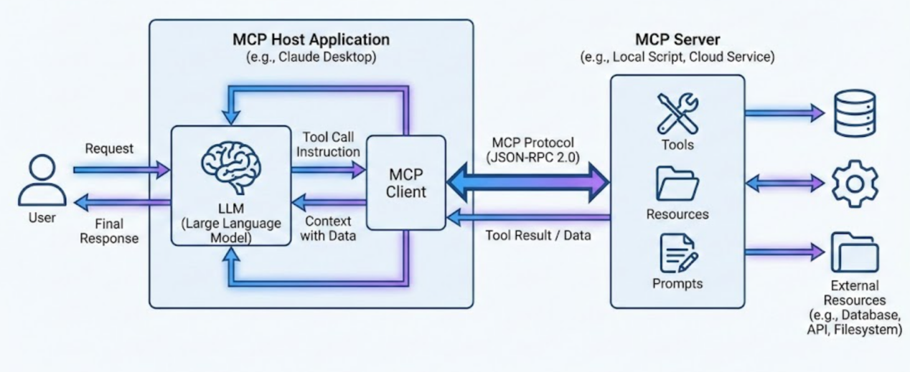

# 24.2 Model Context Protocol

The Model Context Protocol (MCP) is an open standard protocol introduced by Anthropic in November 2024. It connects the model side and tool side, aiming to provide large language models (LLMs) with a standardized interface matching external data sources, tools, and development environments. It is mainly used when AI calls or reads external tools (it is unnecessary if all tool code or database-reading code is already encapsulated on the model side).

As an analogy, MCP is the "USB-C interface" of AI. Just as USB-C unifies physical connections among electronic devices, MCP unifies standards for connections and interactions between AI applications and the external world, such as local filesystems, enterprise databases, and API services.

## I. Background

As large models become agents, an important problem is that many external tools and private datasets are encapsulated by companies in their respective domains. Model providers' interfaces must match those external interfaces to invoke the tools, while providers such as OpenAI, Anthropic, and Google each use their own tool-call data structures. Developers wanting an internal database-query tool to support both GPT and Claude must write and maintain multiple adaptation layers.

By defining a universal protocol independent of model providers, MCP enables "develop once, run with multiple models." Tool developers need only encapsulate system capabilities once according to MCP, making them uniformly accessible to any supporting AI client.

## II. Core Architecture

MCP host: the AI application or environment with which the user directly interacts, such as Claude Desktop or Cursor. It is on the model side and runs the LLM internally. When the LLM needs a tool, the host finds the corresponding MCP client from the tool name in the model's output.

MCP client: embedded in the model-side host, it is the "interpreter" between the LLM and external resources. A host can manage multiple logical clients or connectors communicating with corresponding servers. A client constructs MCP-compliant structured requests and handles capability discovery, tool-call routing, results, and errors. In MCP version 2026-07-28, the core protocol has moved to stateless requests, so clients must no longer be assumed to maintain the persistent sessions of older versions.

MCP server: a lightweight standalone program on the external-tool or data side. Each server provides one or more specific capabilities, including tools (executable actions or functions) and resources (read-only). It can be a local script or a cloud service. It exposes tool and data-reading capabilities to clients, executes operations upon receiving standard instructions, and returns formatted results.

## III. Workflow

1. Protocol version and optional capability discovery: in MCP version 2026-07-28, each request carries the protocol version, client identity, and capability information. The old `initialize`/`initialized` handshake and `Mcp-Session-Id` are no longer required. Clients wishing to learn the server's supported versions and capabilities before calling tools may invoke optional `server/discover`, or directly send a specific request and handle unsupported-version or method errors.

2. Capability listing: clients can use `tools/list`, `resources/list`, and similar methods to obtain currently exposed tools and resources, including tool names, purposes, and parameter schemas. The host provides necessary descriptions to the LLM according to its context-management strategy. For scalability, to avoid context explosion, and to preserve cache hits as much as possible, it can expose only a tool directory or meta-tools and load specific definitions as needed.

3. User request: the user asks the host a question, such as "Find how many paying users were added to the database yesterday and generate a summary."

4. LLM decision and instruction generation: the host sends the question and server-provided tool list to the model. The LLM determines that a database-query tool is needed and generates a tool call conforming to its schema.

5. Routing and execution: the host routes the instruction to the appropriate internal client, which wraps it as an MCP JSON-RPC request with the current protocol version and other required metadata and sends it to the server. The server executes the SQL query, obtains the data, and returns the results to the model-side client.

6. Context return and final response: the client adds the query results to the model's context. The LLM reasons from the retrieved data and generates a natural-language answer, which the host displays to the user.

## References

- Anthropic. (2024). [Introducing the Model Context Protocol](https://www.anthropic.com/news/model-context-protocol).
- Soria Parra, D., & Delimarsky, D. (2026). [The 2026-07-28 Specification](https://blog.modelcontextprotocol.io/posts/2026-07-28/). Model Context Protocol Blog.
- Model Context Protocol. (2026). [Specification (Protocol Revision 2026-07-28)](https://modelcontextprotocol.io/specification/2026-07-28).
