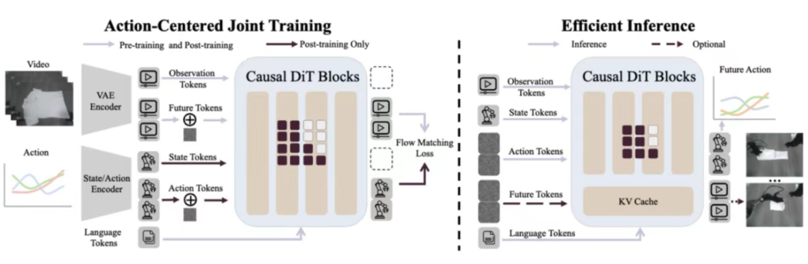

# 34.1 Overview of Embodied AI Training Data

Insufficient training data is a major challenge for embodied AI. Different data types vary in both quantity and value.

## I. Real-Robot Data

This is the most precise and valuable data category. It can be generated by human operators controlling real robots through teleoperation devices or by pretrained models autonomously executing tasks (near failure, human experts may intervene to correct them, producing recovery data). Teleoperation takes many forms, including:

1. Direct input: Humans send motion commands directly through controllers, joysticks, keyboards, mice, touchscreens, and similar devices, but this is difficult for high-degree-of-freedom tasks.

2. Leader–follower operation: The operator controls a “leader device,” and the robot moves synchronously as a “follower device,” such as a remote arm following a leader arm's position and orientation.

3. Motion capture: Human motions are retargeted to the robot, fitting everyday human movement relatively well. However, bulky equipment can distort motion, high-quality collection is insufficiently efficient, and some movements are difficult for robots to reproduce.

4. VR/AR devices: The operator wears a VR headset, observes the robot's viewpoint in a virtual or augmented environment, and controls it through handheld controllers, hand tracking, or similar methods.

Advantages: Captures extremely complex real-world physical interactions, including friction, deformation, complex contact mechanics, and real lighting changes, without a simulation-to-reality gap.

Disadvantages:

1. Extremely high collection costs and difficulty scaling.

2. Dependence on enclosed spaces, limiting task and environmental diversity.

## II. Physics-Engine Synthetic Data

Physics simulators can construct virtual environments and obtain data through reinforcement learning or massively parallel sampling.

Advantages:

1. Rapid collection of vast trial-and-error data and easy access to ground-truth environmental states, such as exact object poses and contact forces.

2. More diverse environments than real-robot data.

Disadvantages: A simulation-to-reality gap remains because physics engines cannot perfectly simulate reality, particularly fluids, deformable objects, complex sliding friction, tactile sensors, and unexpected events.

## III. Internet Video Data

The Internet contains vast video data rich in common sense, physical laws, and knowledge of “how to interact with the world.” It can support embodied-model pretraining and help models understand basic physical-world laws.

Advantages: Large volume and high diversity, improving cross-scenario generalization.

Disadvantages:

1. Human body structures (degrees of freedom and musculoskeletal systems) differ completely from robots, creating an embodiment gap. A video of a human deftly chopping vegetables is difficult to convert directly into motor commands for a robotic arm with a two-finger gripper.

2. Only pixel changes are available, without action labels.

## IV. Data Collected with UMI and Wearable Devices

The universal manipulation interface (UMI) is a class of data-collection approaches for robotic manipulation. Collectors typically use portable handheld devices with cameras, pose sensors, grippers, and similar components to directly grasp, organize, open and close doors, and perform other operations in real environments. First-person visuals, end-effector poses, gripper states, and related information are recorded, then human trajectories are mapped to robots. Wearable-exoskeleton approaches similarly collect real-environment data and subsequently map trajectories to robots.

Advantages:

1. Data comes directly from the real world, while collection is lighter and cheaper than real-robot teleoperation and is not limited by the number of robots.

2. Collectors can directly use flexible human movement to perform complex tasks.

Disadvantages: An embodiment gap remains between collection devices and actual robots. They mainly record end-effector trajectories and cannot fully reproduce some information present during robot execution.

## V. First-Person Human Video Data

Head-mounted cameras, smart glasses, chest cameras, and similar devices record first-person videos of humans cooking, organizing, repairing, assembling, and performing other tasks in real-life environments.

Advantages:

1. Low cost and strong scaling potential.

2. Compared with ordinary Internet videos, viewpoints more closely resemble a robot's task-execution observations and contain extensive continuous human–object interactions.

Disadvantages:

1. Primarily video pixels without robot-action labels, with a significant embodiment gap between human and robot hands.

2. Severe hand/object occlusion, rapid camera movement, and viewpoint jitter make 3D trajectory recovery and action recognition difficult.

## VI. World-Model-Generated Data

World models learn state-transition laws from real-world or robot-interaction data, predicting environmental changes given current states and actions. Running many agent rollouts inside a world model produces large amounts of data.

Advantages:

1. Low cost and rapid acquisition.

2. Can cover corner cases rare in real data and simulate extreme environments.

Disadvantages:

1. Errors may accumulate, and conformity to real physical laws cannot currently be guaranteed.

2. Modeling of fine contact, friction, deformation, force sensing, and touch remains limited.

## VII. Data-Mixture Recipes

Embodied AI training often combines data types according to their characteristics and optimizes the mixture. GigaWorld-Policy's training provides an example:

1. General physical-world pretraining: Pretrain on vast Internet videos to establish a basic understanding of general physical laws and visual dynamics.

2. Embodied-scenario post-training: Post-train on multisource manipulation videos covering first-person, real-robot, and simulated data, learning spatiotemporal evolution and basic manipulation in embodied-interaction settings.

3. Few-shot action alignment: A small amount of real-robot action-labeled training data aligns the pretrained world model with robot-action prediction, rapidly establishing the causal mapping between “observation, action, and future vision.”

## References

- Open X-Embodiment Collaboration. (2023). [Open X-Embodiment: Robotic Learning Datasets and RT-X Models](https://arxiv.org/abs/2310.08864). arXiv:2310.08864.
- Khazatsky, A., Pertsch, K., Nair, S., et al. (2024). [DROID: A Large-Scale In-The-Wild Robot Manipulation Dataset](https://arxiv.org/abs/2403.12945). arXiv:2403.12945.
- Chi, C., Xu, Z., Pan, C., et al. (2024). [Universal Manipulation Interface: In-The-Wild Robot Teaching Without In-The-Wild Robots](https://arxiv.org/abs/2402.10329). arXiv:2402.10329.
- Xu, M., Zhang, H., Hou, Y., et al. (2025). [DexUMI: Using Human Hand as the Universal Manipulation Interface for Dexterous Manipulation](https://arxiv.org/abs/2505.21864). arXiv:2505.21864.
- X Square Robot. (2026). [TwinDEX — Dexterous. Consistent. Scalable](https://x2robot.com/en/pages/twindex). Project page.
- Zheng, R., Niu, D., Xie, Y., et al. (2026). [EgoScale: Scaling Dexterous Manipulation with Diverse Egocentric Human Data](https://arxiv.org/abs/2602.16710). arXiv:2602.16710.
- Ye, A., Wang, B., Ni, C., et al. (2026). [GigaWorld-Policy: An Efficient Action-Centered World-Action Model](https://arxiv.org/abs/2603.17240). arXiv:2603.17240.
