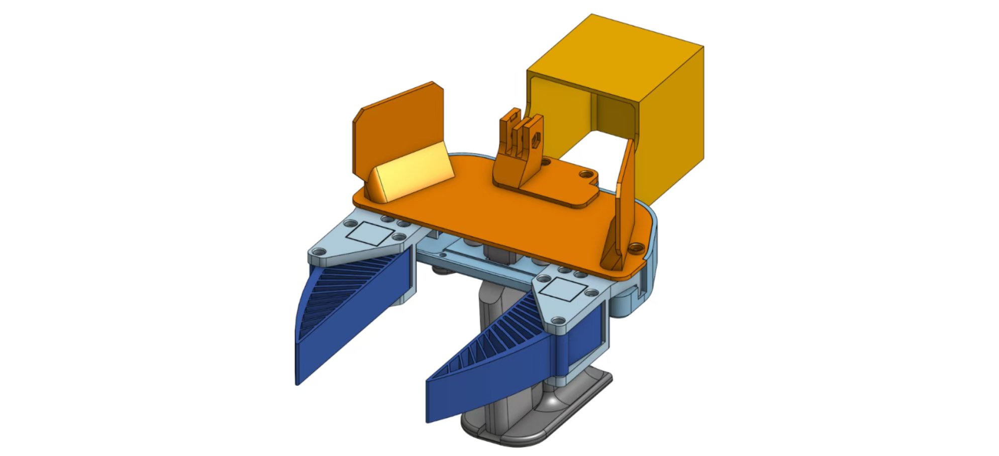
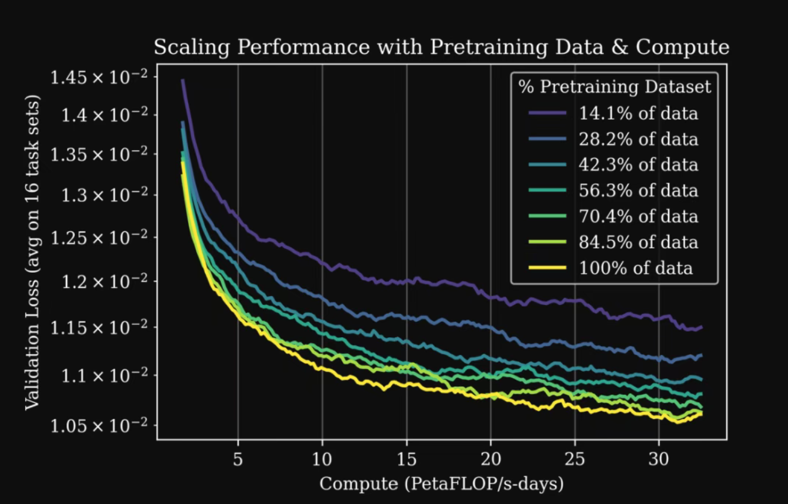
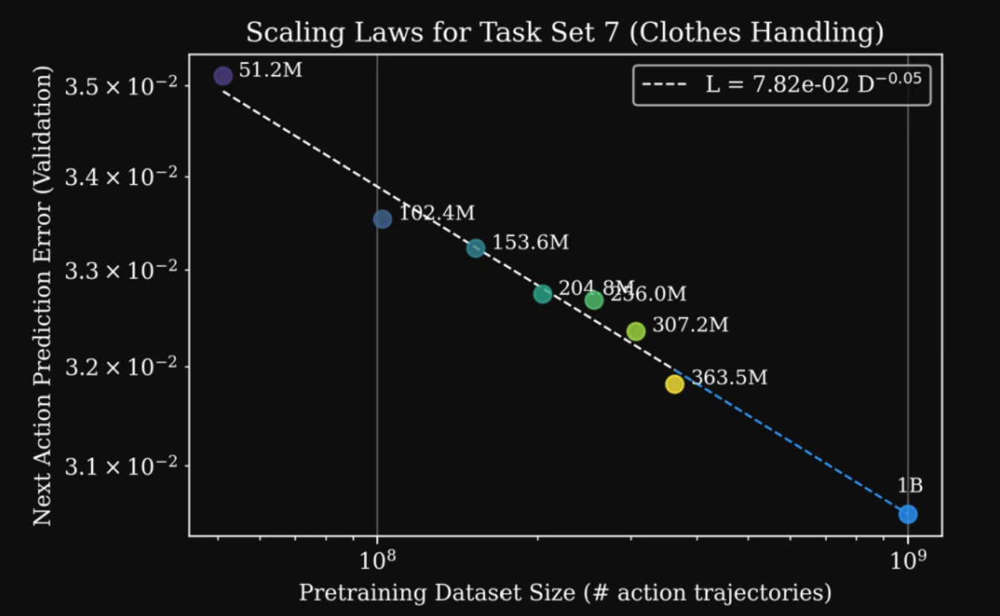
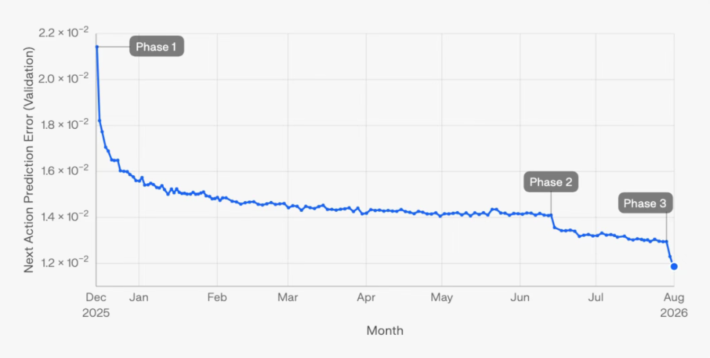

# 34.2 UMI Data

## I. UMI's Core Method

UMI collects data with a GoPro, a handheld gripper, and a wrist-view camera, using mirrors on both sides to provide stereo information. It aims to collect data through human manipulation with a handheld gripper, combining human flexibility with a structure analogous to robot operation and independence from robot embodiment. Collection is no longer confined to enclosed data factories, increasing diversity and reducing costs.

UMI records camera images, gripper opening (continuous rather than discrete), and relative end-effector pose trajectories. The wrist-mounted first-person camera is the sole observation point. Relative poses remove dependence on a particular robot's base coordinate system, achieving embodiment independence; deployment only requires converting relative trajectories into joint commands.

## II. Improvements and Quality Control in UMI Data Collection

### (1) Directions for Improving UMI Devices

1. Adjust manufacturing processes, reduce weight, improve usability, and increase robustness.

2. Add viewpoints to address camera occlusion that makes some fine-manipulation data unusable, while carefully handling embodiment differences.

3. Add sensors to address missing tactile and force data.

4. Evolve the end effector from a simple parallel gripper into more general and dexterous forms.

### (2) Quality Control in UMI Data Collection

Large-scale collection often produces unusable data: operations may be too fast for a robotic arm's physical limits, or the hand may reach positions the arm cannot reproduce, causing inverse-kinematics failure. Data may also contain many meaningless segments, such as repeatedly picking up and putting down the same object or turning on a switch without proceeding further. Quality control is crucial. Real-time quality control can avoid substantial waste compared with checking only after collection is complete.

Moreover, the difficulty is not merely obtaining data but making it useful for model training. Data and models must co-evolve: use collected data for model iteration and promptly adjust collection strategies when problems emerge.

## III. The GEN Series: Scaling Laws for UMI-Based Pretraining

Generalist's GEN series uses large-scale UMI data for embodiment-native pretraining. Capabilities improve from GEN-0's 270,000 hours to GEN-1's 500,000 hours and the still larger dataset of GEN-1.5.

During GEN-0 pretraining, Generalist finds scaling-law relationships between performance, compute, data, and parameters:

By GEN-1.5, in-context learning begins to emerge. A single short demonstration placed in the context window lets the robot immediately perform the task, without gradient updates. Demonstrations recorded in simulation also work, even though GEN-1.5 was not trained on simulation data. Physical prompts can be concatenated like text prompts, and analogy enables the model to use tools and strategies not directly shown in the demonstration.

The figure shows the continuously decreasing loss during GEN-1.5 pretraining.

## IV. UMI Derivatives: Collecting Data with Wearable Exoskeletons

As robot end effectors develop from parallel grippers into multifingered dexterous hands, UMI's concept extends beyond handheld grippers to wearable exoskeletons and related devices. The core remains collecting data through humans directly manipulating real objects. Exoskeletons constrain and map human-hand motion into the executable space of robot dexterous hands, reducing the embodiment gap.

DexUMI, for example, designs corresponding hand exoskeletons for different robot dexterous hands. Humans directly perform complex grasping, twisting, and tool-use operations while multifinger actions and tactile information are recorded. Compared with collecting bare-hand motions and retargeting them afterward, exoskeletons reduce kinematic differences during collection itself. To address the visual difference between seeing a “human hand + exoskeleton” during collection and a robot hand during deployment, DexUMI also transforms collected images through visual processing to more closely resemble deployment observations.

Subsequent work adopts similar ideas while emphasizing co-design of collection and robot hardware. TwinDEX's three-finger exoskeleton and robot hand, for example, are designed to be as kinematically consistent as possible, reducing action mapping and retargeting complexity at the hardware level. Collection devices are evolving from simple grippers toward multifingered dexterous hands and increasingly use hardware–software co-design to actively narrow the embodiment gap during collection.

## References

- Chi, C., Xu, Z., Pan, C., et al. (2024). [Universal Manipulation Interface: In-The-Wild Robot Teaching Without In-The-Wild Robots](https://arxiv.org/abs/2402.10329). arXiv:2402.10329.
- Rayyan, O., Abanes, J., Hafez, M., Tzes, A., & Abu-Dakka, F. (2025). [MV-UMI: A Scalable Multi-View Interface for Cross-Embodiment Learning](https://arxiv.org/abs/2509.18757). arXiv:2509.18757.
- Liu, F., Li, C., Qin, Y., Xu, J., Abbeel, P., & Chen, R. (2025). [ViTaMIn: Learning Contact-Rich Tasks Through Robot-Free Visuo-Tactile Manipulation Interface](https://arxiv.org/abs/2504.06156). arXiv:2504.06156.
- Xu, M., Zhang, H., Hou, Y., et al. (2025). [DexUMI: Using Human Hand as the Universal Manipulation Interface for Dexterous Manipulation](https://arxiv.org/abs/2505.21864). arXiv:2505.21864.
- X Square Robot. (2026). [TwinDEX — Dexterous. Consistent. Scalable](https://x2robot.com/en/pages/twindex). Project page.
- Lin, F., Hu, Y., Sheng, P., Wen, C., You, J., & Gao, Y. (2025). [Data Scaling Laws in Imitation Learning for Robotic Manipulation](https://proceedings.iclr.cc/paper_files/paper/2025/hash/88b7b2c896506daabc8d3fd587055167-Abstract-Conference.html). ICLR.
- Generalist Team. (2025). [GEN-0: Embodied Foundation Models That Scale with Physical Interaction](https://generalistai.com/blog/gen-0). Generalist.
- Generalist Team. (2026). [GEN-1: Scaling Embodied Foundation Models to Mastery](https://generalistai.com/blog/gen-1). Generalist.
- Generalist Team. (2026). [GEN-1.5: Embodied Foundation Models are One-Shot Learners](https://generalistai.com/blog/gen-1.5). Generalist.
