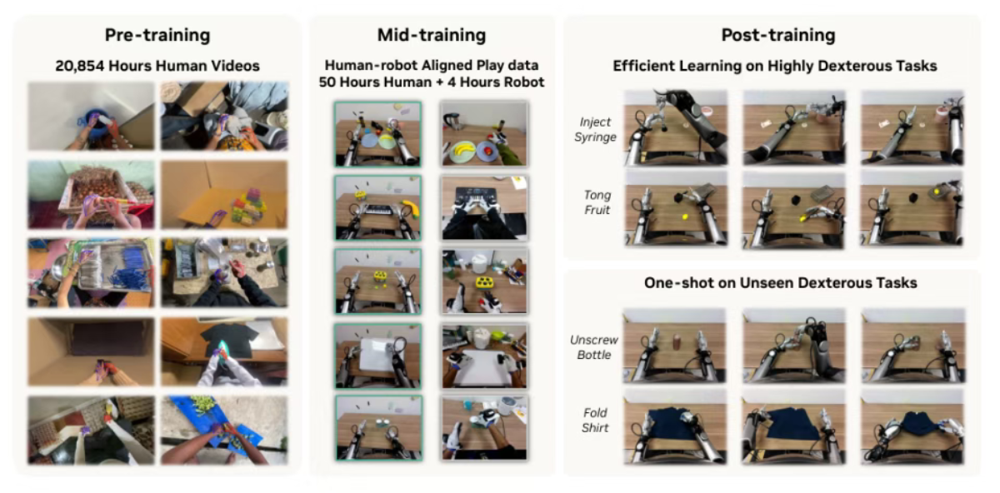
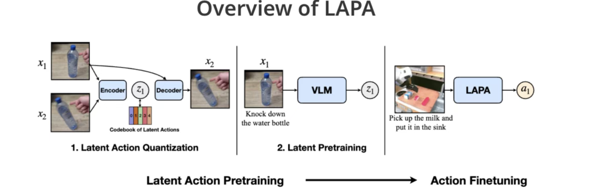
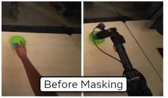
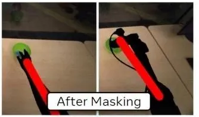
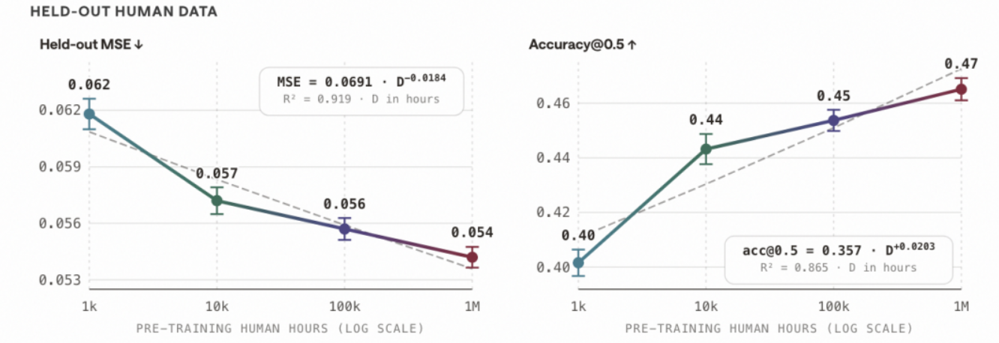
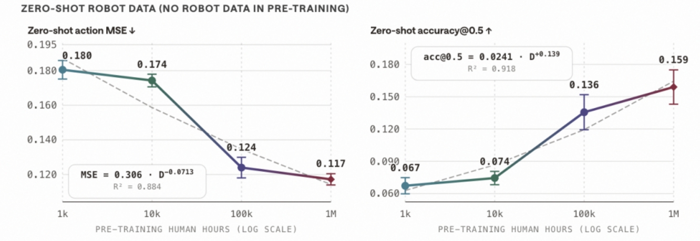
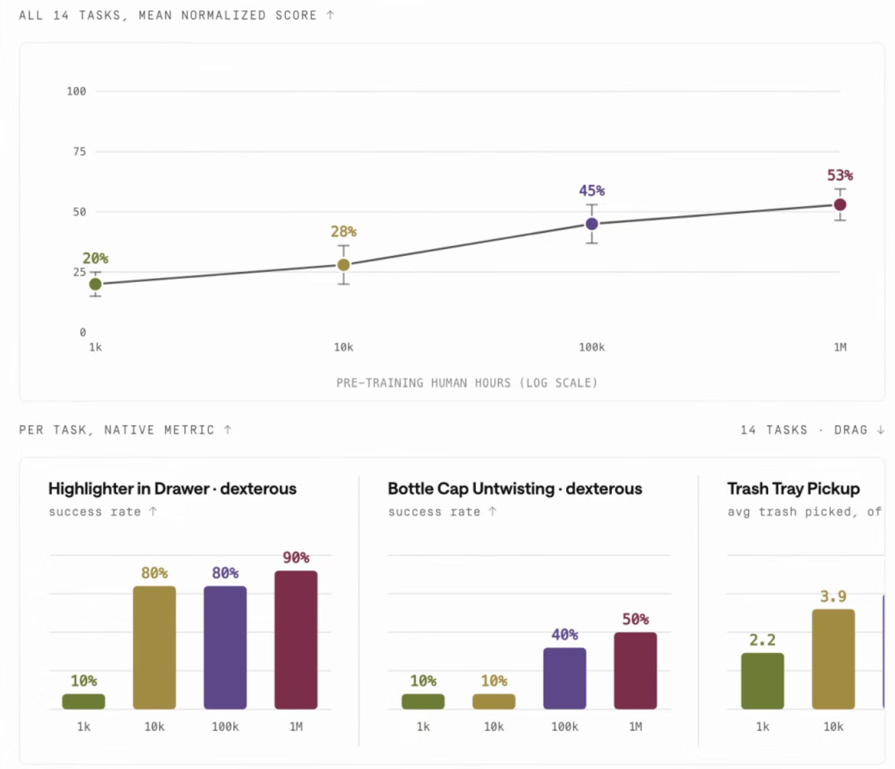
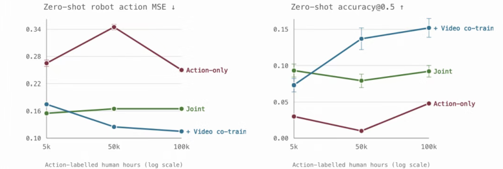

# 34.3 First-Person Human Data

## I. Overview of First-Person Human Video Data

First-person human video is an important training-data category for embodied AI. It is both scalable to collect and well matched to embodied manipulation. Beginning in 2026, from NVIDIA's EgoScale and DreamDojo to Dyna Robotics' Dyna-2, it has become a major source for large-scale embodied-model pretraining. EgoScale's training provides an example:

It first pretrains on 20,854 hours of first-person human videos, then uses a small amount of human–robot alignment data for mid-training, followed by task-specific post-training. EgoScale marks first-person human video as a core paradigm for scaling embodied pretraining.

## II. What Signals Can Models Learn from First-Person Human Videos?

### (1) Representation Learning (Compression)

1. Explicit: Any-point trajectory modeling (ATM), for example, extracts explicit 2D image-plane motion paths of hands and key objects from human videos, providing keypoint sequences to the policy network. EgoVLA uses explicitly extracted 3D hand poses and wrist trajectories from first-person human videos as pretraining signals.

2. Implicit: LAPA does not predefine the semantics of intermediate variables; it trains an encoder to compress interframe changes into low-dimensional implicit latent-action representations.

### (2) World-Model Learning (Future Prediction)

1. Explicit: ByteDance's GR-1 trains a video-generation model on first-person human videos to predict future frames given the current frame and language instructions. Subsequent transfer to robots significantly improves on a robot-data-only baseline, demonstrating that these human videos benefit embodied-model training.

2. Implicit: DreamDojo, for example, learns next-state prediction and action prediction together in latent space.

## III. Transfer from Humans to Robots

Embodied AI models ultimately generate actions, but first-person human data does not inherently contain actions. Humans and robots also have an embodiment gap: human hands and robotic arms have different degrees of freedom, and their motion spaces are not fully isomorphic. Before first-person human videos can support robot-model pretraining, they must therefore be processed to enable cross-embodiment transfer. Several methods follow.

Embodied AI models ultimately need robot-action outputs, but first-person human videos usually lack robot-action labels. Human hands, robotic arms, and dexterous hands also differ in degrees of freedom, joint structures, and motion spaces, creating a clear embodiment gap. Human videos generally require cross-embodiment processing before robot pretraining. Existing methods broadly fall into four categories.

### (1) Changing the Data's Visual Appearance to Reduce Human–Robot Observation Differences

These methods primarily address humans and robots “looking different.” They modify images to bring human videos and robot observations closer in visual distribution.

For example, Phantom and Qwen-RobotManip first remove human hands from images, use the original hand trajectories to compute robot-arm motion in a physics simulator, and overlay virtual robots at the same image positions. Real-robot observations receive the same processing at inference to keep training and deployment inputs consistent. EgoMimic instead uses SAM to mask human hands and robot arms, representing hand or end-effector directions with uniform red lines. This reduces appearance differences and focuses the model on objects, contact regions, and manipulation directions.

These methods mainly address the observation gap and do not themselves convert human actions into robot actions, so they usually need subsequent action alignment.

### (2) Explicitly Mapping Human Actions to Robot Actions

These methods directly establish “human action → robot action” mappings. They usually recover wrist, finger, or 3D keypoint trajectories from videos, then apply coordinate transforms, inverse kinematics, retargeting, or trajectory optimization to obtain executable robot actions.

DexMV, for example, first recovers 3D human-hand poses with MANO, then uses kinematic optimization to map human motions into a robot dexterous hand's joint space. For arm tasks, human wrist poses can similarly become robot end-effector target poses, followed by IK to solve joint actions.

This has a clear physical meaning but poor scalability. Different robot structures often require separate mappings, such as Human→Robot A and Human→Robot B, making extension to many heterogeneous robots difficult.

### (3) Designing Action Representations Shared by Humans and Robots

Rather than directly translating human actions into those of one robot, these methods design a shared action space usable by every embodiment. Human actions and those of robots A and B are all mapped into it.

Instead of designing a mapping for each embodiment pair, different embodiments thus use the same “action language.”

Being-H0.5, for example, constructs a unified state–action space, dividing action vectors into dimensions or slots with clear physical meanings, such as:

1. End-effector translation: Motion of the wrist or robot end effector in the x,y,zx,y,z directions.

2. End-effector rotation: Changes in wrist or end-effector orientation.

3. Arm joint states/actions: Positions or movements of individual robot joints.

4. Finger actions: Fine finger motions of human or dexterous robot hands.

5. Gripper opening and closing: The opening state of end effectors such as two-finger grippers.

6. Mobile-base actions: Translation, steering, and other mobile-robot motions.

Each embodiment uses only relevant dimensions. Human data can fill end-effector dimensions with wrist poses and use MANO finger parameters for fine manipulation; arm robots use end-effector and arm-joint dimensions; dexterous-hand robots additionally use finger-action dimensions; mobile manipulators can also use base-action dimensions. Although embodiments differ in degrees of freedom, actions with the same physical meaning occupy the same positions. Joint training on human videos and multiple robot datasets shares cross-embodiment motion patterns such as “move forward,” “rotate the wrist,” “approach an object,” and “grasp.”

Dyna-2 provides another example. Instead of deliberately designing many dimensions or slots, it recovers 3D hand trajectories and compresses complex human-hand motion into only two dimension types:

1. Wrist pose: Corresponding to robot end-effector movement.

2. Thumb–index opening: Corresponding to robot gripper opening.

This “minimalist” design imposes only basic requirements on the shared action representation. It does not use visual or embodiment-specific processing to narrow visual or kinematic gaps between pretraining and robot data. Instead, it “leaves room” for large-scale WAM pretraining to learn transfer, training the world model on extensive data to learn physical dynamics shared across embodiments.

To improve cross-embodiment transfer, we can also extract higher-level, more embodiment-independent manipulation knowledge rather than exact joint movements: contact points, grasp poses, object affordances, and hand–object interaction patterns. MAPLE, for example, learns hand–object contact locations and 3D hand poses at contact from Ego4D. These tell the robot “where to make contact” and “how to grasp.” Contact points, grasp regions, and affordances are generally more embodiment-independent than precise joint trajectories.

### (4) Hardware–Software Co-Design That Proactively Aligns Robot Embodiments with Humans

The first three categories generally assume fixed robot embodiments and bridge the human–robot gap through visual processing, action mapping, or representation learning. This category reverses the perspective: rather than continually designing more complex algorithms to fit human data to robots, proactively align robots with human body structures, action spaces, and perception during design, narrowing the gap at its source.

Human-as-Humanoid exemplifies this idea. It does not eliminate action conversion; hardware–software co-design simplifies complex cross-embodiment transfer into a relatively direct kinematic mapping. PrimeU is therefore designed around human manipulation at several levels:

1. Body-proportion alignment: Shoulder width, arm length, and joint ranges approximate adult humans, making reachable spaces as similar as possible.

2. Degree-of-freedom alignment: Two 7-DoF arms, two 20-DoF dexterous hands, a 3-DoF neck, and a 3-DoF waist total 60 DoF, covering as much major upper-body and hand movement as possible.

3. Hand-structure alignment: Dexterous-hand degrees of freedom follow human-hand kinematics, enabling relatively direct correspondence for pinching, grasping, rotating, and other actions.

4. Viewpoint alignment: Cameras are placed at the robot's head and wrists, while human-data collection uses corresponding first-person and near-hand views to reduce training–deployment visual differences.

With this hardware, human-video-to-robot conversion can follow a relatively simple process:

Human ego/exo videos → Body and hand keypoints → Staged IK → 60-DoF robot actions.

First-person video directly provides visual model input, while third-person video recovers body motion. Staged IK then sequentially solves hand, arm and wrist, neck, and waist actions, followed by joint limits and smoothing. Because robot proportions, degrees of freedom, and motion ranges are already aligned with humans, retargeting no longer needs to resolve severe morphological differences and mainly becomes a kinematic solution problem.

During model training, Human-as-Humanoid also uses dual-space hierarchical kinematic consistency (DS-HKC) to constrain joint and task spaces together. Predicted 60-dimensional joint actions must match converted joint labels and, after forward kinematics, keep key positions such as wrists and fingertips consistent with original motions. This avoids “reasonable joint angles but displaced actual hand positions” in high-DoF systems.

## IV. Dyna-2: Scaling Laws on First-Person Human Video Data

Dyna-2 pretrains on first-person human videos. Its technical report states that scaling these data from 1,000 to one million hours reveals scaling laws across several aspects.

### (1) Action Prediction on Human Validation Data as Pretraining Data Increases

As human-data volume grows, decreasing loss and increasing accuracy broadly follow the power law $y=a\cdot D^{-b}$ (dashed lines).

### (2) Action Prediction on Zero-Shot Robot Data as Pretraining Data Increases

After pretraining only on human data, direct evaluation on held-out robot data still shows scaling laws crossing the embodiment gap: robot-validation metrics decrease monotonically as purely human data grows.

### (3) Fine-Tuned Real-Robot Performance as Pretraining Data Increases

Pretraining scaling laws transfer across tasks, embodiments, and capabilities to fine-tuned real robots.

### (4) World Modeling Is Key to the Emergence of Cross-Embodiment Scaling Laws

Dyna-2 learns future-world-state and action prediction together. Controlled experiments find that the key to improving cross-embodiment transfer with scale is not merely expanding action data but introducing world modeling, especially future-video prediction. With human action data containing hand-pose labels fixed at 5k, 50k, and 100k hours, the experiments compare three methods using the same architecture:

Action-only: Predict actions without world modeling.

Joint: Predict actions and future video together.

Video co-training: Add an equal amount of action-unlabeled human video to Joint, using it only for future-video prediction.

All three are evaluated zero-shot on 39 robot tasks. Joint outperforms Action-only at every data scale, showing that future prediction itself substantially improves cross-embodiment transfer. However, as action data continues to increase, Action-only readily overfits, and Joint does not consistently improve with scale. Only video co-training with large amounts of video-only data improves steadily. Furthermore, holding action-labeled human data at 50k and 250k hours separately while increasing only action-unlabeled video still monotonically improves held-out robot generalization. World modeling may therefore be the key to bridging embodiment differences when using large-scale human videos for human-to-robot transfer.

Notably, scaling video-only data does not substantially improve performance on same-embodiment human-action data and may slightly reduce it. Video modeling's main value may therefore lie less in fitting same-embodiment actions and more in learning general object motion, contact relationships, and physical dynamics, improving transfer to unseen robot embodiments.

### (5) Video Pretraining May Improve Instruction Following

Dyna-2's technical report also proposes that video prediction itself improves instruction following. The authors design four counterfactual language-task categories: pushing or pulling blocks as instructed; selecting a specified object from several and placing it in a box; changing block-stacking order according to language; and picking up, pulling, rotating, flipping, folding, or smoothing napkins. Evaluation keeps the visual scene largely unchanged while varying instructions, testing whether action selection genuinely follows language.

Switching from action-only to joint video training significantly improves overall success. Joint training on a larger video corpus improves it further, especially for object reference and complex action primitives. These results suggest that larger, richer videos and world modeling not only improve cross-embodiment generalization but may strengthen language-instruction following by teaching correspondences among “language, objects, actions, and physical outcomes.”

## References

- 具身纪元. (2026). [Egocentric Data, Booming in Silicon Valley, Is Rewriting the Rules of Embodied Data](https://www.jintiankansha.com/t/rxSAsq869K) (translated title; in Chinese). WeChat public-account article, published March 17, 2026.
- 具身纪元. (2026). [Our Previous Approaches to Using Human Video Data May Have Taken the Wrong Direction](https://www.jintiankansha.com/t/PtzdfzjSA4) (translated title; in Chinese). WeChat public-account article, published July 8, 2026.
- Damen, D., Doughty, H., Farinella, G. M., et al. (2018). [Scaling Egocentric Vision: The EPIC-KITCHENS Dataset](https://arxiv.org/abs/1804.02748). ECCV.
- Grauman, K., Westbury, A., Byrne, E., et al. (2022). [Ego4D: Around the World in 3,000 Hours of Egocentric Video](https://arxiv.org/abs/2110.07058). CVPR.
- Zheng, R., Niu, D., Xie, Y., et al. (2026). [EgoScale: Scaling Dexterous Manipulation with Diverse Egocentric Human Data](https://arxiv.org/abs/2602.16710). arXiv:2602.16710.
- Gao, S., Liang, W., Zheng, K., et al. (2026). [DreamDojo: A Generalist Robot World Model from Large-Scale Human Videos](https://arxiv.org/abs/2602.06949). arXiv:2602.06949.
- Dyna Robotics. (2026). [Dyna-2: A 1-Million-Hour Scaling Law for World-Action Models](https://www.dyna.co/dyna-2). Technical report, August 2026.
- Nair, S., Rajeswaran, A., Kumar, V., Finn, C., & Gupta, A. (2022). [R3M: A Universal Visual Representation for Robot Manipulation](https://arxiv.org/abs/2203.12601). Conference on Robot Learning.
- Ma, Y. J., Sodhani, S., Jayaraman, D., Bastani, O., Kumar, V., & Zhang, A. (2023). [VIP: Towards Universal Visual Reward and Representation via Value-Implicit Pre-Training](https://arxiv.org/abs/2210.00030). ICLR.
- Wen, C., Lin, X., So, J. I. R., et al. (2024). [Any-point Trajectory Modeling for Policy Learning](https://www.roboticsproceedings.org/rss20/p092.html). Robotics: Science and Systems. https://doi.org/10.15607/RSS.2024.XX.092.
- Yang, R., Yu, Q., Wu, Y., et al. (2025). [EgoVLA: Learning Vision-Language-Action Models from Egocentric Human Videos](https://arxiv.org/abs/2507.12440). arXiv:2507.12440.
- Ye, S., Jang, J., Jeon, B., et al. (2025). [Latent Action Pretraining from Videos](https://openreview.net/forum?id=VYOe2eBQeh). ICLR. arXiv:2410.11758.
- Yang, J., Shi, Y., Zhu, H., et al. (2025). [CoMo: Learning Continuous Latent Motion from Internet Videos for Scalable Robot Learning](https://arxiv.org/abs/2505.17006). arXiv:2505.17006.
- Wu, H., Jing, Y., Cheang, C., et al. (2024). [Unleashing Large-Scale Video Generative Pre-training for Visual Robot Manipulation](https://openreview.net/forum?id=NxoFmGgWC9). ICLR. arXiv:2312.13139.
- Mendonca, R., Bahl, S., & Pathak, D. (2023). [Structured World Models from Human Videos](https://arxiv.org/abs/2308.10901). Robotics: Science and Systems.
- Lepert, M., Fang, J., & Bohg, J. (2025). [Phantom: Training Robots Without Robots Using Only Human Videos](https://proceedings.mlr.press/v305/lepert25a.html). Conference on Robot Learning. arXiv:2503.00779.
- Yuan, H., Liang, Z., Chen, A., et al. (2026). [Qwen-RobotManip Technical Report: Alignment Unlocks Scale for Robotic Manipulation Foundation Models](https://arxiv.org/abs/2606.17846). arXiv:2606.17846.
- Kareer, S., Patel, D., Punamiya, R., et al. (2024). [EgoMimic: Scaling Imitation Learning via Egocentric Video](https://arxiv.org/abs/2410.24221). arXiv:2410.24221.
- Kirillov, A., Mintun, E., Ravi, N., et al. (2023). [Segment Anything](https://openaccess.thecvf.com/content/ICCV2023/html/Kirillov_Segment_Anything_ICCV_2023_paper.html). ICCV.
- Qin, Y., Wu, Y.-H., Liu, S., et al. (2022). [DexMV: Imitation Learning for Dexterous Manipulation from Human Videos](https://arxiv.org/abs/2108.05877). ECCV.
- Romero, J., Tzionas, D., & Black, M. J. (2017). [Embodied Hands: Modeling and Capturing Hands and Bodies Together](https://doi.org/10.1145/3130800.3130883). ACM Transactions on Graphics, 36(6), Article 245. (MANO)
- Bahl, S., Gupta, A., & Pathak, D. (2022). [Human-to-Robot Imitation in the Wild](https://arxiv.org/abs/2207.09450). Robotics: Science and Systems.
- Singh, H. G., Loquercio, A., Sferrazza, C., et al. (2025). [Hand-Object Interaction Pretraining from Videos](https://arxiv.org/abs/2409.08273). ICRA.
- Luo, H., Wang, Y., Zhang, W., et al. (2026). [Being-H0.5: Scaling Human-Centric Robot Learning for Cross-Embodiment Generalization](https://arxiv.org/abs/2601.12993). arXiv:2601.12993.
- Gavryushin, A., Wang, X., Malate, R. J. S., et al. (2025). [MAPLE: Encoding Dexterous Robotic Manipulation Priors Learned From Egocentric Videos](https://arxiv.org/abs/2504.06084). arXiv:2504.06084.
- Cai, X., Qiu, R.-Z., Chen, G., et al. (2025). [In-N-On: Scaling Egocentric Manipulation with in-the-wild and on-task Data](https://arxiv.org/abs/2511.15704). arXiv:2511.15704.
- Li, Q., Deng, Y., Liang, Y., et al. (2025). [Scalable Vision-Language-Action Model Pretraining for Robotic Manipulation with Real-Life Human Activity Videos](https://arxiv.org/abs/2510.21571). arXiv:2510.21571.
- Yang, B., Li, Z., Sun, Y., et al. (2026). [AoE: Always-on Egocentric Human Video Collection for Embodied AI](https://arxiv.org/abs/2602.23893). arXiv:2602.23893.
- Lin, X., Yang, R., Lian, S., et al. (2026). [Human-as-Humanoid: Enabling Zero-Shot Humanoid Learning from Ego-Exo Human Videos with Human-Aligned Embodiments](https://arxiv.org/abs/2606.32009). arXiv:2606.32009.
- Feng, Z., Li, Q., Liang, H., et al. (2026). [From Human Videos to Robot Manipulation: A Survey on Scalable Vision-Language-Action Learning with Human-Centric Data](https://arxiv.org/abs/2606.00054). IJCAI 2026 Survey Track.
