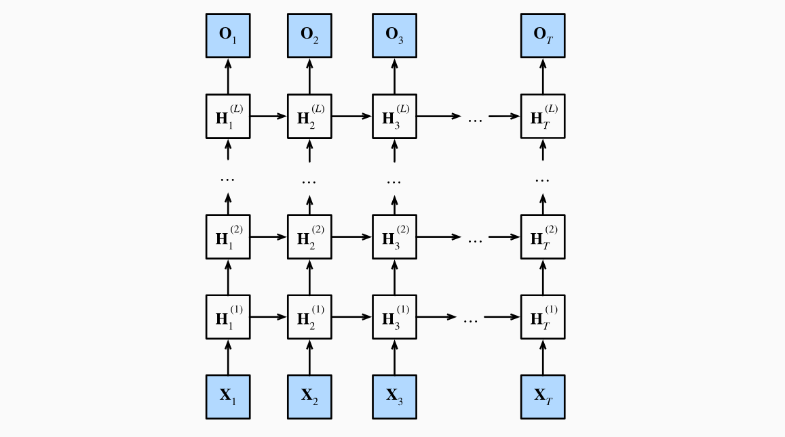

# 4.6 深度循环神经网络

到目前为止，我们只讨论了具有一个单向隐藏层的循环神经网络。其中，隐变量和观测值与具体的函数形式的交互方式是相当随意的。 只要交互类型建模具有足够的灵活性，这就不是一个大问题。然而，对一个单层来说，这可能具有相当的挑战性。之前在线性模型中，我们通过添加更多的层来解决这个问题。 而在循环神经网络中，我们首先需要确定如何添加更多的层，以及在哪里添加额外的非线性，因此这个问题有点棘手。

事实上，我们可以将多层循环神经网络堆叠在一起，通过对几个简单层的组合，产生了一个灵活的机制。特别是，数据可能与不同层的堆叠有关。例如，我们可能希望保持有关金融市场状况（熊市或牛市）的宏观数据可用，而微观数据只记录较短期的时间动态。

下图描述了一个具有 $L$ 个隐藏层的深度循环神经网络，每个隐状态都连续地传递到当前层的下一个时间步和下一层的当前时间步。

我们可以将深度架构中的函数依赖关系形式化，这个架构由 $L$ 个隐藏层构成。后续的讨论主要集中在经典的循环神经网络模型上，但这些讨论也适用于其他序列模型。

假设在时间步 $t$ 有一个小批量的输入数据 $X_t \in \mathbb{R}^{n \times d}$（样本数为 $n$，每个样本中的输入数为 $d$）。同时，将第 $l$ 个隐藏层（$l = 1, \ldots, L$）的隐状态设为 $H_t^{(l)} \in \mathbb{R}^{n \times h}$（隐藏单元数为 $h$），输出层变量设为 $O_t \in \mathbb{R}^{n \times q}$（输出数为 $q$）。设置 $H_t^{(0)} = X_t$，第 $l$ 个隐藏层的隐状态使用激活函数 $\phi_l$，则：

$$
H_t^{(l)} = \phi_l(H_t^{(l-1)}W_{xh}^{(l)} + H_{t-1}^{(l)}W_{hh}^{(l)} + b_h^{(l)})
$$

其中，权重 $W_{xh}^{(l)} \in \mathbb{R}^{h \times h}$、$W_{hh}^{(l)} \in \mathbb{R}^{h \times h}$ 和偏置 $b_h^{(l)} \in \mathbb{R}^{1 \times h}$ 都是第 $l$ 个隐藏层的模型参数。

最后，输出层的计算仅基于第 $L$ 个隐藏层最终的隐状态：

$$
O_t = H_t^{(L)}W_{hq} + b_q
$$

其中，权重 $W_{hq} \in \mathbb{R}^{h \times q}$ 和偏置 $b_q \in \mathbb{R}^{1 \times q}$ 都是输出层的模型参数。

与多层感知机一样，隐藏层数目 $L$ 和隐藏单元数目 $h$ 都是超参数，可以由我们调整。另外，用门控循环单元或长短期记忆网络的隐状态来代替上式中的隐状态进行计算，可以很容易地得到深度门控循环神经网络或深度长短期记忆神经网络。

## 参考文献

暂无已核验参考文献。
