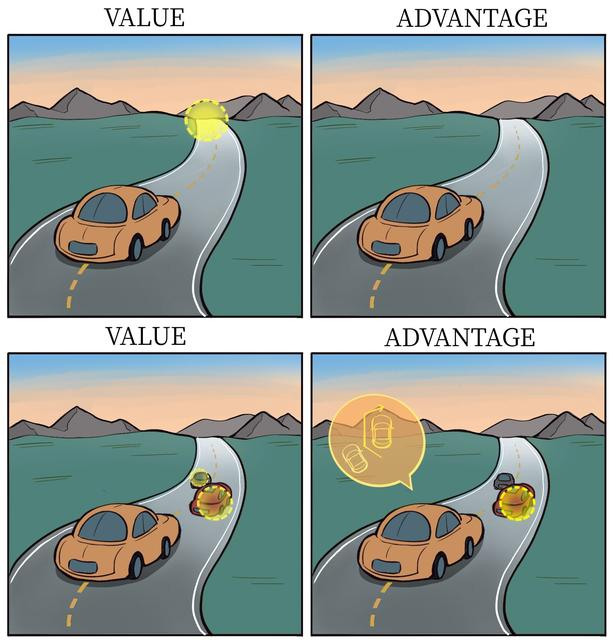

# 11.7 Dueling DQN

DQN中，D是一个同时由状态s和动作a决定的函数。但在某些状态下，智能体只需要知道“现在的环境好不好”（V值），而不关心具体动作的差异；而在需要通过做动作来避险或得分时，才需要关心“哪个动作比平均水平好”（A值）。如果我们将两者分开建模，V(s)专门负责看大局，评估当前环境好不好；A(s, a)专门负责看细节，评估在当前环境下，哪个动作比其他动作好，好多少。这种解耦使得V(s)可以在每一个样本中都被学习更新（因为无论选哪个动作，V(s)都是基础），从而大幅提升了训练效率。

场景 A（大直道，前方无车）：此时通过屏幕（状态 $s$），可以判断当前局势较稳，在这个状态下大概率能得高分。此时，无论稍微向左打方向盘，还是向右打方向盘（动作 $a$），对最终得分的影响都较小。

- 结论：此时 $V(s)$（状态价值）很高，而 $A(s,a)$（动作优势）的差异很小。神经网络不必费力学习每个动作的具体数值，只需要知道“这里不错”即可。

场景 B（前方有障碍物，必须急转弯）：此时状态 $s$ 很危险，如果不操作好就会撞车。

- 结论：此时动作选择非常重要，向左转可能存活，向右转可能失败。这时 $A(s,a)$（动作优势）的差异很大。
从而我们把Q函数拆分如下：

$$
Q(s,a;\theta,\alpha,\beta)=V(s;\theta,\beta)+A(s,a;\theta,\alpha)
$$

- $\theta$：共享参数（卷积层），负责从图像中提取边缘、形状、物体位置等通用特征。这些特征既对判断局势有用，也对选择动作有用。
- $\beta$：价值流参数（全连接层），将特征映射为一个标量 $V$。
- $\alpha$：优势流参数（全连接层），将特征映射为一个向量 $A$，维度为动作数。
但问题在于，我们计算和更新的都是Q值，怎么从Q值中求出V和A？

我们可以获取同一个状态s上的所有动作a’（遍历），各个动作Q值的相对大小关系也就是它们的A值相对大小。一个方案是对于给定s，取让Q(s,a’)最大的动作a*，设A(s,a*)=0（最大动作优势值），V(s)=Q(s,a*)，则：

方案 A：Max 约束（理论最优）

$$
Q(s,a)=V(s)+(A(s,a)-\max_{a'}A(s,a'))
$$

- 数学含义：强制让最大的优势值为 $0$。
另一方案是取所有动作优势值的平均值为0：

方案 B：Mean 约束（工程最优）

$$
Q(s,a)=V(s)+(A(s,a)-\frac{1}{|\mathcal{A}|}\sum_{a'}A(s,a'))
$$

- 数学含义：强制让所有动作的优势值之和为 $0$，也就是平均值为 $0$。
- 为什么更好：$\max$ 操作是非线性操作，梯度只在最大值处传递，其他位置梯度为 $0$；而 mean 操作涉及所有动作的求和，梯度可以平滑地回传给每一个动作优势输出节点。
- 抗噪性：均值对异常值不那么敏感，能让网络训练更平稳。
这样虽然不严格满足贝尔曼最优方程，但在工程实现上更优。原因如下：

- 数学含义：强制让所有动作的优势值之和为 $0$（即平均值为 $0$）。
- 为什么更好：
  - 梯度稳定性：$\max$ 操作是一个非线性操作，梯度只在最大值处传递，其他位置梯度为 $0$。而 mean 操作涉及所有动作的求和，梯度可以平滑地回传给每一个动作的优势输出节点。
  - 抗噪性：均值对异常值不那么敏感，能让网络训练更平稳。

## 参考文献

- Wang, Z., Schaul, T., Hessel, M., van Hasselt, H., Lanctot, M., & de Freitas, N. (2016). [Dueling Network Architectures for Deep Reinforcement Learning](https://arxiv.org/abs/1511.06581). ICML 2016.
- [《动手学强化学习》](https://hrl.boyuai.com/).
