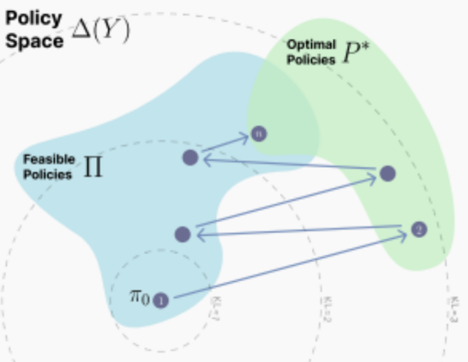

# 17.9 为什么Online RL比SFT更能避免“灾难性遗忘”

研究指出，On-Policy RL在避免“灾难性遗忘”上优于SFT（《RL’S RAZOR: WHY ONLINE REINFORCEMENT LEARNING FORGETS LESS》，MIT，2025）。相比于利用SFT微调，用On-Policy RL微调后的模型输出的策略与原预训练模型输出策略间的KL散度更小。（这里的KL散度工程上用的是在输入为新任务的情况下求出的期望，这是一个经验性的发现，即模型在新任务上的分布偏移量能预测它在旧任务上的遗忘程度；论文预测指标是Forward KL，但也指出RL之所以遗忘少，是因为它在优化过程中隐式地最小化了反向KL散度）

## 一、核心原因

SFT（Offline）：使用外部固定的数据集。这些数据的分布可能与模型当前的分布相去甚远。SFT 会强制将模型输出拉向这个任意的外部分布。由于解空间很大，外部数据往往会将模型引导至一个距离当前位置很远的最优解，导致剧烈的KL偏移，进而引发遗忘。论文发现，使用Off-Policy RL也存在类似问题。

RL（On-Policy）：使用模型自身生成的样本。On-Policy RL的更新逻辑是：对模型自己按当前策略生成的样本进行重加权，增加高奖励样本的概率，降低低奖励样本的概率。因为样本来自自身策略 $\pi$，RL的更新本质上是在当前分布的邻域内进行调整。它不会像SFT那样被强行拉向一个未知的、可能正交于原知识表示的分布。相反，On-Policy RL倾向于在满足新任务要求的前提下，寻找一条KL变化最小的路径。

## 二、从投影的视角看RL的收敛

标准的策略梯度方法本质上就是一个在“可行策略空间”和“最优解空间”之间，交替进行两种投影的算法：

假设我们处于一个简化的二值奖励（Binary Reward，$R \in \{0,1\}$）场景中：

**第一步：E-Step（I-Projection / 信息投影）**。这一步并不是在更新神经网络参数，而是在**构建目标分布**。当我们用当前策略 $\pi_t$ 采样，并根据奖励 $R$ 进行筛选（例如只保留 $R=1$ 的样本，即 Rejection Sampling）时，我们实际上构建了一个新的非参数化分布 $q_t$。

论文证明（Lemma A.1），这个重加权后的分布 $q_t$，在数学上是所有满足“最优性条件”（即 $\mathbb{E}_q[R]=1$）的分布中，距离当前策略 $\pi_t$ KL 散度最近的那一个：

$$
q_t = \arg\min_{q:\mathbb{E}_q[R]=1} D_{KL}(q\Vert \pi_t)
$$

直观理解：这相当于在“高分答案集合”中找一个离我现在怎么说话最像的分布。

**第二步：M-Step（M-Projection / 矩投影）**。这一步才是我们熟悉的梯度下降更新参数。当我们计算策略梯度 $\nabla \mathbb{E}[R]$ 并更新 $\pi$ 时，论文证明（Lemma A.2）这等价于让新的参数化策略 $\pi_{t+1}$ 去拟合上述的理想分布 $q_t$。

这实际上是在最小化 $D_{KL}(q_t\Vert \pi)$（即交叉熵损失）：

$$
\pi_{t+1} = \arg\min_{\pi\in\Pi} D_{KL}(q_t\Vert \pi)
$$

直观理解：修改我的模型参数，让它尽可能模仿刚才那个“既得了高分又离我很近”的理想分布 $q_t$。

从而这种连续的投影过程最终收敛到的解，理论上是所有能完成任务（最优）的策略中，距离初始策略的KL散度最小的那一个。

下面证明这两步过程和On-Policy RL的等价性：

### 第一步：为什么“拒绝采样”等价于 I-Projection？

**结论：**从当前策略 $p$ 中进行拒绝采样（Rejection Sampling），得到的分布 $q_{RS}$，正是满足“奖励约束”且距离 $p$ KL 散度最小的分布。

**证明过程：**

**1. 定义场景：**

- $p(y)$ 是当前策略（Base distribution）。
- $R(y) \in \{0,1\}$ 是二值奖励函数。
- $S=\{y\in Y:R(y)=1\}$ 是所有正确答案的集合（即获得奖励的样本）。
- 拒绝采样的过程是：从 $p$ 采样，保留 $y\in S$。这产生的经验分布实际上就是条件概率分布 $p(y\mid S)$。

**2. 构建优化目标（I-Projection）：**我们需要寻找一个分布 $q$，使得它在满足期望奖励为 1 的前提下，与 $p$ 最接近：

$$
\min_q D_{KL}(q\Vert p) \quad \mathrm{s.t.}\quad \mathbb{E}_{y\sim q}[R(y)] = 1
$$

**3. 推导等价性：**

约束条件 $\mathbb{E}_{y\sim q}[R(y)]=1$ 意味着分布 $q$ 的所有概率质量必须全部落在集合 $S$ 上；如果 $q$ 在非 $S$ 区域有值，期望奖励就会小于 1。因此，$q$ 的支持集（Support）必须包含在 $S$ 内。

对于任意支持集在 $S$ 上的分布 $q$，我们可以将 $p(y)$ 分解为 $p(y)=p(S)p(y\mid S)$。代入 KL 散度公式：

$$
D_{KL}(q\Vert p)
= \sum_{y\in S} q(y)\ln\frac{q(y)}{p(y)}
= \sum_{y\in S} q(y)\ln\frac{q(y)}{p(S)p(y\mid S)}
$$

拆解对数项：

$$
D_{KL}(q\Vert p)
= \sum_{y\in S} q(y)\ln\frac{q(y)}{p(y\mid S)}
- \sum_{y\in S} q(y)\ln p(S)
$$

因为 $\sum_{y\in S}q(y)=1$，且 $p(S)$ 是常数，第二项与 $q$ 无关。第一项正是 $D_{KL}(q\Vert p(\cdot\mid S))$。

由 KL 散度的性质（$D_{KL}\ge 0$，当且仅当两个分布相等时为 0），要最小化上式，必须有 $q(y)=p(y\mid S)$。

也就是说当我们将RL中概率分布的调整简化为拒绝采样的情形后，它在数学上就严格等价于找到了一个理论上的最优目标分布。

### 第二步：为什么“策略梯度”等价于 M-Projection？

**结论：**使用策略梯度（Policy Gradient）更新参数化策略 $\pi$，等价于让 $\pi$ 去拟合（投影到）上一步生成的目标分布 $q$。

**证明过程：**

**1. 定义目标分布：**设上一步得到的理想分布为 $q(y)$。在 RL 中，这通常是根据奖励重加权后的分布：

$$
q(y)=\frac{\pi_{\mathrm{old}}(y)R(y)}{Z}
$$

其中 $Z$ 是归一化常数。

**2. 构建优化目标（M-Projection）：**我们需要找到一个新的参数化策略 $\pi$，使其尽可能接近理想分布 $q$：

$$
\min_\pi D_{KL}(q\Vert \pi)
$$

**3. 推导等价性：**

展开 KL 散度公式：

$$
D_{KL}(q\Vert \pi)
= \sum_y q(y)\ln\frac{q(y)}{\pi(y)}
= \sum_y q(y)\ln q(y)-\sum_y q(y)\ln\pi(y)
$$

第一项 $\sum_y q(y)\ln q(y)$ 是目标分布的熵相关项，对于优化变量 $\pi$ 来说是常数。因此，最小化 KL 散度等价于最大化第二项：

$$
\max_\pi \mathbb{E}_{y\sim q}[\ln \pi(y)]
$$

将 $q(y)$ 的定义代回：

$$
\max_\pi \sum_y \frac{\pi_{\mathrm{old}}(y)R(y)}{Z}\ln\pi(y)
$$

忽略常数 $Z$，这等价于最大化：

$$
\mathbb{E}_{y\sim \pi_{\mathrm{old}}}[R(y)\ln\pi(y)]
$$

这正是标准策略梯度的一步更新目标。把采样分布固定为 $\pi_{\mathrm{old}}$ 时，对 $\mathbb{E}_{y\sim\pi_{\mathrm{old}}}[R(y)\ln\pi(y)]$ 求梯度，就得到策略梯度定理中的 $R(y)\nabla\ln\pi(y)$ 形式。

策略梯度的更新过程，本质上就是在一个参数化的分布族中，寻找一个 $D_{KL}(q\Vert \pi)$ 最小的解，让神经网络输出策略分布 $\pi$ 尽可能拟合实际最优策略分布 $q$（但神经网络输出不可能总是完全和实际分布相同，故取不到零）。

这两个步骤共同构成了一个 EM 算法（Expectation-Maximization）的变体：

E-Step（I-Projection）：用拒绝采样隐式地构造出最优目标分布 $q$（非参数化的）。

M-Step（M-Projection）：用策略梯度更新参数 $\pi$，使其逼近 $q$。

正是因为每一步 M-Projection 都是在拉近 $\pi$ 和 $q$（而 $q$ 又是 $\pi$ 自身的重加权），所以整个轨迹被约束在一条 KL 变化最小的路径上，从而避免了 SFT 那种因拟合外部分布而导致的剧烈参数漂移和遗忘。

## 参考文献

- Shenfeld, I., Pari, J., & Agrawal, P. (2025). [RL's Razor: Why Online Reinforcement Learning Forgets Less](https://arxiv.org/abs/2509.04259). arXiv:2509.04259.
