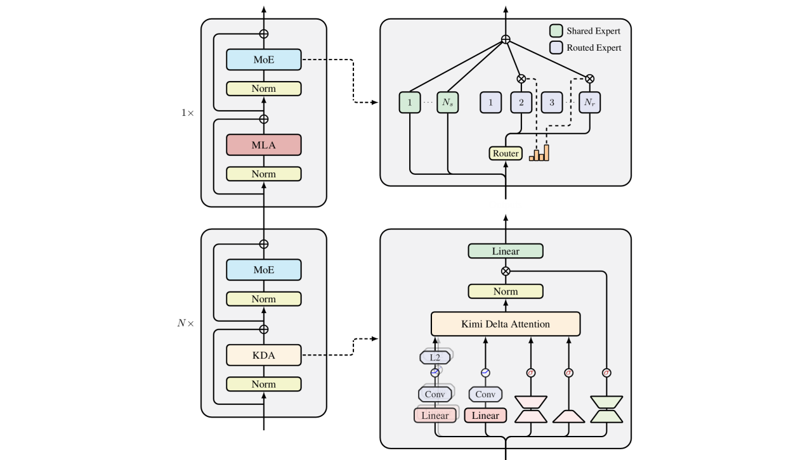

# 27.2 Delta Attention

## 一、提出背景

在前面我们提到，当我们把Transformer视为动态梯度下降时，Softmax在Transformer中最核心的作用就是“归纳头”：对于长上下文，也能保证注意力集中于与y相匹配的x，而不是“注意力涣散”。而对于根据实际值和预测值的差距，进行梯度下降更新“权重W”这样的功能，其实线性注意力已经足够了。考虑到Linear Attention更小的显存消耗，Kimi Delta Attention（KDA）提出了混合式架构：以3:1的比例混合线性注意力层与全Softmax注意力层，让大部分线性注意力层高效处理局部的语义信息聚合、状态传递和持续的特征更新（记忆写入），少数Softmax层（存储了完整的KV Cache）进行全局的高精度信息检索、跨越极长距离的路由和复杂的模式匹配。

## 二、从Linear Attention到DeltaNet

传统的Linear Attention的表达式为：

$$
S_t=S_{t-1}+k_tv_t^\top
$$

这个显式的矩阵（隐状态）S是在残差分支上的，它的目标是拟合K与V的关系，输入Q、输出上下文聚合后的V（作为残差与原来输入相加，而不是像W那样已经在内部包含残差、直接输出总结果y）。对于第l层，输入xtl和输出xtl+1（第l+1层输入）关系如下：

$$
\mathrm{Output}_t^{(l)}=\left(S_t^{(l)}\right)^\top q_t^{(l)}
$$

$$
x_t^{(l+1)}=x_t^{(l)}+\mathrm{Output}_t^{(l)}
$$

前面我们提到Transformer（包括残差流）整体相当于隐式地维护权重矩阵 $W$，满足 $y=Wx$。残差分支上的 $S_t^\top q_t$ 实际上在上下文学习中扮演的作用相当于 $\Delta W x_t$，根据已有数据中的 $K_i$（$x_i$）和 $V_i$（$Wx_i-y_i$）的关系，得出真实的 $y_t$ 和 $Wx_t$ 的差距。

但这个模型在训练中会存在严重的问题。S的更新公式等价于运用相关性Loss学习从kt到vt的映射：

$$
\mathcal{L}_{\mathrm{Linear}}=-\left\langle S^\top k_t,v_t\right\rangle
$$

此时的梯度就是前述 $S$ 的更新公式。我们注意到这种更新是无界的：即便 $S$ 已经学到了从 $k_t$ 到 $v_t$ 的映射，对每个（第 $t$ 个）token，只要 $k_t$ 和 $v_t$ 输入进来，它就会计算出一个非零的梯度 $-k_tv_t^\top$，并且无脑地叠加到 $S$ 上。这可能导致矩阵内部的元素值无限膨胀，在处理长上下文时发生严重的信息干扰（因为维度有限，叠加不可能总是正交）。

在含Softmax时，由于注意力分数和为1，输出向量被约束在已有各token的Value向量构成的凸包内。但这里没有这个限制，故我们修改损失函数，对每个t时刻：

$$
\mathcal{L}_{\mathrm{Delta}}=\frac{1}{2}\left\lVert S^\top k_t-v_t\right\rVert^2
$$

运行一步自适应学习率βt的梯度下降：

$$
S_t=S_{t-1}+\beta_tk_t\left(v_t-k_t^\top S_{t-1}\right)
$$

注意和前面说的矩阵W在每个t时刻用(x1,y1),...,(xt,yt)执行梯度下降（还希望yt不产生梯度）不一样，这里只用(kt,vt)执行梯度下降。这里不同的根本原因在于优化目标不同：

在理论论文（标准 Attention）中，模型面对的是一个外部的 Few-shot 任务（In-Context Learning）。

* 你给模型的 Prompt 就像是一张考卷：已知条件是 $(x_1,y_1),(x_2,y_2),\ldots,(x_n,y_n)$，求 $x_{\mathrm{test}}$ 对应的 $y_{\mathrm{test}}$。

在 KDA（线性 RNN）中，模型面对的是自身的内部记忆压缩任务（Autoregressive State Tracking）。

* KDA 根本不知道你在做什么 Few-shot 考题。它的唯一使命是：作为 KV Cache 的替代品，把源源不断进来的历史文本压缩进一个固定大小的矩阵 $S$ 里。
* 在自回归生成中，时间是单向前的。当模型阅读到第 $t$ 个 token 时，这个 token 产生的特征 $k_t$ 和 $v_t$ 就是“已知事实”。
* KDA 必须立刻用这个已知事实去更新 $S_{t-1}\to S_t$，以便当第 $t+1$ 个 token 甚至第 $t+100$ 个 token 进来查询时，记忆库里有关于第 $t$ 个 token 的记录。

KDA 论文（以及 DeltaNet）明确指出，这是一种在线梯度下降（Online Gradient Descent）。

* 批量梯度下降（Batch GD）也是我们平时训练大模型时用的方法。它需要把整批数据（所有 token）的 loss 全部算出来，求个平均，然后再更新一次权重。它的目标是寻找一个全局最优点。
* 在线梯度下降（Online GD）是 KDA 内部的 $S$ 矩阵采用的、灵活根据特征的策略。因为在自回归生成时，token 是一个一个流进来的；模型不可能为了算第 $t$ 步的更新，就把前面所有 token 的历史全部翻出来重新算一遍误差。
* 因此，它每次只看眼前的第 $t$ 个 token，算出一个瞬间的梯度 $\nabla_S\mathcal{L}_t(S_{t-1})$，然后立刻走一小步（步长为 $\beta_t$），更新记忆。

同时，KDA也尽可能避免“灾难性遗忘”：

* 当第 $t$ 个 token 到来时，它面对的记忆矩阵 $S_{t-1}$ 并不是一张白纸。这个 $S_{t-1}$ 是经历了前面 $t-1$ 次在线梯度下降后，千锤百炼累积下来的结果。
* 当 KDA 计算误差并减去 $\beta_t k_t k_t^\top S_{t-1}$ 时，它并不是把 $S_{t-1}$ 彻底推翻。因为 $\beta_t$ 通常是一个介于 $0$ 到 $1$ 之间的小于 $1$ 的标量（由模型动态预测），它只是在庞大的历史记忆 $S_{t-1}$ 上，针对第 $t$ 个 token 的特定特征方向（$k_t$）进行了微调和打磨。

## 三、Kimi Delta Attention

当t时刻新数据流入时，隐状态S的更新公式如下：

$$
S_t=\left(I-\beta_t k_t k_t^\top\right)\mathrm{Diag}(\alpha_t)S_{t-1}+\beta_t k_t v_t^\top
$$

这里Diag(αt)是一个对角阵，左乘St-1，给每行的参数设置一个类似遗忘门的门控机制。这和Adam中的逐参数自适应学习率有一定相似之处。

Kimi对有关矩阵的定义：

$$
\begin{aligned}
q_t^{(l)},k_t^{(l)}
&=\mathrm{L2Norm}\left(\mathrm{Swish}\left(\mathrm{ShortConv}\left(W_q^{(l)}x_t^{(l)}\right)\right)\right)\in\mathbb{R}^{d_k},\\
v_t^{(l)}
&=\mathrm{Swish}\left(\mathrm{ShortConv}\left(W_v^{(l)}x_t^{(l)}\right)\right)\in\mathbb{R}^{d_v},\\
\alpha_t^{(l)}
&=f\left(W_\alpha^{(l)}x_t^{(l)}\right)\in[0,1]^{d_k},\\
\beta_t^{(l)}
&=\mathrm{Sigmoid}\left(W_\beta^{(l)}x_t^{(l)}\right)\in[0,1].
\end{aligned}
$$

当然，在工程上也可以尝试如αt或βt由xt和αt-1或βt-1共同决定的方式（可能更有利于准确给出token在长序列中的价值判断）。

整体架构：

## 四、KDA与RNN

从原理上看，KDA本质上是一种RNN。那么，为什么KDA比传统RNN架构（如LSTM）效果更好呢？

1.隐状态容量：LSTM的隐状态为d维向量，KDA的隐状态为d*d维矩阵。

2.能否利用GPU大规模并行训练

在模型训练阶段，处理一个包含成千上万 token 的长文本时：

* LSTM 是被串行锁死的。LSTM 的状态更新公式是 $h_t=\tanh(Wx_t+Uh_{t-1})$，注意那个非线性激活函数 $\tanh$。它导致你必须等第 $t-1$ 步的计算彻底完成，拿出确切的 $h_{t-1}$ 后，才能开始算第 $t$ 步。在拥有成千上万个流处理器的 GPU 面前，LSTM 只能排队一个一个算，GPU 算力被大量闲置。
* KDA 是线性可并行的（Linear Recurrence）。忽略具体系数，KDA 的骨架公式可以写成：

$$
S_t=A_tS_{t-1}+V_t
$$

这个公式关于隐藏状态 $S$ 是完全线性的（没有 $\tanh$ 或 Sigmoid 阻挡）。根据矩阵乘法的结合律（Associativity），我们可以把时间序列展开：

$$
S_3=A_3(A_2S_1+V_2)+V_3=(A_3A_2)S_1+A_3V_2+V_3
$$

具体而言，对于推理的两个阶段：

A. 反馈集成阶段（Prefill 模式）：支持 token 间并行

当环境返回一段新的文本（例如搜索结果或环境状态变化）时，KDA 不需要像 RNN 那样一个 token 一个 token 地串行更新状态。

* Chunkwise-Parallel Algorithm：KDA 利用了线性注意力的结合律（Associativity）。通过数学变换，它可以将递推公式转化为块并行（Chunkwise）形式。
* 实现方式：如果环境反馈了 $L$ 个 token，KDA 可以将这 $L$ 个 token 作为一个“块”，在 GPU 上利用 Tensor Core 进行高并发的矩阵运算。一次运行即可处理完这 $L$ 个 token，并直接得到最终的状态 $S_{t+L}$。
* 对比：传统模型处理新反馈时，KV Cache 的计算复杂度随总长度二次增长；而 KDA 处理新反馈的复杂度与总长度成线性关系。

B. 文本生成阶段（Decoding 模式）：单次运行生成，不可 token 间并行

当模型基于反馈开始生成新的回复（Action）时：

* 单次运行：每生成一个新 token，确实只需要进行一次 $O(1)$ 复杂度的前向传播。因为它只需读取上一步的状态 $S_{t-1}$ 并计算 $S_t$，不需要重新扫描之前的全部上下文。
* 并行性限制：由于是自回归（Autoregressive）生成，token $N+1$ 必须依赖 token $N$ 生成后的状态。因此，在生成阶段无法实现 token 间并行（除非配合投机采样等技术）。

当然，这里如果环境反馈的序列较长，为了适配GPU，我们往往会进行分块处理，以一定量token作为一个块。

但总之，KDA可以运用FlashAttention这样的算子进行加速。

3.数学本质：LSTM的更新是“启发式（Heuristic）”的：LSTM内部的遗忘门、输入门，是前人凭借直觉和实验凑出来的公式。网络只是隐式地学到一个“门限值”来决定保留什么、丢弃什么，它的本质是一个特征过滤器。

KDA的更新是“第一性原理（First Principles）”的：如我们上一轮的推导，KDA的更新公式严格等价于在线梯度下降，即在线训练一个内部的线性回归模型。

面对新数据，KDA会算出预测误差，然后精准地沿着梯度的反方向修改记忆矩阵S_t。这种严格的数学底座，使得KDA在处理复杂的逻辑推理和上下文学习（In-context Learning）时，拥有了碾压传统RNN的上限。

## 五、KDA与元学习

我们可以认为KDA是一种元学习（Meta-Learning）架构。在标准Transformer中，这种元学习是隐式的。而KDA将其变成了显式。

1.外层循环：学习“如何在上下文中学习”

在预训练阶段，我们在成千上万个 GPU 上使用标准的优化器（比如 AdamW），通过海量语料去更新 KDA 的物理参数，即用来生成 $q,k,v$ 的投影权重 $W_Q,W_K,W_V$，以及遗忘门控 $\alpha,\beta$。

这些物理参数就是“元参数（Meta-parameters）”。AdamW 并没有教模型具体的知识，它是在教模型：

* 遇到什么样的数据应该分配多大的学习率 $\beta$。
* 遇到什么特征应该开启遗忘门 $\alpha$。
* 如何从文本中提取最适合计算残差的 $k$ 和 $v$。

2.内层循环：在线梯度下降

当模型部署后，你给它输入了一段长长的 Prompt。此时，物理参数（元参数）被冻结了，AdamW 优化器也下线了。

但是，KDA 内部的记忆矩阵 $S_t$ 被激活了。随着你输入的数据一步步流入，KDA 严格按照外层循环教它的那套 Delta Rule，即在线梯度下降公式：

$$
S_t=S_{t-1}+\beta_tk_t\left(v_t-k_t^\top S_{t-1}\right)
$$

在t时刻的token输入KDA层时，隐状态根据kt和vt进行梯度下降更新，从St-1变为St，带上了t时刻新的信息，但同时也已经在前t-1次梯度下降中保留了前t-1个token的信息（以先验形式存储在St-1中）。qt通过富含上下文t个token信息的St，就实现了通过上下文学习来完成新的任务。

3.其他参数（如embedding层、输入投影）：学习先验知识

模型内部的embedding层、输入投影（MLP层）在预训练中记住了“秦始皇是哪一年称帝的”等人类世界的各种先验知识。这些先验知识被压入模型的这些参数，构成了模型极其庞大的高维特征子空间，确保模型输入被映射到符合其实际意义的向量，输入注意力层，如输入“苹果”时，MLP 瞬间把它映射到一个包含了“水果、红色、科技公司、牛顿”等无穷语义的特征坐标系中。

此外，对于输入的token，模型会根据先验参数判断是否需要启动上下文学习机制。如果问一个单纯的常识问题（比如“法国的首都是？”），模型根本不需要启动复杂的在下文梯度下降，它的MLP（先验知识）直接就能把“巴黎”的特征输出出来，此时W原非0而后续注意力层的△W→0。而对于模型在训练时没有见过的分布，会让W原→0（几乎没有先验，避免干扰上下文学习），而交给后续的△W自主分析。

## 参考文献

- Moonshot AI. (2025). [Kimi Linear: An Expressive, Efficient Attention Architecture](https://arxiv.org/abs/2510.26692). arXiv:2510.26692.
