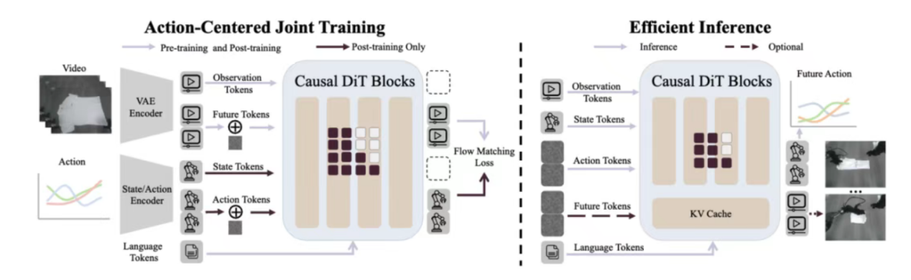

# 33.2 具身智能的训练数据

训练数据是具身智能发展的一大难题。真机数据价值最高但量太少，其余数据则各有其缺点。未来真正能让具身智能实现泛化的模型架构，应该能随着数据的Scaling而获得性能提升，且不依赖监督学习。

## 一、真机数据

这是目前构建高精度、端到端具身操作模型（如 ALOHA、Google RT 系列）最核心、最直接的数据来源。通常由人类操作员通过遥控设备（如 VR 手柄、主从机械臂、外骨骼）或拖动示教（Kinesthetic Teaching）来控制真实机器人完成任务。

工作流（模仿学习 Behavior Cloning）：

1. 数据采集：人类操作员在真实场景中遥控机器人。
2. 传感器同步记录视觉观测（多视角摄像头）、本体感觉（关节角度、速度）和人类给出的动作指令。
3. 模型训练：将收集到的状态-动作对 $(s_t,a_t)$ 构成数据集 $\mathcal{D}$，通过最小化负对数似然或使用扩散模型（如 Diffusion Policy）来训练策略网络：

$$
\mathcal{L}_{BC}
=
-\mathbb{E}_{(s_t,a_t)\sim\mathcal{D}}
\log \pi_\theta(a_t|s_t)
$$

4. 部署：在相同或相似的真实环境中运行训练好的策略。

真机数据的优点包括：

- 零 Sim-to-Real 鸿沟：数据包含了真实世界中极其复杂的物理交互，如摩擦力、形变、复杂接触力学以及真实光影变化。
- 任务成功率高：在与采集环境高度一致的场景中，模型表现极佳。所谓“过拟合”于特定物理环境，在此环境内反而非常可靠。

真机数据的缺点包括：

- 采集成本极高且难以规模化：严重依赖昂贵的人力。例如，Google 在其办公室厨房采集了 17 个月才得到 13 万条数据；斯坦福的 ALOHA 系统虽然降低了硬件门槛，但人工操作疲劳度依然很高。
- 泛化能力弱：由于数据源有限，一旦环境发生细微变化，如换背景、换光照，甚至稍微改变桌子高度，成功率往往会发生断崖式下跌。
- 数据质量受限于人类操作员：人类在遥控时的微小失误、次优动作或不同操作员的习惯差异，会给训练引入噪声，形成多峰分布问题。

在预训练结束后，微调时就可以放到物理环境中执行任务，这种自主执行产生的数据相比于传统的纯人类遥控演示更符合模型原生的动作分布。此时也可以“human in the loop”，即当模型遇到失败边缘时，人类专家介入进行修正，系统自动平滑专家介入前后的过渡边界，生成高质量的连续轨迹数据。

直接用50万小时真机数据从零开始训练的GEN-1模型在具身任务中取得了比类似VLA或WAM更好的效果，证明了足够多的真机数据是最有效的。但纯真机数据训练在数据的可扩展性上仍然会不可避免地遇到障碍。

## 二、物理引擎合成数据

为了解决真实数据难以规模化的问题，研究人员利用物理仿真引擎（如 MuJoCo、Isaac Gym/Sim、PyBullet、SAPIEN、Habitat）在虚拟世界中构建环境，通过强化学习（RL）或大规模并发采样获取数据，然后再迁移到真实世界（Sim-to-Real）。

工作流（以大规模强化学习为例）：

1. 环境建模：在仿真引擎中导入机器人 URDF 模型和环境物体，定义物理属性，如质量、摩擦系数。
2. 域随机化（Domain Randomization）：为了对抗仿真与现实的差异，在每次训练重置时，随机改变环境的视觉参数（光照、纹理、相机视角）和物理参数（质量、摩擦力、阻尼）。
3. 策略训练：使用强化学习算法（如 PPO、SAC），基于设定的奖励函数 $r(s,a)$ 优化策略，最大化期望累积奖励。
4. Sim-to-Real 部署：将训练好的策略直接部署到物理机器人上，依赖域随机化赋予的鲁棒性来克服现实世界的未见扰动。

这类数据的优点包括：

- 成本低廉且无限可扩展：可以在不需要购买大量物理机器人的情况下，全天候在计算集群上生成海量交互数据。
- 绝对安全：机器人在学习初期不断摔倒、碰撞，在仿真中不会造成任何硬件损坏，非常适合训练双足机器人（如人形机器人行走）和无人机。
- 特权信息易得：在仿真中可以轻易获取环境的真实状态，如物体的精确 6D 位姿、接触力，有利于设计 Teacher-Student 蒸馏学习框架。

缺点包括：

- Sim-to-Real 鸿沟（Sim-to-Real Gap）：物理引擎无法完美模拟现实世界。特别是对于流体、柔性物体（如布料、绳子）、复杂的滑动摩擦以及触觉传感器的模拟，目前的仿真器仍存在巨大误差。
- 奖励函数设计困难（Reward Engineering）：在复杂的操作任务中，手工设计能够引导机器人完成任务且不产生“钻空子”行为的奖励函数极其耗时耗力。

## 三、互联网视频数据

互联网上存在海量的第一视角（Egocentric，如 Ego4D 数据集）和第三视角人类活动视频（如 YouTube 烹饪、维修教程）。这些数据蕴含了丰富的常识、物理规律以及“如何与世界交互”的知识。

人类第一视角视频对机器人训练效果最佳。机器人结构越和人形接近，迁移难度越低，随着数据的扩展效果提升越明显。

工作流（视频重定向与表征学习）：

1. 大规模预训练：使用自监督学习或掩码建模（Masked Autoencoders），让模型在海量人类视频上学习视频帧序列的预测和动态特征，提取出通用的视觉-物理表征。
2. 动作提取与重定向（Motion Retargeting）：利用姿态估计技术（如手部关键点检测）提取人类动作，通过逆运动学（Inverse Kinematics）将人手的轨迹映射到机器人末端执行器或灵巧手上。
3. 微调：将提取出的伪标签数据用于微调机器人的策略网络。

互联网视频数据的优势包括：

- 数据量和多样性呈指数级：这是唯一在规模上可以匹敌文本大模型（LLM）预训练语料的数据源，包含了极广的场景、物体和任务语义。
- 赋予机器人常识与高层规划能力：帮助模型理解“什么是门”“如何拧开瓶盖”的宏观概念，增强跨场景泛化能力。

互联网视频数据的缺点包括：

- 严重的具身鸿沟（Embodiment Gap）：人类的身体构造（自由度、肌肉骨骼系统）与机器人完全不同。一段人类灵活切菜的视频，很难直接转化为带有两指夹爪的机械臂电机控制指令。
- 缺乏物理动作标签：视频中只有像素变化（RGB），没有机器人所需的关键输入，如关节力矩、触觉反馈和深度信息。这使得这类数据主要用于高层决策和视觉预训练，难以直接用于底层精确控制。

对于具身鸿沟问题，一个可能的解决方案是不直接在原始动作空间里学习，而是先通过对比学习训练动作编码器，将不同本体（论文覆盖类人灵巧手、人手、平行夹爪三类）的动作映射到一个对齐的“潜在动作空间”。再用一个扩散策略在这个统一的潜在空间里进行联合训练，预测出机器人腕部动作和统一的潜在末端动作。在推理时，再根据具体控制的机器人，调用对应的解码器生成具体的关节指令。

此外，也可以从第一人称视角视频中学习预测两个关键信息：手与物体即将发生接触的点，以及接触瞬间的手部姿态。然后再将这些预测出的结构化先验信息作为额外输入，“喂”给下游的灵巧操作策略。还有一种基于“关键向量”的重定向方法：计算手掌到各个指尖、以及各个指尖相互之间的向量，通过最小化人类手部关键向量和机器手关键向量之间的能量损失，来计算出机器手应有的关节角度，也作为训练的输入数据。

## 四、游戏数据

游戏环境（如《Minecraft》、《GTA》等开放世界沙盒）作为一种极度复杂的交互式仿真器，提供了远超传统物理引擎的场景多样性和任务长视距特性。它允许具身模型在具有一定物理规则但又完全安全的虚拟沙盒中进行大规模预训练，以此弥补物理环境真实操作数据的匮乏。

工作流（以大规模游戏视觉-动作预训练框架如 VPT、MineDojo 为例）：

1. 海量多模态数据采集与逆动力学标签生成：从互联网大规模收集玩家第一人称视角的实况游玩视频。由于绝大多数视频仅有画面（观测）而无按键记录，研究人员会先通过特定接口收集一小批带有确切键盘/鼠标操作轨迹的“观测-动作”对齐数据，以此训练一个高精度的逆动力学模型（Inverse Dynamics Model, IDM）。随后，利用该 IDM 为互联网上海量的无标签游戏视频推断并自动打上伪动作标签。
2. 动作行为克隆与基础模型训练：将海量游戏视觉帧（状态）与玩家的离散控制指令（动作）构成庞大的预训练数据集，在此之上，通过行为克隆（Behavior Cloning）训练基于大规模 Transformer 的视觉-动作策略网络。其核心是最小化观测状态下动作预测的负对数似然：

$$
\mathcal{L}_{BC}=-\log\pi_\theta(a|o)
$$

3. 具身迁移与微调（Game-to-Robot）：游戏预训练赋予了模型对通用物理常识、三维空间几何、复杂目标规划及“视觉-动作”因果映射的深刻认知。在下游物理部署时，将该模型作为基础策略（Foundation Policy），并引入少量带有连续动作空间标签的真实物理机器人数据进行微调，将高层的游戏控制语义（如“前进”“拾取”）映射到底层机器人具体的关节力矩（Torque）或末端执行器 6D 位姿。

优点包括：

- 极低的试错成本与无边界的探索能力：游戏环境允许智能体进行现实中极其危险、甚至会造成毁灭性硬件损坏的操作，如爆炸、高空坠落、超高速碰撞。这种绝对安全的试错特性非常适合用于训练长视距（Long-horizon）的复杂规划任务和强化学习探索，突破了真实机器人在安全约束下的训练瓶颈。
- 低成本获取指数级的高质量交互数据：互联网上积累了数千万小时自带第一人称视角、自然语言解说及人类意图的高质量游戏实况。这些数据蕴含了人类在多变的三维世界中解决物理问题的常识语义，是目前极少数能在规模和丰富度上匹敌大语言模型（LLM）预训练语料的具身来源。
- 极强的跨环境通用泛化与迁移力：现代大型游戏包含动态光影渲染、多变天气系统以及复杂场景互动逻辑。在涵盖数百款甚至上千款不同游戏的复合数据上进行联合训练，可以促使模型学习到不依赖特定画风或光照的通用表征，建立起应对未知环境的鲁棒性。

缺点包括：

- 物理规律的“游戏化”失真：游戏引擎的底层物理往往是为了视觉效果和帧率进行大幅妥协的“伪物理”。例如《Minecraft》中违背重力悬空不掉落的方块，或简化的刚体碰撞动力学。若策略网络过度拟合此类数据，极易导致具身大模型产生违背真实物理常识的幻觉，从而在现实部署中做出不合理决策。
- 巨大的动作空间与具身鸿沟（Action Space Mismatch）：游戏玩家的控制指令通常是高度抽象的离散信号，如按下键盘的 W 键以恒定速度前进、点击鼠标左键瞬间完成攻击；而现实中高自由度（DoF）的仿生机械臂或灵巧手需要平滑、连续的电机控制，以及微秒级的力矩/触觉反馈。这二者之间存在巨大跨模态鸿沟，直接将离散虚拟操作重定向为精确的底层连续物理控制，在控制理论与微调对齐上仍是充满挑战的工程难题。

## 五、人类视角多模态数据

这类数据由人类在自然生活和工作场景中，穿戴特殊的传感器网络（如带有眼动追踪和 RGB-D 相机的智能眼镜、动作捕捉服、触觉/力反馈数据手套、肌电传感器等）采集而成。典型代表包括 Meta 的 Project Aria、Ego4D/Ego-Exo4D 数据集，以及各种基于视触觉融合的灵巧手抓取数据集。它试图在“无物理机器人介入”的情况下，以最高保真度记录人类解决物理问题的完整多模态感知与微观运动过程。

工作流（多模态动捕与重定向）：

1. 沉浸式数据采集：穿戴设备的人类在真实世界中执行任务。系统高频同步记录第一视角视频流（Egocentric Vision）、头部/视线追踪数据（指示注意力焦点）、人体骨骼姿态（IMU 提供的关节角度和加速度）以及手部精细动作与触觉分布。
2. 动作重定向（Motion Retargeting）：由于采集到的是人类的运动学状态 $q_{human}$，必须通过非线性优化或逆运动学（Inverse Kinematics, IK）将其映射到特定机器人的构型空间 $q_{robot}$。通常需要建立一个基于能量或距离的优化目标：

$$
q_{robot}^*
=
\arg\min_{q_{robot}}
\left\|
f_{robot}(q_{robot})-f_{human}(q_{human})
\right\|^2
+
\lambda R(q_{robot})
$$

其中，$f$ 表示正运动学函数，提取关键点（如指尖）的空间坐标，$R(q)$ 为正则化项，用于避免机器人自碰撞或超出关节限位。

3. 跨具身策略学习：将重定向后的机器人状态和动作，结合第一视角视觉输入，作为伪真实数据（Pseudo-Demonstrations），用于模仿学习，也可以作为专家先验引导强化学习的探索。

优势包括：

- 极高的数据质量与意图揭示：与第三方视角的互联网视频相比，第一视角（Egocentric）自带了“注意力掩码”。眼动追踪和头部姿态直接揭示了人类在操作时的视觉焦点和意图（例如看向杯子把手、伸手、抓取），这对训练注意力机制（Attention Mechanism）和预测动作时序极其宝贵。
- 多模态物理属性的直接捕获：数据手套或触觉传感器可以直接捕捉到抓取不同材质（如柔软海绵、光滑玻璃）时的接触力分布和形变，这是纯视觉数据无法提供的，对训练高自由度灵巧手的细粒度控制至关重要。
- 采集规模与自然度远超遥控示教：人类不需要盯着屏幕笨拙地操作手柄，而是直接用自己的身体和双手与世界交互。这种方式极其自然，可以轻松实现长时间、跨场景的数据采集，任务的复杂度和流畅度远超传统的遥控采集。

缺点包括：

- 巨大的具身鸿沟（Embodiment Gap）：人类骨骼肌肉系统（连续柔性驱动）与机器人电机/减速器系统（刚性离散驱动）在自由度（DoF）、动力学特性和力矩限制上截然不同。完美的动作重定向在数学上是不可能的，重定向过程会丢失大量依赖于人类特定生理结构的微操作细节。
- 缺乏直接的控制指令标签：穿戴设备采集的是人类的“状态（State）”，而不是机器人需要的“动作指令（Action/Torque）”。将人类状态转化为机器人电机的底层控制命令，需要复杂的控制理论和动力学建模作为桥梁，中间会引入大量累积误差。
- 传感器噪声与多源对齐难题：真实世界中的可穿戴传感器（特别是 IMU）存在严重漂移问题。同时，在高频动作下，确保视觉帧、触觉信号和骨骼姿态在微秒级别的时间戳绝对对齐（Synchronization），在硬件工程上是一项巨大挑战。

具身鸿沟问题可能的解决方案参考前面的互联网视频数据。

## 六、世界模型生成数据

工作流（以大模型驱动的数据生成框架 RoboGen/Eureka 为例）：

1. 任务生成：LLM 提出大量在现实中可能发生的任务指令。
2. 环境与代码合成：LLM/VLM 自动编写 Python 代码（使用仿真器 API），生成对应的 3D 仿真环境资产，设定物理参数，并编写强化学习的奖励函数代码。
3. 虚拟试错与过滤：在物理引擎中运行这些自动生成的环境进行强化学习，剔除不符合物理规律或无法收敛的失败任务。
4. 视频生成增强：利用视频扩散模型，将少量真实机器人操作视频生成不同视角、不同光照、不同背景的变体视频，用于训练视觉编码器。

优势包括：

- 突破人类想象力瓶颈：自动化生成任务和环境，指数级扩充训练场景的丰富度，大幅减少人工设计环境的干预。
- 物理先验结合高层语义：将大模型广泛的世界知识直接“下沉”转化为机器人的训练数据。

缺点包括：

- AI 幻觉与物理失真：尤其是基于视频生成的纯视觉数据，容易出现违背物理常识的现象，如物体凭空穿透、流体动力学错误。如果用这种有缺陷的数据训练动作策略，会导致严重安全隐患。

一些让算法鲁棒性更强的方案：

- 随机注意力掩码（Stochastic Attention Masking）：为了防止策略过度依赖世界模型生成的合成信号，算法在训练时有 20% 的概率随机屏蔽世界模型的 tokens。这保证了模型在没有世界模型输入时依然鲁棒。

## 七、业界数据工程示例

### （一）GigaWorld-Policy：World-Action Model

1.通用物理世界预训练：首先，利用海量互联网视频数据，让模型建立起对通用物理规律和视觉动态的基础认知。

2.具身场景沉浸式微调：随后，引入数千小时涵盖第一人称、真机及仿真的多源操作视频。在这一阶段，模型专攻具身交互场景，掌握特定空间下的时空演变规律。

3.极小样本的动作对齐：最后，在拥有强大世界认知的基础上，仅需极少量的真机动作标签数据进行训练，即可将预训练世界模型与机器人的动作预测精准对齐，快速打通“观测-动作-未来视觉”的因果映射。

同时，该模型自身也是世界模型与策略模型的合体，在训练时，既生成对未来的视频预测，也生成动作，推理时则舍弃了视频分支。

### （二）π0.7（VLA模型）

π0.7涌现出组合泛化能力的关键在于，用多样化的prompt处理多样化的数据。过去VLA训练只喂一句清理冰箱，模型得到的信号是单一的。π0.7把prompt展开成四层：任务指令（清理厨房）+子任务指令（打开冰箱）+子目标图像（下一秒画面应该长什么样）+episode元数据（这条数据质量几分、有没有出错、速度多快）。

有了这些丰富的context，模型就能分得清训练数据里的好坏、快慢、对错。然后它就能吃下以前吃不了的数据。失败的rollouts，低质量的演示，其他机器人的片段，人类的egocentric视频，全都变成有用的信号。简而言之，π0.7加的那层prompt，就是让模型知道“这段数据是什么质量、用什么策略做的”。

### （三）高德ABot-3DGS、ABot-PhysWorld（World Model作为训练环境）

先把数据转成机器能读懂的“多模态Clip”，比如骑车经过一个路口，高德记录下来的不只是一张图，而是一整套信息，包括路口长什么样（图像）、红绿灯在哪（空间位置）、现在是红灯还是绿灯（状态）、你是直行还是准备转弯（行为），甚至还包括周围有没有行人、车辆在动等，所有东西打包在一起就是一个Clip。ABot-3DGS利用这些Clip数据，重建3D真实场景；ABot-PhysWorld在这些场景中进行合乎物理定律（如滑动、倾倒、堆叠、流体变化）的动作推演。

对于ABot-PhysWorld的训练数据，高德精选300万条真实操作视频，用VLM+LLM双阶段标注，构建四层级物理语义结构，将数据拆解成机器人更易“消化”的结构化信息：

宏观层（意图）：自然语言描述整体任务目标，如“抓取并放置苹果”。

中观层（动作序列）：动词-名词短语序列，如“接近→抓握→提起→移动→释放”。

微观层（轨迹细节）：记录笛卡尔轨迹、相对运动、夹爪状态，如“末端沿Z轴下降5cm，夹爪闭合至20mm”。

场景层（物理关系）：描述接触、支撑、包含关系及任务结果，如“苹果与桌面接触，被夹爪稳固抓握，成功放置于袋中”。

这套标注流程不仅在告诉机器人“发生了什么”，更在解释“为什么发生”。

## 参考文献

- O'Neill, A., Rehman, A., Gupta, A., et al. (2024). [Open X-Embodiment: Robotic Learning Datasets and RT-X Models](https://arxiv.org/abs/2310.08864). ICRA.
- Walke, H., Black, K., Lee, A., et al. (2023). [BridgeData V2: A Dataset for Robot Learning at Scale](https://arxiv.org/abs/2308.12952). arXiv:2308.12952.
