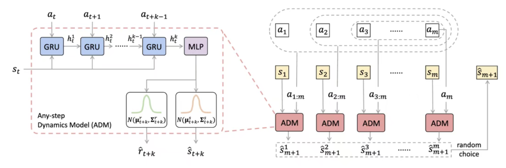
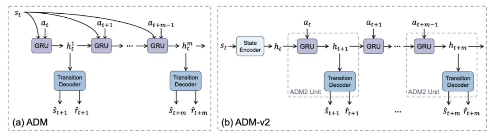

# 36.5 任意步动力学预测（论文）

> 本文是论文阅读笔记，内容代表对应论文方法或作者理解，不应直接视为领域共识或工程最佳实践。

## 一、问题背景与核心思想

传统动力学模型大多采用单步预测：输入当前状态s_t和动作a_t，预测下一状态s_t+1。但在长程自回归推演中，误差会持续累积并不断放大。

Any-step Dynamics Model（ADM）提出，未来状态不一定非要依赖上一步预测结果层层递推得到，也可以基于历史状态直接进行任意步数预测。

## 二、ADM的核心思想与模型架构

### （一）核心思想：“回溯”

每次预测下一个状态s_t+1时，不是仅仅基于当前状态s_t和动作a_t，而是从不同远近的历史状态出发，根据(s_t,a_t),(s_t-1,a_t-1,a_t),...等都可以预测s_t+1。在这t个预测中随机选择一个，这样相当于对历史远近进行蒙特卡洛采样，在长距离多次生成过程中，就既能有效回顾较远的历史，避免偏差累积，又能关注较近的状态，实现精准生成。

### （二）模型架构

- 由于输入计划的步长 $k$ 是可变的，作者采用了包含门控循环单元（GRU）的循环神经网络（RNN）来实现 ADM。
- 为了处理输入维度，模型会将初始的单步状态 $s_t$ 进行复制，使其与多步动作序列的长度相匹配，然后依次送入 RNN。
- RNN 输出的隐藏状态 $h_k$ 会被送入多层感知机（MLP），最终输出目标状态 $s_{t+k}$ 和奖励 $r_{t+k}$ 的高斯分布参数，即均值和标准差 $(\mu_{t+k}^{s}, \Sigma_{t+k}^{s})$ 与 $(\mu_{t+k}^{r}, \Sigma_{t+k}^{r})$。

### （三）训练目标

最大化k步预测（k为1至m间的任意值）的对数似然：

$$
J_T(\theta)
=
\frac{1}{m}
\sum_{k=1}^{m}
\mathbb{E}_{(s_t,a_{t:t+k-1},r_{t+k},s_{t+k}) \sim D_{\mathrm{env}}}
\left[
\log T_{\theta}^{k}(s_{t+k}, r_{t+k} \mid s_t, a_{t:t+k-1})
\right]
$$

### （四）Off-policy时的不确定性量化

- **不确定性量化原理**：当面临轨迹分布发生变化或进入风险区域时，使用不同回溯长度 $k$ 预测出的状态会表现出明显的分歧。ADMPO-OFF 创造性地利用这一特性，通过计算不同回溯长度 $k$ 预测结果的方差（或标准差）来量化模型的不确定性 $U^{ADM}$，彻底摆脱了对集成模型的依赖。
- **不确定性公式**：

$$
U^{ADM}(s_t, a_t)
=
\mathbb{E}_{\tau^m \sim I(\pi)}
\left[
\left\|
\frac{1}{m}
\sum_{k=1}^{m}
\left(
(\Sigma_{t}^{k})^{2}
+(\mu_t^{k})^{2}
\right)
-
(\bar{\mu})^{2}
\right\|
_1
\right]
$$

- **悲观价值迭代机制**：在离线训练好的 ADM 中进行环境展开时，算法会对每一步生成的奖励进行惩罚：$\tilde{r}=r-\beta U^{ADM}(s_t,a_t)$，其中 $\beta$ 是惩罚系数。通过惩罚高不确定性区域的奖励，算法构造了一个悲观的贝尔曼算子，强制策略保持保守，避免采取未知区域的危险动作。

## 三、ADM-v2的改进

### （一）状态初始化与动作演化分离

第一代ADM通过直接建模任意步长的状态转移，减少了自举带来的误差累积。但由于其结构设计问题，ADM需要将初始状态多次复制，反复引入起始状态以对齐动作序列的长度，这导致了RNN隐藏表示与初始状态的强耦合，且无法通过并行计算加速任意步长的预测。

ADM-v2对这一结构做了更自然的重构：把状态编码和动力学预测分开，先将起始状态编码为隐变量，将这一隐表示作为循环单元的初始隐藏状态，后续递推只输入动作序列，不再重复输入起始状态。这样能让预测效果更优，也更符合基于隐变量的世界模型的范式。

模型分为三个组件：

- **状态编码器（State Encoder）**：将回溯起点状态 $s_t$ 编码为隐向量 $h_t$，即 $h_t=enc_{\theta}(s_t)$。这个 $h_t$ 直接作为 GRU 的初始隐藏状态。
- **GRU 单元**：因为起点状态的信息已经压缩在 $h_t$ 中，后续 GRU 的每次循环前向传播不再重复输入起点状态，而仅接收动作序列中的当前动作 $a_t$：

$$
h_{t+1}=g_{\theta}(h_t,a_t)
$$

- **转移解码器（Transition Decoder）**：接收更新后的隐藏状态 $h_{t+1}$，解码并输出下一状态 $s_{t+1}$ 和奖励 $r_{t+1}$ 的独立高斯分布参数：

$$
(\mu_{t+1}^{s}, \Sigma_{t+1}^{s}, \mu_{t+1}^{r}, \Sigma_{t+1}^{r})
=
dec_{\theta}(h_{t+1})
$$

### （二）并行任意步滚动推演（Parallel Any-step Roll-out，PARoll）

> [图片内容待重建：img-a3d24cef5bef-0008] 原 Word 此处有图片。为避免版权风险，开源版暂不上传图片；自动 OCR 已弃用，后续将依据原稿人工重建为 Markdown/LaTeX。
如图，维护m个并行预测分支，每两个分支之间有1步的时间差，每个分支在中间都每隔m步（设定的最大预测步长）进行一次预测。

第一步：轨迹初始化

> [图片内容待重建：img-a3d24cef5bef-0009] 原 Word 此处有图片。为避免版权风险，开源版暂不上传图片；自动 OCR 已弃用，后续将依据原稿人工重建为 Markdown/LaTeX。
第二步：并行生成Roll-out与多样化预测

> [图片内容待重建：img-a3d24cef5bef-0010] 原 Word 此处有图片。为避免版权风险，开源版暂不上传图片；自动 OCR 已弃用，后续将依据原稿人工重建为 Markdown/LaTeX。
> [图片内容待重建：img-a3d24cef5bef-0011] 原 Word 此处有图片。为避免版权风险，开源版暂不上传图片；自动 OCR 已弃用，后续将依据原稿人工重建为 Markdown/LaTeX。
> [图片内容待重建：img-a3d24cef5bef-0012] 原 Word 此处有图片。为避免版权风险，开源版暂不上传图片；自动 OCR 已弃用，后续将依据原稿人工重建为 Markdown/LaTeX。
第三步：跨度重置

> [图片内容待重建：img-a3d24cef5bef-0013] 原 Word 此处有图片。为避免版权风险，开源版暂不上传图片；自动 OCR 已弃用，后续将依据原稿人工重建为 Markdown/LaTeX。
> [图片内容待重建：img-a3d24cef5bef-0014] 原 Word 此处有图片。为避免版权风险，开源版暂不上传图片；自动 OCR 已弃用，后续将依据原稿人工重建为 Markdown/LaTeX。
这意味着每隔m步就要把隐状态输出为预测状态，以此重新编码新的隐状态，完成重置。这样相比于随机回溯步数的好处在于，无论随机选中哪一条分支，都能获得来自历史较远状态和较近状态的信息（每隔m步一个状态），更好地满足平衡防止误差累积和提高精度的需要。

> [图片内容待重建：img-a3d24cef5bef-0015] 原 Word 此处有图片。为避免版权风险，开源版暂不上传图片；自动 OCR 已弃用，后续将依据原稿人工重建为 Markdown/LaTeX。
### （四）全视野rollout的理论边界

> [图片内容待重建：img-a3d24cef5bef-0016] 原 Word 此处有图片。为避免版权风险，开源版暂不上传图片；自动 OCR 已弃用，后续将依据原稿人工重建为 Markdown/LaTeX。
> [图片内容待重建：img-a3d24cef5bef-0017] 原 Word 此处有图片。为避免版权风险，开源版暂不上传图片；自动 OCR 已弃用，后续将依据原稿人工重建为 Markdown/LaTeX。

## 参考文献

暂无已核验参考文献。
