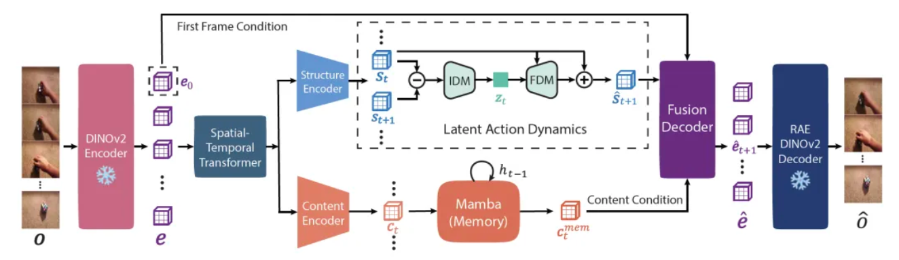

# 36.6 Action Space的学习（论文）

> 本文是论文阅读笔记，内容代表对应论文方法或作者理解，不应直接视为领域共识或工程最佳实践。

## 一、Latent Action Models

世界模型的核心表达式是 $s_{t+1}=f(s_t,a_t)$。对于海量的视频数据，$s_t$ 和 $s_{t+1}$ 都是容易获取的，但我们却没有显式的动作数据 $a_t$。这会影响模型学习“特定干预会造成何种后果”，尤其是在交互式或具身智能场景中更明显。如果将动作看作一种模态，那么模型也需要一个对应的“词表”，即 Action Space。Latent Action Models 是一种从视频中自监督学习 Action Space 的方法。

### （一）核心组件

1. 反向动力学模型（Inverse Dynamics Model）：从前后状态 $s_t$ 和 $s_{t+1}$ 中推断动作 $a_t$ 的潜在表示，并通过信息瓶颈促使 $a_t$ 编码最关键的运动信息。
2. 前向动力学模型（Forward Dynamics Model）：使用当前状态 $s_t$ 和动作 $a_t$ 预测下一状态 $s_{t+1}$。

### （二）抽象要求

如果允许动作 $a_t$ 保留太多信息以提升生成质量，它又容易混入颜色、纹理、背景等内容信息，导致动作不够抽象、难以迁移。为了保证动作表示具有可迁移性和抽象性，模型通常会施加强预测瓶颈，例如向量量化或变分瓶颈。

但不可否认的是，如果动作表示被压缩得足够抽象，它更容易迁移，却也可能偏离动作空间内在的流形结构，丢失预测下一个状态的准确性，以及生成所需的细节。

## 二、动作抽象化中的结构-内容表征解耦方法

### （一）核心思想

前面提到，对于 Latent Action Models 提取动作，一方面需要施加信息瓶颈以保证动作的抽象性；另一方面，如果压缩过度又会影响预测准确性。对于这一对矛盾，论文《DiLA: Disentangled Latent Action World Models》提出了结构-内容解耦的方法：将时空变换结构与视觉内容的表征解耦，在动作（即状态随时空变换的结构）上采取严格的信息瓶颈，在视觉内容方面则通过额外通道避免信息丢失。

### （二）模型架构与工作流

输入视频先经过 DINOv2 编码器和 Spatial-Temporal Transformer，得到视觉表征。随后，模型将这些表征分别送入不同通路中处理：

1. 结构通路：负责建模与运动相关的空间结构，例如位置、布局和动态变化。模型先压缩得到结构表征，再用逆向动力学模型从连续结构表征的差异中推断动作的潜在表示。前向动力学模型根据当前结构表征和动作预测下一时刻的结构表征。这个过程使动作表征主要编码“结构如何变化”，而不是完整图像如何变化。
2. 内容通路：负责保存视觉细节，例如颜色、纹理、背景、物体外观和历史信息。模型使用线性注意力 Mamba 层作为记忆模块，用于聚合历史内容信息。它关注相对稳定的视觉内容，而不是快速变化的动态结构。

最后，Fusion Decoder 将预测出的结构表征、内容记忆表征以及初始帧信息融合起来，重建未来视觉表征。

为了验证结构与内容是否真正分离，论文设计了实验：从一个视频中提取结构，从另一个视频中提取内容，然后将二者重新组合生成新序列。生成序列继承了结构序列的空间动态，同时保留了内容序列的颜色、纹理和外观属性。而固定结构表征，只让内容的记忆模块随时间更新，序列保持静止。这说明内容记忆模块主要编码时间上相对稳定的内容信息，而不是运动本身。

## 参考文献

- Schmidt, D., & Jiang, M. (2024). [Learning to Act without Actions](https://openreview.net/forum?id=rnnt2Be6nN). International Conference on Learning Representations.
- Garrido, Q., Nagarajan, T., Terver, B., Ballas, N., LeCun, Y., & Rabbat, M. (2026). [Learning Latent Action World Models In The Wild](https://arxiv.org/abs/2601.05230). arXiv:2601.05230.
