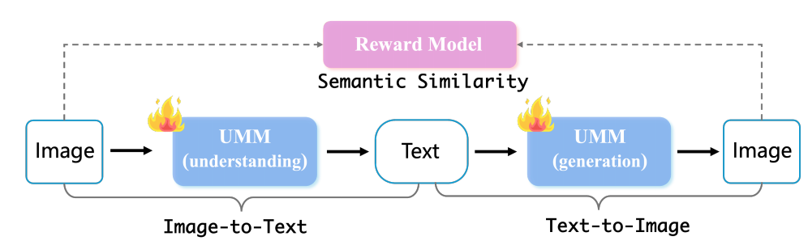
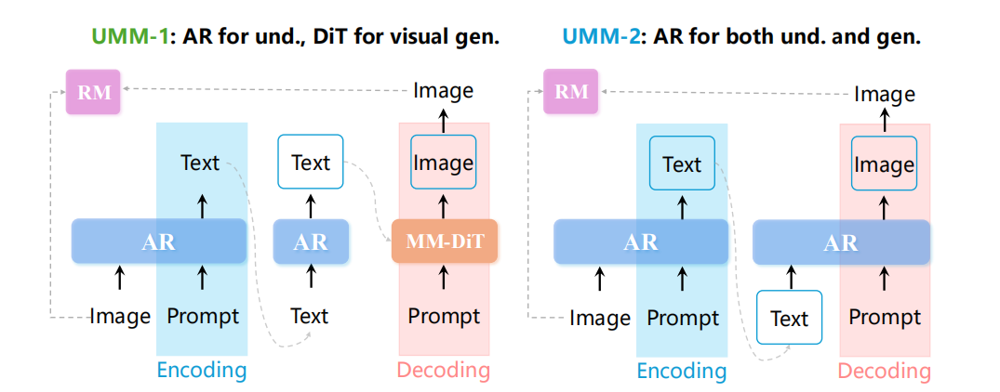

# 38.6 UAE：训练中理解与生成合为自编码器（论文）

> 本文是论文阅读笔记，内容代表对应论文方法或作者理解，不应直接视为领域共识或工程最佳实践。

## 一、问题背景与核心思想

在多模态统一理解-生成模型中，在训练中常发生理解与生成的冲突，语义抽象的准确性和像素还原的保真度不仅不互相促进，反而可能互相造成负面影响。一些研究通过架构上的调整，实现了二者的共存，但两个任务本质上仍然是割裂的，没有明显的相互促进效应。

北大等提出了UAE，其具体训练方式即Unified-GRPO。这种方法重新定义了任务本身，利用自编码器的思想，将同一个模型视为编码器和解码器，对于每一个样本，让理解和生成成为同一条训练“流水线”的两个环节，二者的目标完全相同：保证“流水线”终端产出的“重建图像”能够完美还原最初投入的原始图像。这样，二者就可以通过训练真正相互促进，而不仅仅是共存。

在这一训练“流水线”中，编码阶段先将图像和Prompt输入主干自回归模型，得到文本描述；解码阶段将文本描述输入Diffusion Transformer（对于UMM-1类即生成文本用自回归、生成图像用扩散的模型）或同一个自回归模型（对于UMM-2类即纯自回归模型），得到重建的图像。

## 二、训练流程

### （一）UMM-1类模型

冻结Decoder（即Diffusion Transformer），将其作为RL环境的一部分，只用GRPO训练Encoder（即自回归模型）。Encoder中的ViT也要冻结，因为ViT负责把原始图像像素转化为视觉 token，是LLM的“眼睛”，一旦视觉特征在RL中发生漂移，整个系统将失去稳定基准。消融实验表明，如果对视觉编码器（ViT）或DiT也做梯度更新，RL的随机性和高方差梯度会导致生成崩溃，表现为语义信息丢失、结构坍塌、出现异常伪影等。

在训练的过程中，针对Encoder生成的每一条文本，提取其最后一个隐状态向量，通过一个投影层将其映射为扩散模型的条件输入。模型会学会在表示文段生成结束的最后一个<end> token中蕴含丰富的全局语义信息。

### （二）UMM-2类模型

Encoder和Decoder完全相同，故同步训练。梯度（或相对优势估计）不仅会指导模型如何更好地提取语义，还会直接指导模型如何更精准地将文本翻译回视觉token。这样可以真正实现协同进化：理解能力的提升为生成提供了更密集的先验信号，而生成过程为了达到极高的还原度，反过来促使模型在统一的权重空间内完善其细粒度的视觉感知能力（例如对小目标或细微属性的捕捉）。

Encoder中的ViT也需要冻结，原因与前面所述相同。

## 三、使用RL的原因和奖励函数

由于“模型需要生成怎样的文本”没有可学习的Ground Truth，只通过图像生成情况好坏来评判，故这里使用强化学习中的GRPO算法，而不是监督学习或无监督学习。奖励计算方式如下：

具体操作是：使用预训练的 CLIP 模型分别提取原始输入图像 $x$ 和重建图像 $\tilde{x}^{(i)}$ 的视觉特征向量，并计算二者之间的余弦相似度作为单次采样的奖励值 $\mathcal{R}$：

$$
\mathcal{R}(x, \tilde{x}) = \cos\left(f_{\mathrm{CLIP}}(x), f_{\mathrm{CLIP}}(\tilde{x})\right)
$$

这样做有两个原因：

- 不使用传统的像素级均方误差（MSE），是因为该框架中的“中间隐空间”是纯文本字典，文本只能保留语义级特征，例如物体、颜色和位置，无法保留光照、噪点、微小纹理等底层像素变化。如果强制用 MSE 作为奖励，算法会严重惩罚新图像和原图在底层像素上的变化，违背评估“语义一致性”的初衷。
- 使用 CLIP，是因为 CLIP 擅长在高维空间对齐高级语义。最大化 CLIP 相似度只要求重建图像和原图在核心属性与空间关系上吻合，这更接近“模型是否全面理解图像”的评估目标。

## 参考文献

- Yan, Z., Lin, K., Li, Z., Ye, J., Han, H., Wang, Z., Liu, H., Lin, B., Li, H., Xu, X., Xiao, X., Wang, J., Wang, H., & Yuan, L. (2025). [Unified Multimodal Models as Auto-Encoders](https://arxiv.org/abs/2509.09666). arXiv:2509.09666.
