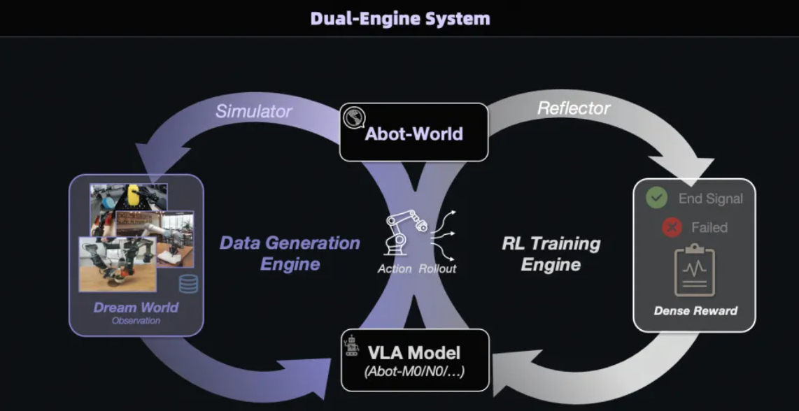

# 39.3 世界-策略顺序架构的具身智能（论文）

> 本文是论文阅读笔记，内容代表对应论文方法或作者理解，不应直接视为领域共识或工程最佳实践。

## 一、利用动作模型物理先验训练世界模型

### （一）问题背景

当前的视频世界模型缺乏明确的可执行性约束。它们生成的视频在像素层面上可能非常逼真连贯，但往往会违反刚体物理和运动学约束（例如发生机械臂形变、自交叉或时间上的突变）。

在实际部署中，通常会使用一个逆动力学模型（Inverse Dynamics Model, IDM）将这些生成的视频帧理解并解码为可执行的机器人动作。然而，如果视频中包含上述违背物理规律的视觉伪影，IDM 就会将其翻译成极端不稳定、高频抖动或超出物理限制的控制指令，从而导致任务失败。这种视觉生成与物理可执行控制之间的错位，被作者定义为“可执行性鸿沟”。

### （二）核心算法与工作流

**第一步：训练逆动力学模型（IDM）**

IDM 的作用是从视觉观察序列中推断出机器人的底层控制指令。

- 模型输入一个以时间 $t$ 为中心的短时视频帧窗口 $I_{t-k:t+k}$（$k$ 为时间上下文半径），并预测出对应的真实执行动作 $a_t$。
- 网络结构上，IDM 通过卷积主干提取空间特征，随后经过空间 Softmax 层将特征图转化为 2D 坐标，最后由多层感知机（MLP）映射到动作空间。

这一步在真实的机器人“视频-动作轨迹”数据对上，通过监督回归进行训练，使得 IDM 能准确地将输入的视频解码为机器人的动作指令。其损失函数定义为：

$$
\mathcal{L}_{IDM} = \mathbb{E}\left[\sum_t \left\| f_{\phi}(I_{t-k:t+k}) - a_t^{gt} \right\|_2^2\right]
$$

**第二步：构建基于 IDM 的可执行性奖励信号（IDM-based Executability Reward）**

由于视频生成器本身不受机器人运动学的约束，EVA 将冻结权重的 IDM 作为奖励模型，通过评估生成视频所隐含的动作序列的“平滑度”与“合规性”来提供密集的奖励。即使视频出现严重视觉伪影，IDM 也会将其转化为抖动或越界的动作，从而产生低奖励分数，确保信号的鲁棒性。

- 给定生成的视频 $V$，IDM 预测出完整的关节动作序列 $A = \{a_t\}_{t=1}^{T}$。
- 通过有限差分计算出关节空间的速度 $v_t$、加速度 $\alpha_t$ 和加加速度（jerk）$j_t$。
- 为了惩罚不平滑的运动，算法对加速度和加加速度应用了鲁棒的 Huber 惩罚函数：

$$
Huber(x;\delta)=
\begin{cases}
\frac{1}{2}x^2, & |x| \le \delta,\\
\delta\left(|x|-\frac{1}{2}\delta\right), & |x| > \delta.
\end{cases}
$$

从而得到运动平滑度惩罚项：

$$
\mathcal{P}_{\alpha} = \mathbb{E}_t[Huber(\alpha_t;\delta_{\alpha})], \quad
\mathcal{P}_{j} = \mathbb{E}_t[Huber(j_t;\delta_j)]
$$

- 同时，算法会惩罚超出机器人本体物理极限（如最大速度 $v_{max}$ 和最大加速度 $a_{max}$）的动作违规行为：

$$
\mathcal{P}_{vel} = \mathbb{E}_t\left\|\max(|v_t|-v_{max},0)\right\|_2^2, \quad
\mathcal{P}_{acc} = \mathbb{E}_t\left\|\max(|\alpha_t|-a_{max},0)\right\|_2^2
$$

- 将上述各项进行加权组合得到总惩罚 $\mathcal{P}(A)$：

$$
\mathcal{P}(A) = \lambda_j\mathcal{P}_j + \lambda_{\alpha}\mathcal{P}_{\alpha} + \lambda_{v-lim}\mathcal{P}_{vel} + \lambda_{a-lim}\mathcal{P}_{acc}
$$

- 最后，将惩罚值映射为用于网络更新的有界奖励 $R(V)$（$P_0$ 为惩罚基准尺度，$\gamma$ 为衰减率）：

$$
R(V) = \left(1 + \frac{\mathcal{P}(A)}{P_0}\right)^{-\gamma}
$$

这里事实上是利用对机器人动作的物理先验来给予RL奖励，通过梯度反传让视频生成模型生成符合物理规律的动作。

利用上述构建的奖励信号，EVA 框架采用群组相对策略优化（GRPO）算法对预训练的视频生成主干网络进行微调。

- 在优化过程中，模型被引导生成不仅符合文本指令，更能诱导出平滑、物理可行控制命令的视频轨迹。
- 通过持续的强化学习，模型学会了避开如图 5 所示的导致执行失败的典型特征，如运动学不合理（形态变形、关节模糊、时间不连续）以及错误的物体接触（如穿模或丢失接触）。

## 二、ABot-World：利用世界模型实现具身闭环

### （一）核心组件

高德的ABot-World是一个统一的具身智能体系，其中包括3D生成引擎ABot-3DGS、世界模型ABot-PhysWorld和VLA模型。

ABot-3DGS生成模拟的3D空间，这里的“空间”不是只有几何外观，而是带物理属性的。每个物体都会被赋予质量、摩擦系数等参数，从一开始就构成一个可计算、可干预的物理环境。

多模态世界模型ABot-PhysWorld预测该空间随着时间和机器人干预的状态演变，输出的每一帧不仅是像素，更是包含质量、接触力场、惯性张量的可微分物理状态快照，支持“动作条件化推演”与“零样本泛化”。

### （二）世界模型与策略模型的闭环

ABot-World不是一个静态模型，而是一个具备自我修正能力的认知基座，能接入真实世界的执行反馈，让自己越用越准。VLA和世界模型构成完整的闭环（预测—执行—反馈—自我修正）。例如，机器人根据ABot-World的推演去抓杯子，结果实际执行中夹爪滑脱了。这个误差信号会立刻回传给ABot-PhysWorld，模型自动调整参数，下次预测就会更精准。闭环工作流如下：

1.预测：基于DiT架构，以当前观测和动作为输入，在潜空间中直接生成符合时空动力学的未来状态序列。

2.执行：将推演出的最优动作指令下发给机器人执行机构。

3.反馈：采集真实世界的执行结果（例如预测能抓起水杯，但实际机械夹爪滑脱了）。

4.自我修正：利用真实世界的误差信号反哺认知基座，实时调整模型权重或状态记忆，使得模型“越用越准”。

## 参考文献

暂无已核验参考文献。
