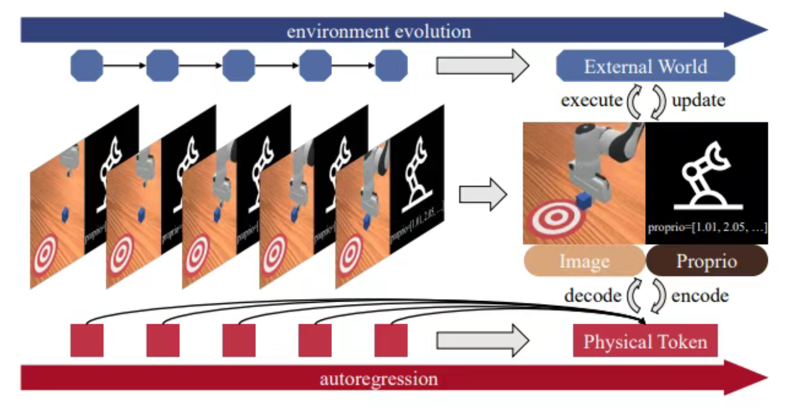

# 39.4 世界-策略统一架构的具身智能（论文）

> 本文是论文阅读笔记，内容代表对对应论文方法或作者理解，不应直接视为领域共识或工程最佳实践。

## 一、基于世界模型的微调

基于具有对物理世界深刻认知的世界模型进行微调，可以获得具身智能需要的“大脑”和训练环境。下面以宇树科技 UnifoLM-WMA-0 为例介绍。

### （一）工作模式

UnifoLM-WMA-0 的核心在于让模型理解机器人与环境相互作用时的物理规律。为了实现这一目标，该架构被设计为支持两种独立但互补的核心工作模式：

1. **决策模式（Decision-Making Mode / Policy Enhancement）**：执行任务时，世界模型会提前预测机器人在给定动作下与环境物理交互的未来关键信息。这些具有物理常识的“未来特征”，例如物体形变和位移预判，会被输入到动作策略头中，辅助机器人生成更精确的下一步动作。
2. **仿真模式（Simulation Mode / Simulation Engine）**：模型作为交互式物理仿真器运行。输入机器人给定的动作指令后，模型能够自回归地生成高度还原真实场景的物理环境反馈，通常表现为未来视频帧。这相当于在神经网络内部为机器人构建一个可交互的“梦境”环境，可用于生成合成数据以强化学习。

### （二）核心架构和工作流

UnifoLM-WMA-0 的训练与部署工作流分为三个阶段，逐步从单纯的“视频生成”过渡到“物理决策”：

1. **视频生成模型基础微调（World Model Pre-training）**
   - 输入：海量跨实体机器人数据集（如 Open-X Embodiment Dataset）中的图像观测（Observation）和文本指令（Text Instruction）。
   - 处理：对预训练的视频生成扩散模型进行针对性微调，使其生成能力从“生成通用视频”收敛到“生成机器人真实作业场景视频”。
   - 输出：具备基础物理直觉的视频大模型。
2. **决策模式后训练（Decision-making Post-training）**
   - 输入：下游具体任务数据集，例如具体型号机器人的抓取、叠积木动作数据。
   - 处理：冻结部分世界模型参数，接入动作头（Action Head）。将世界模型提取的中间特征表征与环境观测共同喂入动作头。
   - 输出：优化动作头网络，使其能够输出精确的关节控制指令序列。
3. **仿真模式后训练（Simulation Post-training）**
   - 输入：当前环境观测、文本指令，以及给定动作序列（Action Condition）。
   - 处理：强迫世界模型不仅根据文本预测未来，还严格遵循输入动作序列生成对应的未来物理反馈视频。
   - 输出：高保真的交互式神经网络仿真器。

1. 基于机器人数据、图像和文本指令的基础微调。

**子步骤 1：独立编码与降维压缩（Encoding & Compression）**。高分辨率像素图像和离散自然语言文本无法直接在同一个数学空间中计算，因此第一步必须将它们映射到各自的高维连续特征空间中。

**图像观测处理（Image Observation Processing）**：为了大幅降低扩散模型的计算复杂度，系统通常不会在像素空间直接操作，而是使用预训练变分自编码器（VQ-VAE 或连续 VAE）的编码器模块。设输入的初始图像观测为高分辨率张量 $o_0 \in \mathbb{R}^{H \times W \times 3}$，经过编码器后，图像被压缩为隐空间特征图：

$$
z_0 = E(o_0), \qquad z_0 \in \mathbb{R}^{h \times w \times c}
$$

其中 $h,w$ 是压缩后的空间分辨率，$c$ 是隐通道数。此时 $z_0$ 包含当前机器人视角下浓缩的几何与物理状态。

**文本指令处理（Text Instruction Processing）**：输入的自然语言指令，例如“将红色苹果放入篮子中”，由大语言模型或文本编码器（如 T5 或 CLIP Text Encoder）分词并提取语义特征，转化为上下文嵌入序列：

$$
E_{\mathrm{text}} = T(c_{\mathrm{text}}), \qquad E_{\mathrm{text}} \in \mathbb{R}^{L \times D}
$$

**子步骤 2：跨模态时空注意力融合（Cross-Modal Attention Fusion）**。扩散模型主干网络通常是 3D U-Net 或 Diffusion Transformer（DiT），它需要把“文本的意思”和“图像的现状”融合进未来画面的生成过程。网络内部主要通过交叉注意力机制实现文本指令对视觉生成的指导。设网络当前层处理的未来视频帧隐变量特征为 $z_{\mathrm{visual}}$，则：

$$
Q = W_Q z_{\mathrm{visual}}
$$

$$
K = W_K E_{\mathrm{text}}, \qquad V = W_V E_{\mathrm{text}}
$$

物理解释是：当网络生成“机械臂抓取苹果”的画面时，画面中“机械臂”和“苹果”所在区域的视觉特征会与文本指令中“抓取”和“苹果”的语义向量产生高权重匹配，从而使生成的视频遵循文本约束。

**子步骤 3：基于条件的隐空间去噪（Conditional Denoising）**。融合图像观测 $z_0$ 和文本指令 $E_{\mathrm{text}}$ 后，模型以它们为条件预测未来视频序列噪声。假设预测未来第 $k$ 帧的隐状态，网络接收加噪的未来隐状态 $z_t^{(k)}$，并以拼接或自注意力方式注入初始观测 $z_0$。网络相关目标函数可写为：

$$
\mathcal{L}
= \mathbb{E}_{\epsilon \sim \mathcal{N}(0,1), t}
\left[
\left\|
\epsilon - \epsilon_\theta \left(z_t^{(k)}, k, z_0, E_{\mathrm{text}}\right)
\right\|_2^2
\right]
$$

通过优化这一损失，模型学习“看到初始画面 $z_0$，并听到指令 $E_{\mathrm{text}}$ 时，接下来的物理世界应该如何演变”。

2. 决策模式。

在决策模式下，目标是输出动作 $a_{\mathrm{pred}}$。系统会提取世界模型在逆向去噪过程中的中间层特征表示：

$$
f_{\mathrm{WM}}(o_t, c)
$$

这组特征隐含模型对场景几何和动力学规律的高维理解。动作策略头接收该特征，并输出对应动作。对于连续型物理控制任务，采用均方误差（MSE）计算与专家真实动作 $a_{\mathrm{GT}}$ 的行为克隆损失：

$$
\mathcal{L}_{\mathrm{action}}
= \mathbb{E}_{o_t,c}
\left[
\left\|
a_{\mathrm{GT}} - \pi_\theta(f_{\mathrm{WM}}(o_t,c))
\right\|_2^2
\right]
$$

端到端联合微调时，系统总损失为：

$$
\begin{aligned}
\mathcal{L}_{\mathrm{total}}
&= \lambda_1 \mathcal{L}_{\mathrm{WM}}
\\
&\quad + \lambda_2 \mathcal{L}_{\mathrm{action}}
\end{aligned}
$$

3. 仿真模式：采用条件扩散模型的损失。

## 二、LingBot-VA：基于 MoT 的策略与世界模型统一

在具身智能中，世界模型和 VLM/VLA 模型可以合二为一，采用 MoT 架构。下面以 LingBot-VA 为例分析。

### （一）顺序双流架构

视觉观察首先通过因果视频 VAE 被压缩为紧凑隐变量 $z_t \in \mathbb{R}^{N \times 4}$。动作向量也被投影为对应维度的 token。在每个自回归步骤中，模型首先基于观察和动作历史，预测未来 $K$ 帧视频画面的隐状态：

$$
z_{t+1:t+K} \sim p_\theta(z \mid z_{\le t}, a_{\lt t})
$$

随后，逆动力学模型利用预测的未来视觉状态、历史观察和历史动作，解码出具体动作：

$$
a_{t:t+K-1} \sim q_\phi(a \mid z_{t+1:t+K}, z_{\le t}, a_{\lt t})
$$

需要注意的是，上面的世界模型条件是 $a_{\lt t}$ 而不是 $a_{\le t}$。这是因为第一阶段预测未来画面，第二阶段的逆动力学才根据预测画面推导当前应执行的动作 $a_t$。

视频流非常庞大，基于 Wan2.2-5B 预训练模型初始化，隐藏层维度高达 $d_v=3072$，因为它需要理解复杂视觉场景和物理动态。动作流则更轻量，深度虽与视频流相同，但隐藏层维度仅为 $d_a=768$，约为视频流的四分之一。这是因为动作分布，例如机械臂 7 自由度关节角和 1 维夹爪操作，在本质上比像素级视觉画面简单得多。

在世界模型中，这两个流融合在统一 Transformer 中推理。视频会被降采样，以保证 Transformer 维度对齐。在注意力层，两者统一交互：

$$
\left[z_t', a_{t,1}, a_{t,2}, \ldots, a_{t,r}, z_{t+1}', \ldots\right]
$$

在 MoT 结构中，两种模态通过交叉注意力机制融合特征，同时保持各自特征空间的独立性。

在前馈神经网络或 MoE 层，不同模态分开处理。二者的输出头也是分开的，但对每次输出 token 来说，总是只选择一个。输出时，模型可以在输出序列中交替输出视频 token 和动作 token。

### （二）工作流与异步推理方法

整体是“块内扩散，块间自回归”，每个块包含 $r$ 个 token。

1. **基于 KV-Cache 的同步推理（Algorithm 1）**

这是标准流程，利用大模型的 KV 缓存机制避免历史数据重复计算：

1. 获取初始图像 $o_0$，通过 VAE 编码为 $z_0$，将其存入缓存 $C_0$。
2. 采样随机噪声，结合缓存 $C$，通过积分流时间至 $s=0.5$，生成未来的视频块预测 $z_{t+1:t+K}$。
3. 基于预测出的视频块和缓存，积分流时间至 $s=1.0$，生成未来的动作块 $a_{t:t+K-1}$。
4. 机器人执行动作，收集真实环境的新观察，并将新的 $z$ 与 $a$ 追加到缓存 $C$ 中，循环执行。

2. **FDM-grounded 异步推理（Algorithm 2）**

假设当前系统处于时间步 $t$：

- 机器人侧：正在花费物理时间执行动作块 $a_t$。
- 模型侧：必须立刻开始计算下一时间步的动作 $a_{t+1}$，以保证 $a_t$ 执行完后无缝衔接。
- 困境：此时现实世界中，执行 $a_t$ 后的最终真实视觉状态尚未发生，相机无法捕捉。

如果采用朴素异步策略，模型会直接从 KV-Cache 里取上一轮在 $t-1$ 时刻凭空预测出来的幻觉状态，并基于这个过期幻觉继续预测未来的 $z_{t+1}$。由于视频生成模型偏好时间平滑性，它会顺着幻觉轨迹一路生成下去，忽视现实世界中已经发生的微小物理偏差，最终导致开环退化和轨迹漂移。

为了打断这种“用幻觉预测幻觉”的恶性循环，系统会提取目前能拿到的最新真实环境反馈，也就是执行 $a_{t-1}$ 之前的真实观测 $z_{t-1}$。

此时模型不使用旧预测，而是执行一次 FDM 前向传播。它将最新真实观测 $z_{t-1}$ 以及当前电机正在执行的动作 $a_t$ 一起喂给模型，让模型在真实前置条件下推演“施加该动作后，当前视觉状态应该变成什么样”，得到新的 $\hat{z}_t$。

这一步是纠正的核心：系统将这个基于真实数据反馈推演出的 $\hat{z}_t$ 强制更新进 KV-Cache，替换原本陈旧、未接地的预测。随后，模型基于这个与环境反馈重新对齐的基础，再预测未来的视频块 $z_{t+1}$ 并解码后续动作序列 $a_{t+1}$。

### （三）为什么视觉流只需要去噪到 $s=0.5$，动作流必须到 $s=1$？

简单来说，前者是为了加速，后者是为了精确。

1. **视觉流**

在自回归生成中，视频画面维度极高，生成视频 token 并进行多步去噪是推理过程最大的延迟来源。作者发现，逆动力学模型并不需要像素级完美的未来画面。只要视频画面能呈现大致的语义结构和运动趋势，动作解码器就能提取足够信息来规划动作。

为让模型具备“看半成品做决策”的能力，训练阶段以 $p=0.5$ 的概率将历史视觉特征 $z_{\lt t}$ 替换为部分加噪特征 $\tilde{z}_{\lt t}$：

$$
\tilde{z}_{\lt t} = (1-s_{\mathrm{aug}})z_{\lt t} + s_{\mathrm{aug}}\epsilon,
\qquad s_{\mathrm{aug}} \in [0.5, 1]
$$

这里的 $s_{\mathrm{aug}}$ 模拟未完全去噪状态。通过这种增强，动作解码器被训练出从半模糊视频状态中准确预测动作的鲁棒性。

因此，在实际推理时，视频流不必完全去噪到 $s=1$。只需将常微分方程（ODE）积分到 $s=0.5$，有些实现中具体到 $s=0.6$，即可把半噪声的视频块交给后续动作流使用。这会显著降低视频生成的去噪步数和计算开销。

2. **动作流**

半模糊视频可以看懂，但半噪声动作无法在物理世界中执行。机器人的动作空间包含末端位姿、旋转四元数、关节角度和夹爪开合等连续数值，任何残余噪声都可能造成碰撞或抓取失败。因此动作流必须完整积分到 $s=1.0$，获得干净、确定的动作指令。

得益于非对称 MoT 架构，动作流隐藏层维度较低，仅为视频流宽度的四分之一，参数量也小。对低维动作数据进行完整 ODE 积分的额外计算开销很小，不会像视频生成那样成为系统瓶颈。

## 三、物理 token 的统一自回归预测

PAR、PhysGen 等论文以及 NVIDIA DreamDojo 提出了把状态与策略统一编码到“物理 token”中，统一自回归生成，再在下游解码为状态与策略输出的范式。

### （一）核心思想

将过去的视频和动作编码为统一物理 token。设 $t$ 时刻的视频帧 token 集合为 $o_t$，动作 token 集合为 $a_t$，则上下文序列为：

$$
\left[\mathrm{prompt}, o_1, a_1, o_2, a_2, \ldots, o_t, a_t\right]
$$

模型联合预测下一步的 $[o_{t+1}, a_{t+1}]$。预测出的 $[o_{t+1}, a_{t+1}]$ 再通过扩散解码，分别得到连续的未来状态值（视频）和要采取的动作值。

具体而言，$o_t$ 和 $a_t$ 的生成方式并不相同：$o_t$ 内部 token 可以并行生成，$a_t$ 内部则按时间顺序严格串行。借助 multi-token prediction，模型在动作块内部拉长微观规划视野，即使需要预判 2 到 5 步极小的机械臂位姿变化，也能让自回归生成的动作轨迹更连贯，避免控制上的短视和抖动。

### （二）自回归 Transformer

主干 Transformer 网络采用自回归生成范式，因果掩码方式如下。

1. **帧内部：块级全注意力**

对于物理 token 中的视频帧部分，掩码允许同一画面内的所有图像块相互可见。单帧图像内部的空间信息是同时存在的，没有时间先后顺序。全注意力机制可以保证模型完整提取该帧全局空间特征。

2. **动作内部：时间因果注意力**

对于物理标记中的动作部分，模型执行严格的时间因果掩码。一个时间步的动作块内部，各个 token 仍有先后顺序，靠前动作标记不能关注排在后面的动作标记。这对应“过去决定未来，未来不能干涉过去”的物理约束。

3. **动作单向关注视觉**

在同一个时间步 $t$ 中，动作 token 被允许单向关注视频 token。这使模型学习“给定目标状态，反推动作”的逆运动学推导。

4. **跨时间步：全局时间因果**

不同时间步之间严格遵守时间因果掩码，用 $t$ 时刻以前的信息预测 $t+1$ 时刻，防止未来帧信息泄露到过去规划中。

### （三）扩散解码器

与传统离散分类不同，PhysGen 引入基于 DiT（Diffusion Transformer）的去噪过程，利用扩散损失直接在连续空间中估计概率分布。模型被训练来预测注入噪声，从而最小化均方误差损失：

$$
\begin{aligned}
\mathcal{L}(P_n, z_n)
&= \mathbb{E}_{\epsilon,t}
\left[
\left\|
\epsilon - \epsilon_\theta(P_{n,t}\mid t,z_n)
\right\|_2^2
\right]
\end{aligned}
$$

推理阶段去噪公式为：

$$
\begin{aligned}
P_{n,t-1}
&=
\frac{1}{\sqrt{\alpha_t}}
\left(
P_{n,t}
\, - \, \frac{1-\alpha_t}{\sqrt{1-\bar{\alpha}_t}}
\epsilon_\theta(P_{n,t}\mid t,z_n)
\right)
\\
&\quad + \sigma_t \epsilon
\end{aligned}
$$

去噪后的物理标记最终被分离，并解码为预测视频帧和真实世界中要执行的机器人动作。

### （四）BOA token

真实物理世界中的因果关系非常严格。假设一个机器人需要完成任务：

- 初始时刻 $t=0$：机器人看到桌子上的杯子，获得初始视觉观察结果 Frame 0，但此时还没有执行任何动作。
- 第一步 $t=1$：机器人处理 Frame 0 的信息，决定伸出机械臂并输出第一个动作 Action 1。因为这个动作，物理世界发生变化，机器人看到新的画面 Frame 1。

PhysGen 的特色是把帧标记（Frame token）和动作标记（Action token）拼在一起，组成统一的物理标记 $P_n$ 来进行自回归预测：

$$
P_n = [F_{o,n}; F_{a,n}]
$$

按照物理直觉，输入模型的历史序列是：

- 视觉观察序列：$\{O_0,O_1,O_2,\ldots,O_{N-1}\}$，从 0 开始，多一个初始帧。
- 对应动作序列：$\{A_1,A_2,\ldots,A_{N-1}\}$，从 1 开始，少一个初始动作。

如果强行两两打包，就会遇到时间偏移问题：

- $P_0 = [O_0; \varnothing]$，这里对不齐。
- $P_1 = [O_1; A_1]$
- $P_2 = [O_2; A_2]$

为在数学结构上对齐这两个长度不同的序列，让它们能放入 Transformer，作者在动作序列最前面人为塞入一个可学习占位符，称为 BOA（Begin of Action）token。

### （五）训练工作流

1. **预训练**

预训练阶段，模型主干网络只在海量视频数据上训练。此时模型尚未见过机器人动作指令，学习的是“世界如何运转”，例如杯子掉到地上会碎、手碰到物体会让物体移动等物理和时间动态。

该阶段只训练语言 tokenizer、视觉 tokenizer（如 D-VAE）、自回归 Transformer 主干以及帧生成器（Frame Diffusion），动作模块不参与。

2. **动作微调**

为了让模型控制机器人，作者会在具体下游任务上进行微调（Fine-tuning）。这一阶段使用带动作标签的演示数据。因为模型在第一阶段已经学习到物理世界运作规律，所需动作数据量可以较小。

此时模型会增加用于编码动作的 Action Tokenizer（一个 MLP）以及轻量级动作解码器（Action-DiT）。微调时，模型被训练为：一旦看到 BOA token，后续就按“60 个视频帧 token + 8 个动作 token”的模式交替生成，系统再按 token 类型分发给不同解码器。

## 四、LaST-R1：对“世界隐状态推理-动作生成”思维链运用RL

### （一）问题背景与核心思想

现有具身大模型的一个问题在于，能模仿，不等于能在物理世界泛化。LaST-R1在隐空间中构建物理推理链，先在隐空间里建模场景的结构、物体的物理关系以及未来的动态变化。目前的强化学习方法大多只优化动作，而没有关注物理推理。

LaST-R1的做法是，给定当前视觉观测和语言指令，不会直接生成动作，而是先生成一段隐状态推理嵌入，作为行动前在隐空间对物理世界的“慢思考”，用于建模物体关系、未来状态和操作动态。随后，模型再基于这些隐状态推理并行生成一批action tokens，即一连串动作。

### （二）核心算法：LAPO

$$
\begin{aligned}
\mathcal{L}_{\mathrm{total}}(\theta)
&= \mathcal{L}_{\mathrm{action}}(\theta)
\\
&\quad + \lambda_1 \mathcal{L}_{\mathrm{latent}}(\theta)
\\
&\quad + \lambda_2 \mathcal{L}_{\mathrm{value}}(\theta)
\\
&\quad + \lambda_3 \mathcal{L}_{\mathrm{end}}(\theta)
\end{aligned}
$$

其中$\mathcal{L}_{\mathrm{action}}$和$\mathcal{L}_{\mathrm{latent}}$来自下面的PPO风格表达式，$k$分别取隐状态$z$和动作$a$：

$$
\begin{aligned}
\mathcal{L}_{\mathrm{policy}}(\theta)
&= -\mathbb{E}_t
\left[
\sum_{k\in\{z,a\}}
\min\left(
r_t^k(\theta)\hat{A}_t,\,
\mathrm{clip}\left(r_t^k(\theta), 1-\epsilon_{\min}, 1+\epsilon_{\max}\right)\hat{A}_t
\right)
\right]
\end{aligned}
$$

其中对于隐状态的策略比值计算转化如下：

$$
\begin{aligned}
r_t^z(\theta)
&=
\frac{\pi_\theta\left(\mathbf{Z}_t^{\mathrm{old}}\mid \cdot\right)}
{\pi_{\theta_{\mathrm{old}}}\left(\mathbf{Z}_t^{\mathrm{old}}\mid \cdot\right)}
\\
&=
\exp\left(
-\frac{1}{2\sigma^2}
\sum_{i=1}^{N_z}
\left\|
\mathbf{z}_{t,i}^{\mathrm{old}}-\mathbf{z}_{t,i}^{\theta}
\right\|^2
\right)
\end{aligned}
$$

$\mathcal{L}_{\mathrm{value}}$是PPO风格的策略函数。

$\mathcal{L}_{\mathrm{end}}$则自适应地决定合适结束物理隐状态推理，执行动作，使得物理推理不只是一步预测，而成为一个可以被动态调节的推理过程。具体而言，$\mathcal{L}_{\mathrm{end}}$针对`<latent_end>`这个离散词表内的token，用PPO风格的损失，核心逻辑是$\hat{A}_t>0$时奖励当前时刻的停止决策，$\hat{A}_t<0$时抑制当前时刻的停止决策。这里`<latent_end>`的生成方式是在每若干步隐状态推理后进行一次在离散词表内的预测，一旦预测到`<latent_end>`或达到隐状态推理最大步数，则停止隐状态推理，生成动作。

## 参考文献

- Unitree Robotics. (2025). [UnifoLM-WMA-0: World-Model-Action Architecture for General Robots](https://github.com/unitreerobotics/unifolm-world-model-action). GitHub repository.
- Li, L., Zhang, Q., Yu, M., Gao, Z., Luo, Y., Xue, N., Yang, S., Zhu, X., Wang, R., Shen, Y., Han, F., & Xu, Y. (2026). [Causal World Modeling for Robot Control](https://arxiv.org/abs/2601.21998). arXiv:2601.21998.
- Song, Z., Qin, S., Chen, T., Lin, L., & Wang, G. (2025). [Physical Autoregressive Model for Robotic Manipulation without Action Pretraining](https://arxiv.org/abs/2508.09822). arXiv:2508.09822.
- Song, Z., Li, Q., Qin, S., et al. (2026). [Learning Physics from Pretrained Video Models: A Multimodal Continuous and Sequential World Interaction Models for Robotic Manipulation](https://arxiv.org/abs/2603.00110). arXiv:2603.00110.
- Gao, S., Liang, W., Zheng, K., et al. (2026). [DreamDojo: A Generalist Robot World Model from Large-Scale Human Videos](https://arxiv.org/abs/2602.06949). arXiv:2602.06949.
- Chen, H., Liu, J., Yan, Z., et al. (2026). [LaST-R1: Reinforcing Robotic Manipulation via Adaptive Physical Latent Reasoning](https://arxiv.org/abs/2604.28192). arXiv:2604.28192.
