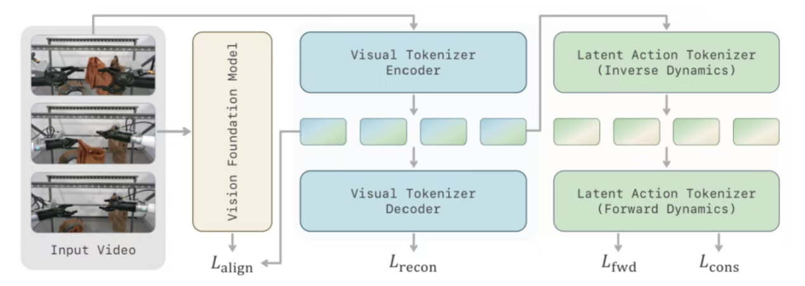
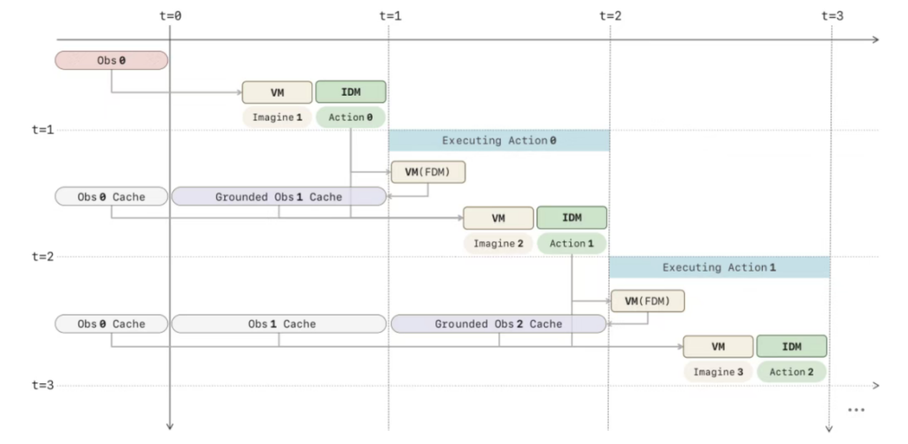
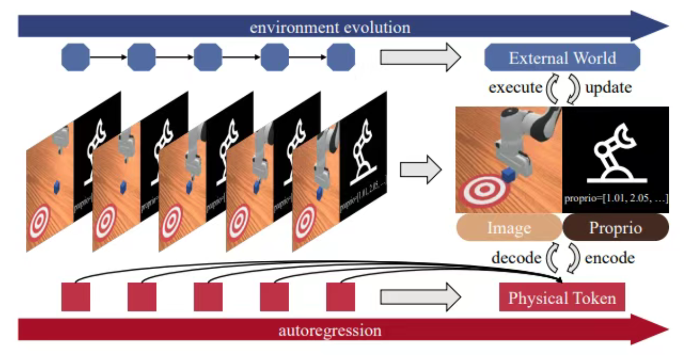

# 33.2 世界-动作统一生成模型

## 一、从LingBot-VA到LingBot-VA 2.0：先预测状态，再得到动作

### （一）模型架构

1.顺序架构与MoT

视觉观察首先通过因果视频VAE压缩为紧凑的隐变量 $z_t\in\mathbb{R}^{N\times d}$，动作向量也被投影为对应维度的Token $a_t$。

在每个自回归步骤中，模型首先基于观测和动作历史预测未来 $K$ 帧视频画面的隐状态：

$$
z_{t+1:t+K}\sim p_\theta\!\left(\,\cdot\mid z_{\leq t},a_{\lt t},c_t\right).
$$

随后，运动力学模型利用预测的未来视觉状态、历史观察和历史动作，以及任务条件，生成具体动作：

$$
a_{t:t+K-1}\sim q_\phi\!\left(\,\cdot\mid\hat{z}_{t+1:t+K},z_{\leq t},a_{\lt t},c_t\right).
$$

预测状态和预测动作在同一个模型中进行，采用MoT架构，即在统一的注意力层交互，但在FFN/MoE层则有各自分开的参数。输出时，模型可以在输出序列中交替输出视频token和动作token。

由于视觉的信息量大于动作，故二者往往采取非对称设计，体现在两个方面：

（1）参数：以LingBot-VA 2.0为例，动作专家的参数量较小，视觉专家则采取了较稀疏的MoE架构，128个专家在推理时只激活Top 8。

（2）隐藏层维度：在FFN/MoE层，视频的隐藏层维度比动作更高（因为前者信息量更大），为了保证注意力层中隐藏层维度对齐，一般会在层间前向传播时通过下采样或上采样的方式进行处理。

2.Backbone

Lingbot-VA以视频生成模型Wan2.2作为预训练backbone，在此基础上进行后训练；Lingbot-VA 2.0从零开始用具身数据预训练Diffusion Transformer，属于具身原生的世界-动作模型。

3.Tokenizer的设计

Lingbot-VA复用了Wan 2.2主干的Tokenizer。LingBot-VA 2.0则单独训练了Tokenizer，如图是其语义视觉动作分词器的结构，视觉重建、语义对齐与潜在动作提取三路并行，共同构成训练Tokenizer的损失函数。

（1）视觉重建：类似VAE训练的重建损失。

（2）语义对齐：将Perception Encoder作为教师策略冻结，使得自身生成的视觉特征与之对齐，使得分词器眼中的画面从低级的像素升维成高级的语义概念。

（3）潜在动作提取：训练逆动力学模型（IDM）和前向动力学模型（FDM），前者可以从前后两帧的状态特征中提取出两帧之间采取的动作特征，后者试图用前一帧的状态特征与该动作特征还原后一帧的状态特征。该项损失旨在确保Tokenizer得到的隐变量能反映动作动态，而不仅仅是压缩像素特征。

### （二）训练数据（LingBot-VA 2.0）

1.通用图文视频：提供最宽的外观和动力学先验。

2.机器人数据：遥操作数据、AgiBot、OXE（含DROID）等。

3.第一人称人类视频：有65.4k个episode、3000多种场景任务组合，每帧都标了双手的6-DoF位姿和每只手22个手指关节角。人手全部对齐为平行夹爪。

4.后续ICL用的合成数据：先让多模态LLM做任务分析、生成图像编辑指令，把机器人首帧改写成人类操作的初始观测，再用视频生成模型合成人类操作视频，最后由一个VLM从任务语义保真和物理合理性给机器人数据和生成的人类操作视频打分，合格的才和原机器人视频配成一对。覆盖了10多个机器人视频源、5000多个任务和50000对以上的人机配对。

### （三）预训练任务（LingBot-VA 2.0）

T2I（文生图）：负责建立视觉语义的对齐、把潜空间和语言结合在一起。

T2V（文生视频）：从互联网规模视频里学通用的时间动力学。

TI2VA（text-image to video-action）：既预测未来潜变量，又对相邻状态之间的潜在动作做逆动力学建模。

ICL（上下文学习）：以人类演示视频为条件上下文，要求模型在不更新权重的情况下泛化生成新实例的操作轨迹。

HCT（人机协同训练）：将人类视频与机器人数据置于共享世界模型中联合训练，提取跨本体的通用动作表征。

为了更好地继承先验知识，五个训练任务全程联合优化，只随训练进度调混合权重。早期把质量集中在T2I，中期移向T2V，晚期集中到TI2VA、ICL和HCT但也对T2l、T2V等提供非零的正则，以免模型遗忘底层的世界常识。

### （四）异步推理

整体上“块内扩散，块间自回归”，一次扩散的块可以包含若干token。将块编号为0，1，2，……

为避免停顿，在机器人执行动作时，模型需提前预测下一个动作，即异步推理。LingBot-VA 2.0的异步推理工作流如下：

在动作0被预测出来后，动作0才能开始执行。模型需在动作0执行的同时，先预测状态2和动作1，此时上下文中的状态1还是预测值。如果上下文中不断积累预测值，将容易发生偏差累积。因此，在动作0执行完毕来到状态1、状态2和动作1预测完毕后，要将真实的状态1写入上下文，代替之前的预测值，这样上下文中就只有状态2是预测值，此时再执行动作1、预测状态3和动作2，以此类推，保证上下文中只有一个状态是预测值，且模型预测和动作执行可以同时进行。

## 二、物理token的统一自回归预测

具身智能中，未来视觉状态和动作本质都是高维连续信号。PAR、PhysGen等论文及NVIDIA的DreamDojo等提出了状态与策略统一编码于“物理token”中，统一进行自回归生成，再在下游解码为状态与策略输出的范式。

### （一）核心思想

将过去的视频和动作均编码为统一的物理token。设 $t$ 时刻的视频帧token集合为 $o_t$（PhysGen中每个 $o_t$ 包含360个token），动作token集合为 $a_t$（PhysGen中每个 $a_t$ 包含8个token），则上下文序列为 $[\mathrm{prompt},o_1,a_1,o_2,a_2,\ldots,o_t,a_t]$，联合预测下一步的 $[o_{t+1},a_{t+1}]$。预测出的 $[o_{t+1},a_{t+1}]$ 再通过扩散解码，分别得出连续的未来状态值（视频）和要采取的动作值。

具体来说， $o_t$ 和 $a_t$ 也不一样： $o_t$ 内部的token可以并行生成； $a_t$ 内部则按时间顺序严格串行，但利用Multi-token prediction的方法，在动作块内部拉长微观的规划视野。即便只预判2到3步极其微小的机械臂位姿，也能让自回归生成的动作轨迹更加连贯，有效避免控制上的“短视”和抖动。

### （二）自回归Transformer

主干Transformer网络采取自回归生成范式。因果掩码方式如下：

1.帧内部：块级全注意力

对于物理token中的视频帧部分，掩码允许同一个画面内的所有图像块相互“看到”彼此。单张图像内的空间信息是同时存在的，没有时间上的先后顺序。全注意力机制能保证模型完整地提取这一帧的全局空间特征。

2.动作内部：时间因果注意力

对于物理标记中的动作部分，模型执行严格的时间因果掩码。在一个时间步的动作块内，各个token仍有先后顺序，时间上靠前的动作标记无法关注到排在它后面的动作标记。这是因为动作是随时间线性发生的连续序列，必须遵守“过去决定未来，未来不能干涉过去”的物理法则。

3.动作单向关注视觉

在同一个时间步t中，动作token被允许单向地关注视频token。这也就是让模型学会了“给定目标状态，反推所需的动作”的逆运动学推导。

4.跨时间步：全局时间因果

在不同的时间步之间，严格遵守时间因果掩码，用t时刻以前的信息预测t+1时刻，防止未来帧的信息泄露到过去的规划中。

### （三）扩散解码器

与传统的离散分类不同，PhysGen引入了基于DiT（Diffusion Transformer）的去噪过程，利用扩散损失直接在连续空间中估计概率分布。

模型训练时对动作噪声进行预测，从而最小化均方误差损失：

$$
\mathcal{L}(P_n,Z_n)=\mathbb{E}_{\varepsilon,t}\left[\left\|\varepsilon-\varepsilon_\theta(P_{n,t}\mid t,Z_n)\right\|^2\right].
$$

推理阶段去噪的公式为：

$$
\begin{aligned}
P_{n,t-1}
&=\frac{1}{\sqrt{\alpha_t}}
\left(
P_{n,t}-\frac{1-\alpha_t}{\sqrt{1-\bar{\alpha}_t}}
\varepsilon_\theta(P_{n,t}\mid t,Z_n)
\right)
+\sigma_t\varepsilon.
\end{aligned}
$$

去噪后的物理标记最终被分离，并解码为预测的视频帧和要在物理世界中执行的机器人动作。

### （四）BOA token

在真实的物理世界中，因果关系非常严格。假设机器人要完成一个任务：

- 初始时刻 $t=0$：机器人睁开眼睛，看到桌子上的杯子，此时得到初始视觉观察结果（Frame 0）。但在这个极其短暂的瞬间，还没有执行任何动作。
- 第一步 $t=1$：模型处理Frame 0的信息，决定伸出机械臂，输出第一个动作（Action 1）。动作使物理世界发生变化，机器人随后看到新的画面（Frame 1）。

PhysGen框架将视频帧标记（Frame Token）和动作标记（Action Token）拼在一起，组成物理标记（Physical Token） $P_n$，其具体编码为

$$
P_n=[O_n;E_{A,n}].
$$

按照上述物理直觉，输入给模型的历史序列由两部分组成：

- 视觉观察序列： $\lbrace O_0,O_1,O_2,\ldots,O_{N-1}\rbrace$，从0开始，共 $N$ 个初始帧。
- 对应动作序列： $\lbrace A_1,A_2,\ldots,A_{N-1}\rbrace$，从1开始，共 $N-1$ 个初始动作。

如果强行把二者打包成 $P_n$，就会遇到一个尴尬的时间偏移问题： $P_0=[O_0;\text{什么都没有}]$，而 $P_1=[O_1;A_1]$、 $P_2=[O_2;A_2]$。

为在数学结构上完美对齐这两个长度不一的序列，作者在动作序列最前面人为加入一个可学习的占位符，称为BOA（Begin of Action）Token。它使初始物理标记可以写成

$$
P_0=[O_0;\mathrm{BOA}],
$$

从而让后续每个物理标记都稳定包含一帧视觉状态和与之对应的动作标记。

### （五）训练工作流

1.预训练

在预训练阶段，模型的主干网络仅仅在海量的视频数据上进行了训练。这个阶段模型没有见过任何机器人的动作指令，它学到的是“世界是如何运转的”（例如：杯子掉在地上会碎、手碰到物体物体会移动等纯物理和时间动态）。

这个阶段只训练了语言Tokenizer、视觉Tokenizer（3D-VAE）、自回归Transformer主干网络，以及帧生成器（Frame Diffusion），动作模块并不参与。

2.动作微调

为了让模型能够控制机器人，作者会在具体的下游任务上进行微调（Fine-tuning）。在这个阶段，模型会使用带有动作标签的演示数据。但是，因为模型在第一阶段已经懂得了物理世界的运作规律，它所需的动作数据量极小。

此时，模型会增加一个用于编码动作的Action Tokenizer（一个MLP），以及一个轻量级的动作解码器（Action-DiT）。微调时，模型被训练为一旦看到BOA token，后面就按“360个视频帧token+8个动作token”交替生成，系统也会按token数量交替分发给不同解码器。

## 参考文献

- Li, L., Zhang, Q., Luo, Y., et al. (2026). [Causal World Modeling for Robot Control](https://arxiv.org/abs/2601.21998). arXiv:2601.21998.（LingBot-VA）
- Zhang, Q., Li, L., Zhang, L., et al. (2026). [Native Video-Action Pretraining for Generalizable Robot Control](https://arxiv.org/abs/2607.08639). arXiv:2607.08639.（LingBot-VA 2.0）
- Song, Z., Qin, S., Chen, T., Lin, L., & Wang, G. (2025). [Physical Autoregressive Model for Robotic Manipulation without Action Pretraining](https://arxiv.org/abs/2508.09822). arXiv:2508.09822.（PAR）
- Song, Z., Li, Q., Qin, S., et al. (2026). [Learning Physics from Pretrained Video Models: A Multimodal Continuous and Sequential World Interaction Models for Robotic Manipulation](https://arxiv.org/abs/2603.00110). arXiv:2603.00110.（PhysGen）
- Gao, S., Liang, W., Zheng, K., et al. (2026). [DreamDojo: A Generalist Robot World Model from Large-Scale Human Videos](https://arxiv.org/abs/2602.06949). arXiv:2602.06949.（NVIDIA DreamDojo）
