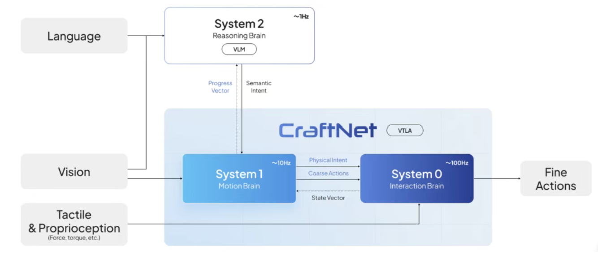
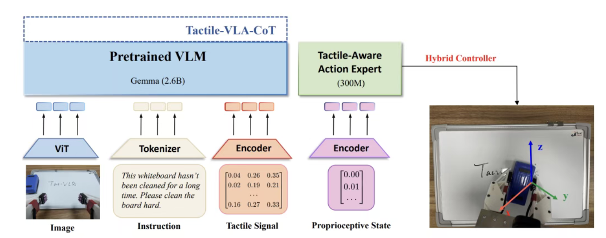
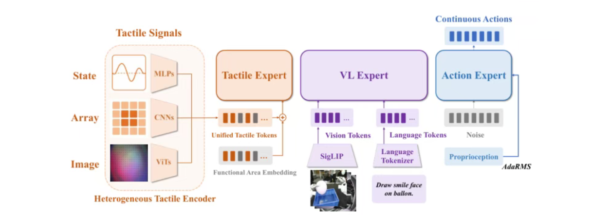

# 33.4 触觉的建模

## 一、触觉建模的难点

1.缺少获取大规模的触觉数据的方法。目前行业内可获得的有效触觉数据远远少于语言、视觉等数据。且带触觉的采集设备依旧存在较高的门槛，数据采集规模化难度较大。

2.触觉模态与语言、视觉模态融合建模难度大。触觉通常发生在机器人与物体接触的瞬间，具有高频性；而在其他时间可能又不存在此信号，具有稀疏性。这决定了触觉模态不能简单粗暴地和与语言、视觉模态数据混合在一起。

3.跨触觉传感器迁移困难。触觉传感器类型多样，可以分为视触觉、压阻、电容等，所产生的信号模态不同，有图像型、阵列型、状态型等，分辨率不同，难以通用。

4.不同类型的末端传感器分布不同。如夹爪和灵巧手的触觉传感器的分布和数量等都不同，但它们又要作用于同一套机器人策略，增大了建模的难度，尤其是对于机器人全身的策略进行建模的难度。

## 二、触觉建模的主要方法

### （一）触觉模型与主干策略相对分开

这种方法把触觉做成独立的高频纠错模块，附加在主干策略之外。如CraftNet把一台机器人拆成三个异步运转的部分。System0是一个每秒上百次的交互环节，专门接收力和力矩信号，在接触的瞬间实时微调指尖位置。触觉在这里是反应最快的纠偏回路。

但分层架构的缺点在于，触觉并没有进入主干模型的预训练，Scaling潜力不如端到端统一，且无法实现跨本体复用。

### （二）用Adapter接入主干策略

以Tactile-VLA为例，用一个adapter把触觉token注入视觉语言模型，和视觉、语言模态共享注意力，并不另起炉灶。这种方法的优点在于，可以让视觉信息进入主干策略，实现了端到端统一，避免了分层架构固有的弊端。

但仍存在两个缺点：

1.对于已经训练完毕的视觉语言模型，后续接入触觉信息微调时，触觉和已有的视觉语言知识之间容易互相干扰。事实上，如果不对触觉做恰当的模态融合，强行和视觉语言合并在一起，触觉非但帮不上忙，反而会干扰视觉语言感知，连累整体性能。

2.依然绑定在单一传感器上，传感器一旦更换，整个Adapter将无法复用。

### （三）在主干策略模型中用MoE区分不同模态

可通过混合专家模型，用门控来控制不同阶段的主导专家，如无接触时以视觉为主，接触时触觉的权重显著增强。如ForceVLA把力读数投影成token，在动作解码的阶段用一个力觉MoE做模态和阶段感知的路由；ForceVLA2一边把力当成文本提示喂进VLM形成“力觉任务概念”，一边在动作端上跨尺度进行MoE。

运用MoE的好处在于两个方面：

1.由于触觉和视觉、语言模态的特点相差较大，用不同权重隔离可避免伤害预训练获得的视觉语言知识。

2.只要规定好触觉输入数据格式，就支持在微调时将预训练得到的共享触觉专家复用到从没有见过的传感器。只需要训练一个轻量级编码器，将传感器的数据转换为触觉专家可读取的格式即可。

## 三、FTP-1：融合触觉建模的基础模型

### （一）触觉传感器的数据格式规定

论文《FTP-1: A Generalist Foundation Tactile Policy Across Tactile Sensors for Contact-Rich Manipulation》提出了数据接口MTTS。其坐标用手本身的功能区划分，把一只手划分成24个功能区，任何传感器的触觉信号都按功能区归位，从而可以翻译成同一套槽位token。每个token都会有功能区embedding标明感觉来自哪一个功能区。

### （二）不同类型传感器信号的翻译方法

图像型（形变图）：训练轻量级ViT处理图像，转换为符合MTTS格式的token。

阵列型（压力网格）：训练轻量级CNN提取特征，转换为符合MTTS格式的token。

状态型（力读数）：先用傅里叶编码，再训练轻量级MLP变换数据格式，转换为符合MTTS格式的token。

### （三）模型架构

不同类型传感器信号经过翻译后进入主干模型。主干模型主要由视觉语言、动作和触觉专家构成，视觉语言专家具备VLM的能力，动作专家用流匹配方法生成连续动作，触觉专家处理触觉信号。动作专家可以从触觉专家中单向获取信息。

## 参考文献

- Yu, J., Liu, H., Yu, Q., et al. (2025). [ForceVLA: Enhancing VLA Models with a Force-aware MoE for Contact-rich Manipulation](https://arxiv.org/abs/2505.22159). arXiv:2505.22159.
- Yuan, C., Zhang, Z., Zhou, M., et al. (2026). [FTP-1: A Generalist Foundation Tactile Policy Across Tactile Sensors for Contact-Rich Manipulation](https://arxiv.org/abs/2606.13102). arXiv:2606.13102.
